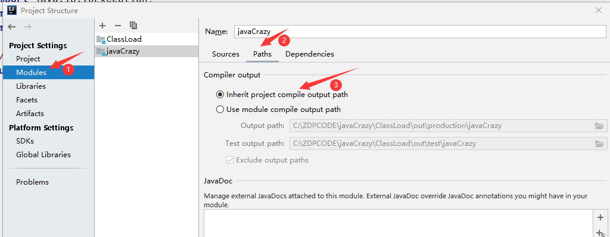
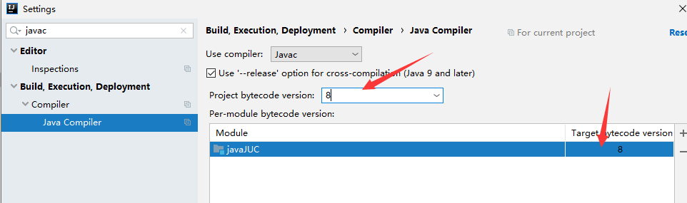

[toc]


# 1.在IDEA 中 java项目中新建一个Module,点击编译时报错

- 错误信息：`Cannot start compilation: the output path is not specified for module "XXX".`

- 错误原因：没有设置output的路径

- 解决办法： 修改两个地方的设置

  

  

  


# 2.编译运行java程序时，提示Error:java: 错误: 不支持发行版本 5

项目运行时，jdk版本于本地的不一致，将Project 和 maven中的JDK版本修改一下就可以了。





# 3. git push 的时候出现错误 failed to push some refs to xxx

#### 分支名不完整

------

emmm，这个错误大概是最难发现的了，不是说难度系数高，而是大家都把以本地master与远程master为例去写答案，于是大家会下意识忽略掉本地分支与远程分支名不一样的情况。（也可能这个大家只包含了我....）

git推送的完整写法如下：

```bash
  git push @remoteName  @localBranch:@remoteBranch

  // eg.remoteName:origin  localBranch:ceshi  remoteBranch:test
  git push origin ceshi:test
```

但是如果本地分支与远程分支名字一样的话，是可以简写的。例如本地和远程的分支名都是master：

```undefined
  git push origin master
```

如果确认分支名没有错，那就继续往下看

#### 没有提交代码

------

可以用 `git status`查看是否忘了把代码提交上去了。若是忘了，提交了就行。

```bash
  git add .
  git commit -m "This is a new commit"
  git push origin master
```

#### 本地与远程产生冲突

------

或是有其他协作者提交了代码，或是你之前在远程上直接做了处理。这部分有两个处理方法，一是直接强覆盖，二是先把远程的变化拉取下来，解决冲突后，再一并提交。

1. 强覆盖

   ```bash
     git push -f origin master
   ```

2. 拉取再提交

   ```bash
     git pull –-rebase origin maste
     git push origin master
   ```


