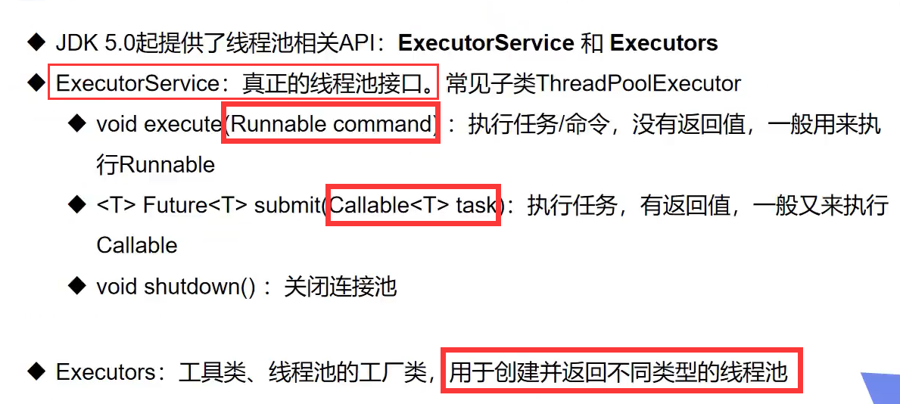

-   [0 核心概念](#核心概念)
-   [1.继承Thread 类实现多线程](#继承thread-类实现多线程)
    -   [1.1 多线程实现同步下载图片](#多线程实现同步下载图片)
-   [2.实现Runnable接口](#实现runnable接口)
-   [3.Callable接口的实现（了解）](#callable接口的实现了解)
-   [4.静态代理](#静态代理)
-   [5.Lamda 表达式](#lamda-表达式)
    -   [5.1 Lambda 表达式简化](#lambda-表达式简化)
-   [6 线程状态](#线程状态)
    -   [6.1 线程方法](#线程方法)
    -   [6.2 停止线程](#停止线程)
    -   [6.3 线程休眠 sleep](#线程休眠-sleep)
    -   [6.4 线程 运行转就绪 （yield）礼让](#线程-运行转就绪-yield礼让)
    -   [6.5 线程 join(类似于插队)](#线程-join类似于插队)
    -   [6.6 线程状态观测](#线程状态观测)
    -   [6.7 线程优先级](#线程优先级)
    -   [6.8 守护(daemon)线程](#守护daemon线程)
-   [7.线程同步 （重点+难点）](#线程同步-重点难点)
    -   [7.1 三大不安全案例](#三大不安全案例)
    -   [7.2 解决线程不安全问题
        （同步方法，同步代码块）](#解决线程不安全问题-同步方法同步代码块)
    -   [7.3 死锁](#死锁)
        -   [7.3.1 产生死锁的四个必要条件:](#产生死锁的四个必要条件)
-   [8 Lock（锁）](#lock锁)
    -   [8.1 Lock 与 synchronized 的比较](#lock-与-synchronized-的比较)
-   [9.线程通信](#线程通信)
    -   [9.1 生产者消费者模式(问题)](#生产者消费者模式问题)
    -   [9.2 管程法](#管程法)
    -   [9.3 信号灯法](#信号灯法)
-   [10.线程池](#线程池)
    -   [10.1 线程池的使用](#线程池的使用)

0 核心概念
==========

1.  线程就是独立的执行路径
2.  在程序运行时，即使没有自己创建线程，
    后台也会有多个线程，主线程，gc线程等
3.  main()称之为主线程， 为系统的入口，用于执行整个程序
4.  在一个进程中，如果开辟了多个线程，线程的运行是由调度器安排调度，调度器是与操作系统紧密相关的，先后顺序是不能人为的干预
    （可以设置一下线程优先级来改变线程被调度的概率）
5.  对于同一份资源操作时，会存在资源抢夺的问题，需要加入并发控制（锁机制）
6.  线程会带来的额外的开销，如cpu调度时间，并发控制开销
7.  每个线程都在**自己的工作内存交互**，内存控制不当会造成数据的不一致

1.继承Thread 类实现多线程
=========================

1.1 多线程实现同步下载图片
--------------------------

-   使用到 Apache.commons.io jar包

``` {.java}
package demo01;


import org.apache.commons.io.FileUtils;

import java.io.File;
import java.io.IOException;
import java.net.URL;

//实现多线程同步下载图片
public class TestThread01 extends Thread{
    private String url;
    private String name;
    public TestThread01(String url,String name){
        this.url = url;
        this.name = name;
    }

    //线程执行体

    @Override
    public void run() {
        WebDownloader downloader = new WebDownloader();
        downloader.downloader(url,name);
        System.out.println("下载的文件 文件名为"+ name);
    }

    public static void main(String[] args) {
        TestThread01 t1 = new TestThread01("https://tse2-mm.cn.bing.net/th/id/OIP.WItaXdICxOycfyWN9d8veQHaHa?w=182&h=182&c=7&o=5&dpr=1.75&pid=1.7","1.jpg");
        TestThread01 t2 = new TestThread01("https://tse4-mm.cn.bing.net/th/id/OIP.ZZAqlHy-0MZIt-Jet0BpMAHaJ4?w=182&h=243&c=7&o=5&dpr=1.75&pid=1.7","2.jpg");

        t1.start();
        t2.start();
    }
}


//下载器
class WebDownloader{
    //下载方法
    public void downloader(String url,String name){
        try {
            FileUtils.copyURLToFile(new URL(url),new File(name));
        } catch (IOException e) {
            e.printStackTrace();
            System.out.println("IO异常，downloader方法出现问题");
        }
    }

}
```

2.实现Runnable接口
==================

-   `Thread`类中也实现了`Runnable`接口
-   避免了单继承的局限性，可以让多个线程
    同时操作同一个对象（同一个对象的成员变量 共享）
-   多个线程同时操作同一个对象 会产生并发问题（数据紊乱）

``` {.java}
package demo01;
//模拟抢票
public class TestThread3 implements Runnable{

    private int tickets = 10;
    public void run(){
        while(tickets>0){
            try {
                Thread.sleep(200);
            } catch (InterruptedException e) {
                e.printStackTrace();
            }
            System.out.println(Thread.currentThread().getName()+"抢到了第"+tickets--+"张票");
        }
    }

    public static void main(String[] args) {
        //模拟抢票
        TestThread3 r = new TestThread3();

        //创建3个线程对象，同时操作一个对象
        new Thread(r, "小明").start();
        new Thread(r,"红花").start();
        new Thread(r,"老黄").start();
    }
}
```

-   龟兔赛跑问题（兔子睡觉，乌龟赢）---\>就是sleep()的使用。。。

``` {.java}
package demo01;

public class Race implements Runnable{
    private static String winner = null;

    public void run() {

        for (int i = 0; i <= 20; i++) {
            //让兔子睡觉
            if(Thread.currentThread().getName().equals("兔子")&&i%5==0){
                try{
                    System.out.println("兔子睡觉");
                    Thread.sleep(200);
                } catch (InterruptedException e) {
                    e.printStackTrace();
                }
            }
            System.out.println(Thread.currentThread().getName()+"----->跑了"+i+"步");
            isWinner(i);
        }
    }

    //判断胜利者
    Boolean isWinner(int step){
        if(winner!=null){
            return true;
        }
        if(step==20){
            winner = Thread.currentThread().getName();
            System.out.println("当当当当 winner is "+winner);
            return true;
        }
        return false;
    }

    public static void main(String[] args) {
        Race r = new Race();

        new Thread(r,"兔子").start();
        new Thread(r,"乌龟").start();
    }
}
```

3.Callable接口的实现（了解）
============================

好处：可以定义返回值，可以抛出异常

1.  实现Callable 接口，需要返回值类型(返回值类型为call方法的返回值)
2.  重写call方法，需要抛出异常
3.  创建目标对象（不一定要用线程池来使用，也可以像实现Runnable接口一样来使用）
4.  创建执行服务：`ExecutorService ser = Executors.newFixedThreadPool(1);`
    (好像是个线程池)
5.  提交执行：`Future<Boolean> result1 = ser.submit(t1);`
6.  获取结果: `boolean r1 = result1.get();`
    :获取结果会阻塞进程，直到进程执行完毕获取到结果
7.  关闭服务： `ser.shutdownNow();`

代码实现：

``` {.java}
package demo02;

import demo01.TestThread01;
import org.apache.commons.io.FileUtils;

import java.io.File;
import java.io.IOException;
import java.net.URL;
import java.util.concurrent.*;

public class CallableTest  implements Callable<Boolean> {
    private String url;
    private String name;

    public CallableTest(String url,String name){
        this.url = url;
        this.name = name;
    }

    @Override
    public Boolean call() throws Exception {
        WebDownloader downloader = new WebDownloader();
        downloader.downloader(url,name);
        System.out.println("下载的文件 文件名为"+ name);
        return true;
    }

    public static void main(String[] args) throws ExecutionException, InterruptedException {
        CallableTest t1 = new CallableTest("https://tse2-mm.cn.bing.net/th/id/OIP.WItaXdICxOycfyWN9d8veQHaHa?w=182&h=182&c=7&o=5&dpr=1.75&pid=1.7","1.jpg");
        CallableTest t2 = new CallableTest("https://tse4-mm.cn.bing.net/th/id/OIP.ZZAqlHy-0MZIt-Jet0BpMAHaJ4?w=182&h=243&c=7&o=5&dpr=1.75&pid=1.7","2.jpg");

        //创建线程池
        ExecutorService ser = Executors.newFixedThreadPool(1);
        //提交执行
        Future<Boolean> r1 = ser.submit(t1);
        Future<Boolean> r2 = ser.submit(t2);

        //获取结果
        boolean rs1 = r1.get();
        boolean rs2 = r2.get();
        //输出结果
        System.out.println(rs1);
        System.out.println(rs2);
        //关闭服务
        ser.shutdownNow();

    }

}

class WebDownloader{
    //下载方法
    public void downloader(String url,String name){
        try {
            FileUtils.copyURLToFile(new URL(url),new File(name));
        } catch (IOException e) {
            e.printStackTrace();
            System.out.println("IO异常，downloader方法出现问题");
        }
    }
```

-   Runnable接口的另一种使用方式

``` {.java}
FutureTask<Integer> futureTask = new FutureTask<Integer>(new MyThread3());
new Thread(futureTask).start();

class MyThread3 implements Callable<Integer>{
    public Integer class() throws Exception{
        System.out.println("MyThread3");
        return 100;
    }
}
```

4.静态代理
==========

代理:我帮你完成处理工作，你享受成果？

-   静态代理模式总结：
    -   真实对象 和 代理对象 都要实现同一个接口
    -   代理对象 要代理一个 真实的对象（实例化后的对象）
    -   代理对象可以做很多真实对象 做不了的事情
    -   真实对象可以专注于做自己的事情
-   多线程 实现Runnable接口 ===\>也是代理

``` {.java}
new Thread(()->System.out.pritln("hhhh")).start();
//Thread类也实现了Runnable接口， 我们传入Thread 类的 为Runnable接口的实现类
new WeedingCompany(new You()).HappyMarry();
//WeedingCompany类实现了 Marry接口，You类也实现了 Marry接口
```

-   婚庆公司案例代码：

``` {.java}
package 静态代理;

public class StaticProxy {
    public static void main(String[] args) {
        You you = new You();
        WeddingCompany weddingCompany = new WeddingCompany(you);
        weddingCompany.HappyMarry();
    }
}

interface Marry{
    void HappyMarry();
}

//真实角色，结婚的人
class You implements Marry{
    @Override
    public void HappyMarry() {
        System.out.println("我结婚了hhh");
    }
}

//代理角色，帮助你结婚
class WeddingCompany implements Marry{

    private Marry target;

    public WeddingCompany(Marry target){
        this.target = target;
    }
    @Override
    public void HappyMarry() {
        before();
        target.HappyMarry();
        after();
    }
    private void before(){
        System.out.println("结婚前，处置现场");
    }
    private void after(){
        System.out.println("结婚后，收尾款");
    }
}
```

5.Lamda 表达式
==============

``` {.txt}
(params) -> expression [表达式]
(params) -> statement [语句]
(params) -> {statements}
```

-   函数式接口：
    任何接口，如果只包含一个抽象方法，那么它就是一个函数式接口
-   可以使用Lambad表达式来创建函数式接口的对象

一步一步的简化过程：

1.  接口实现类
2.  静态内部类
3.  局部内部类
4.  匿名内部类
5.  Lambda简化

代码显示：

``` {.java}
package Lambda;

//推到Lambda 表达式
public class TestLambda {

    //3静态内部类，将实现类放到静态内部类
    static class Like2 implements ILike{
        @Override
        public void lambda() {
            System.out.println("i like lambda2");
        }
    }
    public static void main(String[] args) {
        ILike like = new Like();
        like.lambda();

        like = new Like2();
        like.lambda();

        //4局部内部类
        class Like3 implements ILike{
            @Override
            public void lambda() {
                System.out.println("i like lambda3");
            }
        }

        like = new Like3();
        like.lambda();

        //5 匿名内部类 ==>没有类的名称，必须要借助接口或者父类来实现
        like = new ILike(){
            @Override
            public void lambda() {
                System.out.println("i like lambda4");
            }
        };
        like.lambda();
        
        //6 使用 lambda简化
        like = ()->{
            System.out.println("i like lambda5");
        };
        like.lambda();
    }
}

//1定义一个函数式接口
interface ILike{
    void lambda();
}
//2实现类
class Like implements ILike{
    @Override
    public void lambda() {
        System.out.println("i like lambda");
    }
}
```

5.1 Lambda 表达式简化
---------------------

1.  去掉参数类型（多个参数也可以去掉参数类型，注意去掉就要全部去掉）
2.  简化括号 （多个参数必须加上括号）
3.  去掉花括号 （代码体中 只有一行代码）

简化后代码：

``` {.java}
package Lambda;

public class TestLambda2 {

    public static void main(String[] args) {
        ILove i = null;
        //未简化代码
        i = (int a,int b)->{
            System.out.println(a);
            System.out.println(b);
        };
        i.love(1,2);
        //简化后代码
        i = (a,b)->{
            System.out.println(a+1);
            System.out.println(b+1);
        };
        i.love(1,2);
    }
}
interface ILove{
    void love(int a,int b);
}
```

6 线程状态
==========

五大状态：

-   创建状态
-   就绪状态
-   运行状态
-   阻塞状态
-   死亡状态


6.1 线程方法
------------


6.2 停止线程
------------

-   不推荐使用JDK提供的 `stop()` 、`destory()`方法（已经废弃的方法）

-   建议 让线程自己停下来 ==\>如何让线程自己停下来？

    -   使用一个标志位作为终止变量 当flag = false ，终止线程运行

    ``` {.java}
    package 线程状态;

    /*
    * 测试stop
    * 1.建议线程正常停止--->利用次数，不建议死循环
    * 2.建议使用标志位-->设置一个标志位
    * 3.不要使用stop或者destory等过时或者JDK不建议使用的方法
    * */

    public class TestStop implements Runnable{
        //线程中定义线程体使用的标识
        private boolean flag = true;

        public void run(){
            int i=0;
            //线程体使用该 标识来控制
            while(flag){
                System.out.println("run...Thread"+i++);
            }
        }
        //对外提供方法改变标识
        public void stop(){
            flag = false;
        }

        public static void main(String[] args) {
            TestStop testStop = new TestStop();

            new Thread(testStop).start();

            for (int i = 0; i < 1000; i++) {
                System.out.println("main"+i);
                if(i==900){
                    //调用stop方法切换标志位，让线程停止
                    testStop.stop();
                    System.out.println("线程停止了");
                }

            }
        }
    }

    ```

6.3 线程休眠 sleep
------------------

-   sleep时间达到后 线程进入就绪状态
-   sleep不会释放锁
-   sleep可以模拟网络延时、倒计时

``` {.java}
//倒计时
package 线程状态;

import java.text.SimpleDateFormat;
import java.util.Date;

//模拟倒计时
public class TestSleep2 {

    public static void main(String[] args) throws InterruptedException {
        //打印系统当前时间
        Date startTime = new Date(System.currentTimeMillis());
        while(true){
            Thread.sleep(1000);
            System.out.println(new SimpleDateFormat("HH:mm:ss").format(startTime));
            startTime = new Date(System.currentTimeMillis());//更新当前时间

        }
    }

    //模拟倒计时
    public static void tenDown() throws InterruptedException {
        int num = 10;

        while(true){
            Thread.sleep(1000);
            System.out.println(num--);
            if (num <= 0) {
                break;
            }
        }
    }
}
```

``` {.java}
//模拟网络延时
package 线程状态;

import demo01.TestThread3;

//模拟网络延时===>放大问题的发生性
public class TestSleep implements  Runnable{
    private int tickets = 10;
    public void run(){
        while(true){
            if(tickets<=0){
                break;
            }
            try {
                //模拟延时
                Thread.sleep(200);
            } catch (InterruptedException e) {
                e.printStackTrace();
            }
            System.out.println(Thread.currentThread().getName()+"抢到了第"+tickets--+"张票");
        }
    }

    public static void main(String[] args) {
        //模拟抢票
        TestSleep r = new TestSleep();

        //创建3个线程对象，同时操作一个对象
        new Thread(r, "小明").start();
        new Thread(r,"红花").start();
        new Thread(r,"老黄").start();
    }
}
```

6.4 线程 运行转就绪 （yield）礼让
---------------------------------

-   让线程从 运行状态 转为就绪状态
-   要执行的线程 则是由cpu来重新调度（无法指定要执行的线程）
    ===\>就绪队列中的所有线程竞争

``` {.java}
package 线程状态;

public class TestYield {
    public static void main(String[] args) {
        MyYield myYield = new MyYield();
        new Thread(myYield,"a").start();
        new Thread(myYield,"b").start();
    }
}

class MyYield implements Runnable{
    @Override
    public void run() {
        System.out.println(Thread.currentThread().getName()+"线程开始执行");
        Thread.yield();//礼让线程
        System.out.println(Thread.currentThread().getName()+"线程停止执行");
    }
}
```

6.5 线程 join(类似于插队)
-------------------------

-   join 合并线程，待此线程执行完毕后，再执行其他线程，让其他线程阻塞
-   由于该方法会让其他线程阻塞，所以尽量避免使用该方法

``` {.java}
package 线程状态;

public class TestJoin implements Runnable{
    @Override
    public void run() {
        for (int i = 0; i < 1000; i++) {
            System.out.println("插队的线程"+i);
        }
    }

    public static void main(String[] args) throws InterruptedException {
        TestJoin testJoin = new TestJoin();
        Thread thread = new Thread(testJoin);
        thread.start();

        for (int i = 0; i < 500; i++) {
            if(i == 200){
                thread.join(); //让该线程插队，会阻塞其他线程
            }
            System.out.println("main"+i);
        }
    }
}
```

6.6 线程状态观测
----------------

-   一个线程可以在给定时间点处于一个状态。但这些状态是不反映任何操作系统线程状态的虚拟机状态。
-   线程状态：
    -   NEW :尚未启动的线程处于此状态
    -   Runnable：在JAVA虚拟机中执行的线程处于此状态
    -   BLOCKED：被阻塞等待监视器锁定的线程处于此状态 （阻塞）
    -   WAITING：正在等待另一个线程执行特定动作的线程处于此状态 （阻塞）
    -   TIMED_WAITING
        :正在等待另一个线程执行动作达到指定等待时间的线程处于此状态
        （阻塞）
    -   Terminated: 已退出的线程处于此状态

``` {.java}
package 线程状态;

public class TestState {
    public static void main(String[] args) throws InterruptedException {
        Thread thread = new Thread(()->{
            for (int i = 0; i < 5; i++) {
                try {
                    Thread.sleep(1000);
                } catch (InterruptedException e) {
                    e.printStackTrace();
                }
            }
            System.out.println("/////////////");
        });

        //观察线程状态
        Thread.State state = thread.getState(); //NEW
        System.out.println(state);

        //启动线程后，观测状态
        thread.start();
        state = thread.getState();
        System.out.println(state);

        //线程状态不为终止状态，就一直输出线程状态
        while(state!=Thread.State.TERMINATED){
            Thread.sleep(100);
            //更新线程状态
            state = thread.getState();
            System.out.println(state);
        }
    }
}
```

6.7 线程优先级
--------------

-   Java提供一个线程调度器来监控程序中启动后进入就绪状态的所有线程
-   线程优先级越高，该线程被运行的权重比例就越大（**优先级低只是意味着获得调度的概率低，并不是优先级低就不会被调用，还是要看cpu的调度的**）
-   线程优先级用数字表示 ，1\~10
    ==\>由于各个操作系统的线程优先级范围可能不同，所以建议使用java中的优先级静态常量
    -   `Thread.MIN_PRIORITY = 1`
    -   `Thread.MAX_PRIORITY = 10`
    -   `Thread.NORM_PRIORITY = 5` （线程默认优先级）
-   获取优先级 改变优先级 `getPriority() , setPriority(int xxx)`
-   建议 先设定优先级，再将线程转为就绪状态（运行`start()`方法）

``` {.java}
package 线程状态;

//线程优先级
public class TestPriority {
    public static void main(String[] args) {
        //主线程默认优先级
        System.out.println(Thread.currentThread().getName()+"---->"+Thread.currentThread().getPriority());
        MyPriority myPriority = new MyPriority();

        Thread t1 = new Thread(myPriority);
        Thread t2 = new Thread(myPriority);
        Thread t3 = new Thread(myPriority);
        Thread t4 = new Thread(myPriority);
        Thread t5 = new Thread(myPriority);
        Thread t6 = new Thread(myPriority);

        //设置优先级后再启动
        t1.start();

        t2.setPriority(1);
        t2.start();

        t3.setPriority(4);
        t3.start();

        t4.setPriority(Thread.MAX_PRIORITY);
        t4.start();

        t5.setPriority(8);
        t5.start();

        t6.setPriority(7);
        t6.start();
    }


}

class MyPriority implements Runnable{
    @Override
    public void run() {
        System.out.println(Thread.currentThread().getName()+"---->"+Thread.currentThread().getPriority());
    }
}
```

6.8 守护(daemon)线程
--------------------

-   线程分为 **用户线程** 和 **守护线程**
-   虚拟机必须确保用户线程执行完毕
-   虚拟机不用等待守护线程执行完毕（比如gc线程）
    ====\>**用户线程执行完毕，守护线程也会被终止**
-   守护线程：后台记录操作日志，监控内存，垃圾回收等待...

``` {.java}
package 线程状态;

//测试守护线程
public class TestDaemon {
    public static void main(String[] args) {
        God god = new God();
        You you = new You();

        Thread thread = new Thread(god);
        thread.setDaemon(true); //线程默认为守护线程(false)，ture为守护线程
        thread.start(); //守护线程启动

        new Thread(you).start(); //用户线程启动
    }
}

class God implements Runnable{
    @Override
    public void run() {
        while(true){
            System.out.println("上帝保佑你");
        }
       
    }
}

class You implements  Runnable{
    @Override
    public void run() {
        for (int i = 0; i < 36500; i++) {
            System.out.println("你每天都活得很开心");
        }
        System.out.println("============goodbye! World!=========");
    }
}
```

-   运行结果图：


7.线程同步 （重点+难点）
========================

-   线程同步： 解决 多个线程操作同一个资源 的问题
-   并发: **同一个对象** 被 **多个线程** 同时操作
-   处理多线程问题时，多个线程访问同一个对象，并且某些线程还想**修改**这个对象，====\>需要线程同步，线程同步其实就是一种**等待机制**，多个需要同时访问此对象的线程进入**该对象**的**对象等待池**形成队列，等待前面线程使用完毕，下一个线程再使用；（注意这个等待池
    是对象的等待池，即多个线程 等待 同一个资源） ====\>有点像排队吧hhhh
-   队列 和 锁 ====\>解决安全性（这就是线程同步）
    -   队列 就是类似于排队 所有想要操作 该对象的线程
        进入该对象的对象等待池形成队列
    -   锁 就是防止 其他线程插队
        每个对象都有一把锁，当一个线程使用完该对象后，释放锁，其他在队列中的线程，就是在争夺这把锁的使用权
-   由于同一进程的多个线程共享同一块存储空间，在带来方便的同时，也带来了访问冲突问题，为了保证数据在方法中被访问时的正确性，在访问时加入**锁机制
    synchronized**
    ，当一个线程获得对象的排它锁（可以把线程看出人，对象房子，获得排它锁就是人把门锁上），独占资源，其他资源必须等待。线程使用后释放锁即可（人打开锁，离开房子）。但存在问题:
    -   一个线程持有锁会导致其他所有需要此锁的线程挂起
    -   在多线程竞争下，加锁，释放锁，会导致比较多的上下文切换 和
        调度延时，引起性能问题
    -   如果一个优先级高的线程 等待一个优先级低的线程释放锁，
        会导致优先级倒置（就是优先级高等低），引起性能问题

7.1 三大不安全案例
------------------

我就写了两个，一个是不安全的买票，一个是不安全的集合

-   线程不安全产生的原因主要还是
    线程调度的原因，比如买票，要判断票数是否大于0，当前票数为1，A线程获得这个票数，并通过ticketNums\>10的判断，但还未进行票数的删减，这时候调度器
    调度B线程开始执行，由于票数还未被改变，所以B线程获得的票数还是为1，并且也通过了ticketNums\>10的判断，将要进行票数的减1.这样就会产生数据的紊乱。

``` {.java}
package Synchronized;

import java.util.ArrayList;
import java.util.List;
//不安全的线程
public class UnsafeList {
    public static void main(String[] args) {
        List<String> list = new ArrayList<>();
        for (int i = 0; i < 10000; i++) {
            new Thread(()->{
                list.add(Thread.currentThread().getName());
            }).start();
        }

        try {
            Thread.sleep(3000);
        } catch (InterruptedException e) {
            e.printStackTrace();
        }

        System.out.println(list.size());
    }
}
```

-   运行结果


-   不安全的买票

``` {.java}
package Synchronized;

//不安全的买票
public class UnsafeBuyTicket {
    public static void main(String[] args) {
        BuyTicket station = new BuyTicket();

        new Thread(station,"我").start();
        new Thread(station,"你").start();
        new Thread(station,"黄牛").start();
    }
}

class BuyTicket implements  Runnable{
    private int ticketNums = 10;
    boolean flag = true; //线程的外部停止方式
    @Override
    public void run() {
        //买票
        while(flag){
            try {
                buy();
            } catch (InterruptedException e) {
                e.printStackTrace();
            }
        }
    }

    private void buy() throws InterruptedException {
        if(ticketNums<=0){
            flag = false;
            return;
        }
        //模拟延时，放大问题
        Thread.sleep(1000);
        System.out.println(Thread.currentThread().getName()+"拿到"+ticketNums--);
    }
}
```

7.2 解决线程不安全问题 （同步方法，同步代码块）
-----------------------------------------------

-   `synchronized` 关键字（修饰符）
-   `synchronized`代码块
-   `synchronized`方法控制对"对象"的访问，每个对象对应一把锁，每个`synchronized`方法都必须要获得**调用该方法的对象的锁（其实就是要获得
    要被线程同时操作的对象的锁）**（同步方法一般在要被同步操作的对象中）才可以执行，否则将被阻塞。`synchronized`方法一旦执行，就独占该锁，直到该方法返回才释放锁，后面被阻塞的线程才可以获得这个锁
-   若将一个大的方法申明为`synchronized`将会影响效率
-   方法里需要修改的内容才需要锁，查询一般不用锁

``` {.java}
//改为线程安全
package Synchronized;

//不安全的买票
public class UnsafeBuyTicket {
    public static void main(String[] args) {
        BuyTicket station = new BuyTicket();

        new Thread(station,"我").start();
        new Thread(station,"你").start();
        new Thread(station,"黄牛").start();
    }
}

class BuyTicket implements  Runnable{
    private int ticketNums = 10;
    boolean flag = true; //线程的外部停止方式
    @Override
    public  void run() {
        //买票
        while(flag){
            try {
                buy();
                Thread.sleep(100);
            } catch (InterruptedException e) {
                e.printStackTrace();
            }
        }

    }

    private synchronized void buy() throws InterruptedException {
        if(ticketNums<=0){
            flag = false;
            return;
        }
        //模拟延时，放大问题

        System.out.println(Thread.currentThread().getName()+"拿到"+ticketNums--);
    }
}
```

-   同步代码块 `synchronized (Obj){}`
-   Obj 为 **同步监视器**
    -   Obj 可以是任何对象，但一般使用共享资源作为同步监视器
    -   同步方法中无须指定同步监视器，因为同步方法的同步监视器就是this,也就是这个对象本身，或者是Class
-   同步监视器的执行过程
    1.  第一个线程访问，锁定同步监视器，执行代码块中代码
    2.  第二个线程访问，发现同步监视器被锁定，获取不到锁，无法访问，进入该同步监视器对象的锁池中（锁池中的线程将竞争同步监视器的锁）
    3.  第一个线程访问完毕，解锁同步监视器（释放锁）
    4.  第二个线程访问，发现同步监视器没有锁，锁定同步监视器并访问（获取锁）===\>锁池中只有第二个线程，所以第二个线程竞争到锁

``` {.java}
//线程安全 集合
package Synchronized;

import java.util.ArrayList;
import java.util.List;

public class UnsafeList {
    public static void main(String[] args) {
        List<String> list = new ArrayList<>();
        for (int i = 0; i < 10000; i++) {
            new Thread(()->{
                synchronized (list){
                    list.add(Thread.currentThread().getName());
                }
            }).start();
        }

        try {
            Thread.sleep(3000);
        } catch (InterruptedException e) {
            e.printStackTrace();
        }

        System.out.println(list.size());
    }
}
```

-   运行结果图：


7.3 死锁
--------

-   两个线程或多个线程都在等待对方释放资源，都停止执行的情况；====\>某一个同步块同时拥有"两个以上对象的锁"时，就可能发生"死锁"问题
-   通俗一点：多个线程互相抱着对方需要的资源，然后形成僵持

``` {.java}
//死锁
package Synchronized;

public class DeadLock {
    public static void main(String[] args) {
         new Makeup(0,"郑").start();
        new Makeup(1,"卡").start();
    }
}

//口红
class Lipstick{}

//镜子
class Mirror{}

//
class Makeup extends Thread{
    static Lipstick lipstick = new Lipstick();
    static Mirror mirror = new Mirror();

    int choice; //选择
    String Name;//使用口红和镜子的人

    public Makeup(int choice,String Name){
        this.choice = choice;
        this.Name = Name;
    }

    @Override
    public void run() {
        //化妆
        try {
            makeup();
        } catch (InterruptedException e) {
            e.printStackTrace();
        }
    }

    private void makeup() throws InterruptedException {
        if(choice==0){
            synchronized (lipstick){
                //获得口红的锁
                System.out.println(this.Name+"获得了口红的锁");
                Thread.sleep(1000);
                //要化妆不就得要镜子，所以还要获得镜子的锁
                synchronized (mirror){
                    //获得镜子的锁
                    System.out.println(this.Name+"获得了镜子的锁");
                }
            }
        }else{
            synchronized (mirror){
                //获得口红的锁
                System.out.println(this.Name+"获得了镜子的锁");
                Thread.sleep(1000);
                //要化妆不就得要镜子，所以还要获得镜子的锁
                synchronized (lipstick){
                    //获得镜子的锁
                    System.out.println(this.Name+"获得了口红的锁");
                }
            }
        }
    }
}
```

-   解决死锁

``` {.java}
package Synchronized;

public class DeadLock {
    public static void main(String[] args) {
         new Makeup(0,"郑").start();
        new Makeup(1,"卡").start();
    }
}

//口红
class Lipstick{}

//镜子
class Mirror{}

//
class Makeup extends Thread{
    static Lipstick lipstick = new Lipstick();
    static Mirror mirror = new Mirror();

    int choice; //选择
    String Name;//使用口红和镜子的人

    public Makeup(int choice,String Name){
        this.choice = choice;
        this.Name = Name;
    }

    @Override
    public void run() {
        //化妆
        try {
            makeup();
        } catch (InterruptedException e) {
            e.printStackTrace();
        }
    }

    private void makeup() throws InterruptedException {
        if(choice==0){
            synchronized (lipstick){
                //获得口红的锁
                System.out.println(this.Name+"获得了口红的锁");
                Thread.sleep(1000);
            }
            //要化妆不就得要镜子，所以还要获得镜子的锁
            synchronized (mirror){
                //获得镜子的锁
                System.out.println(this.Name+"获得了镜子的锁");
            }
        }else{
            synchronized (mirror){
                //获得口红的锁
                System.out.println(this.Name+"获得了镜子的锁");
                Thread.sleep(1000);
            }
            //要化妆不就得要镜子，所以还要获得镜子的锁
            synchronized (lipstick){
                //获得镜子的锁
                System.out.println(this.Name+"获得了口红的锁");
            }
        }
    }
}
```

### 7.3.1 产生死锁的四个必要条件:

1.  互斥条件：一个资源每次只能被一个线程使用（两个进程都想要获取到镜子/口红）
2.  请求与保持条件：一个进程因请求资源而阻塞时，对已获得的资源保持不放（拿了镜子，不放镜子，还想拿口红）
3.  不剥夺条件：进程已获得的资源，在未使用完之前，不能强行剥夺
4.  循环等待条件：若干进程之间形成一种头尾相接的循环等待资源关系

-   四个条件都要满足才会产生死锁

8 Lock（锁）
============


-   `ReentrantLock` :可重入锁
-   一般将`lock()`放在try{}语句外，`unlock()`放在finally{}代码块中
-   代码演示：

``` {.java}
package Highest;

import java.util.concurrent.locks.ReentrantLock;

public class TestLock {
    public static void main(String[] args) {
        TestLock2 t = new TestLock2();

        new Thread(t,"郑").start();
        new Thread(t,"欧").start();
        new Thread(t,"周").start();
    }
}

class TestLock2 implements Runnable{
    int ticketNum = 10;
    private final ReentrantLock lock = new ReentrantLock();
    @Override
    public void run() {
        while(true){
            lock.lock();
            try{
                if(ticketNum>0){
                    System.out.println(Thread.currentThread().getName()+"取得了票"+ticketNum--);
                }else{
                    break;
                }
            }finally {
                lock.unlock();
            }
            try {
                Thread.sleep(100);
            } catch (InterruptedException e) {
                e.printStackTrace();
            }
        }
    }
}
```

8.1 Lock 与 synchronized 的比较
-------------------------------

1.  `Lock` 是显示锁，需要手动开启锁和关闭锁；
    `synchronized`是隐式的锁，出了作用域就会自动释放锁
2.  `Lock`只有代码块锁，`synchroinzed`有代码块锁和方法锁
3.  使用`lock`锁，JVM可以花费较少的时间来调度线程，性能更好；而且有更好的扩展性==\>提供了更多的子类
4.  优先使用顺序
    -   Lock \> 同步代码块（已经进入了方法体，分配了相应资源） \>
        同步方法（在方法体之外)

9.线程通信
==========

9.1 生产者消费者模式(问题)
--------------------------

-   其实就是 生产者对应一条
    生产队列，生产者生产东西放到生产队列中，消费者从生产队列中拿走东西，如果生产队列中没有东西，消费者就停止消费，等待生产者生产东西并将东西放到生产队列中。
    ===\>类似于点餐，我们得等厨师做完菜，然后通知我们，我们才去取餐


-   生产者消费者
    是一个线程同步的问题，生产者和消费者共享同一个资源（同一个数据缓存区），并且生产者和消费者之间相互依赖，互为条件:
    -   对于生产者，没有生产产品之前，要通知消费者等待，生产完产品后，又要通知消费者消费
    -   对于消费者，在消费之后，要通知生产者已经结束消费，需要生产新的产品
-   可以看到，这边主要的问题是 两者如何互相通知？
    -   `synchroinzed`只能实现线程之间的同步，不能实现线程之间的通信
-   Object类 中 方法 ，因为这边的通信是针对 线程
    共享同一个资源，且线程之间相互依赖的问题。同一个资源不就是同步监视器了,
    所以这里的通信是针对的是 使用同一个资源的线程 ，所以通信应该是由这个
    线程共同操作的对象来进行的。（每一个对象都有一把锁，每一个对象都可以对线程进行通信）
    -   (下面方法只能在同步方法或者同步代码块中使用)
    -   `wait()`
        ：表示线程一直等待，直到其他线程通知（`notify()`），`wait()`会释放锁；
        当使用`wait()`方法，线程会进入该对象的等待池中（等待阻塞队列）
    -   `wait(long timeout)`：设置等待的毫秒数
    -   `notify()：`
        唤醒一个处于等待状态的线程；使用`notify()`方法，将会随机唤醒该对象等待阻塞队列中的一个线程，被唤醒的线程将进入该对象的锁池，与其它线程一起竞争该对象的锁资源
    -   `notifyAll()`：唤醒同一个对象上所有调用`wait()`方法的线程，被唤醒的线程全部进入锁池，竞争锁资源
-   生产者消费者问题的解决办法：
    1.  

9.2 管程法
----------

-   代码（但我不明白为什么会生产第11只鸡，搞不懂）

``` {.java}
package Highest;

//测试：生产者消费者模型--->利用缓冲区解决：管程法
public class TestPc {
    public static void main(String[] args) {
        SynContainer container = new SynContainer();
        Consumer c = new Consumer(container);
        Productor p = new Productor(container);
        c.start();
        p.start();
    }


}

//生产者
class Productor extends Thread{
    SynContainer container;
    public Productor(SynContainer container){
        this.container = container;
    }

    @Override
    public void run() {
        //生产者生产一百只鸡
        for (int i = 1; i <= 50; i++) {
            Chicken c = new Chicken(i);
            container.push(c);
            System.out.println("生产者生产了第"+i+"只鸡");


        }
    }
}

//消费者
class Consumer extends Thread{
    SynContainer container;
    public Consumer(SynContainer container){
        this.container = container;
    }
    @Override
    public void run() {
        //消费者消费一百只鸡
        for (int i = 0; i < 50; i++) {
            try {
                sleep(200);
            } catch (InterruptedException e) {
                e.printStackTrace();
            }
            Chicken c = container.pop();
            System.out.println("消费者消费了--->第"+c.id+"只鸡");
        }
    }
}

//产品
class Chicken{
    int id; //产品编号
    public Chicken(int id) {
        this.id = id;
    }
}

//缓冲区
class SynContainer{
    //容器大小
    Chicken[] chickens = new Chicken[10];
    int count = 0;

    //生产者放入产品
    public synchronized void push(Chicken chicken){
        //容器满了，等消费者消费
        if(chickens.length==count){
            //等待消费者消费
            try {
                this.wait();
            } catch (InterruptedException e) {
                e.printStackTrace();
            }
        }
        //容器没满，放入产品，通知消费者消费
        chickens[count++]=chicken;

        this.notify();
    }

    //消费者消费产品
    public synchronized Chicken pop(){
        //容器为空，等待生产者生产
        if(count==0){
            try {
                this.wait();
            } catch (InterruptedException e) {
                e.printStackTrace();
            }
        }
        //容器不为空，消费，并通知生产者可以生产了
        Chicken chicken = chickens[--count];
        this.notify();
        return chicken;

    }
}
```

-   运行结果图:


9.3 信号灯法
------------

``` {.java}
package Highest;

//测试生产者消费者问题2：信号灯法：标志位解决
public class TestPc2 {
    public static void main(String[] args) {
        Water w = new Water();
        Player p = new Player(w);
        Audience a = new Audience(w);
        p.start();
        a.start();
    }
}

//生产者 ：演员
class Player extends Thread{
    Water w ;
    public Player(Water w){
        this.w = w;
    }
    public void run(){
        for (int i = 0; i < 20; i++) {
            if(i%2==0){
                w.play("组织者组织在");
            }else{
                w.play("喀喀喀喀喀喀");
            }
        }
    }
}

//消费者：观众
class Audience extends Thread{
    Water w ;
    public Audience(Water w){
        this.w = w;
    }
    public void run(){
        for (int i = 0; i < 20; i++) {
            w.watch();
        }
    }

}

//节目
class Water{
    String voice;
    boolean flag = true;
    //T 演员表演，观众等待
    //F 观众观看，演员等待

    //表演
    public synchronized void play(String voice){
        if(!flag){
            try {
                this.wait();
            } catch (InterruptedException e) {
                e.printStackTrace();
            }
        }
        //演员表演，表演完毕后，通知观众观看
        System.out.println("演员表演了"+voice);
        this.voice = voice;
        this.flag = !this.flag;
        this.notifyAll();
    }

    //观看表演
    public synchronized void watch(){
        if(flag){
            //演员正在表演，观众应该等待
            try {
                this.wait();
            } catch (InterruptedException e) {
                e.printStackTrace();
            }
        }
        //观众观看，观看完毕后，通知等待的演员进行表演
        System.out.println("观众观看"+voice);
        this.flag = !this.flag;
        this.notifyAll();
    }
}
```

10.线程池
=========

-   经常创建和销毁，使用量特别大的资源，比如并发情况下的线程，对性能的影响很大
-   解决思路（也是线程池的思路):提前创建好多个线程，放入线程池中，使用时直接获取，使用完放回池子中。可以避免频繁创建销毁、实现重复利用。类似于生活中的公共交通工具（不是自己拥有的，而是我们去使用它）
-   线程池好处:
    -   提高响应速度（减少了创建新线程的时间)
    -   降低资源消耗(重复利用线程池中线程，不需要每次都创建)
    -   便于线程管理
        -   `corePoolSize`:线程池大小
        -   `maximumPoolSize` 最大线程数
        -   `keepAliveTime`:线程没有任务时最多保持多长时间后会终止

10.1 线程池的使用
-----------------



-   代码演示 线程池 执行 Runnable

``` {.java}
package Highest;

import java.util.concurrent.ExecutorService;
import java.util.concurrent.Executors;

public class TestPool {
    public static void main(String[] args) {
        //1.创建服务，创建线程池,传入参数为线程池大小
        ExecutorService service = Executors.newFixedThreadPool(10);
        //2.执行
        service.execute(new MyThread());
        service.execute(new MyThread());
        service.execute(new MyThread());
        service.execute(new MyThread());
        //3.关闭服务
        service.shutdown();
    }


}

class MyThread implements Runnable{
    @Override
    public void run() {
        System.out.println(Thread.currentThread().getName());
    }
}
```

-   运行结果图：


