# 0.准备工作

1. maven 中 导入依赖 lombok
2. IDEA 中 Project 和 Modules 中的 Language level 为 8版本

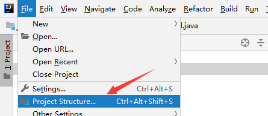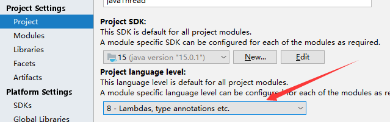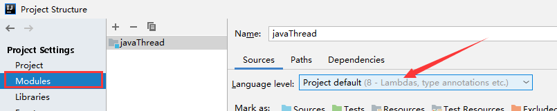

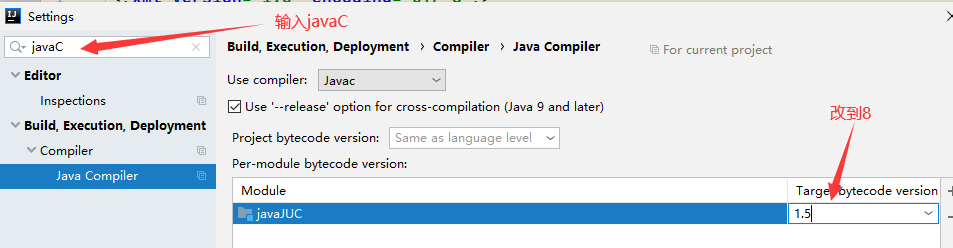


# 1. 什么是JUC

- 源码+官方文档

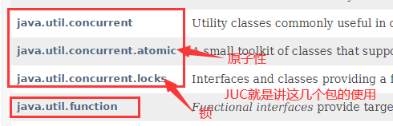


- 就是 java 工具包下的一些包和类 学习它的使用


# 2. 线程和进程

- java 默认有 2个线程， main线程和GC线程
- java无法开启线程，真正开启线程的是一个本地方法

```java
public synchronized void start() {
        /**
         * This method is not invoked for the main method thread or "system"
         * group threads created/set up by the VM. Any new functionality added
         * to this method in the future may have to also be added to the VM.
         *
         * A zero status value corresponds to state "NEW".
         */
        if (threadStatus != 0)
            throw new IllegalThreadStateException();

        /* Notify the group that this thread is about to be started
         * so that it can be added to the group's list of threads
         * and the group's unstarted count can be decremented. */
        group.add(this); //加入一个线程组

        boolean started = false;
        try {
            start0(); //调用一个start0()方法
            started = true;
        } finally {
            try {
                if (!started) {
                    group.threadStartFailed(this);
                }
            } catch (Throwable ignore) {
                /* do nothing. If start0 threw a Throwable then
                  it will be passed up the call stack */
            }
        }
    }

    private native void start0();  //start0()方法 native修饰方法 表示 该方法为一个本地方法，底层的C++去实现的
```

- 并发编程：为了充分利用cpu的资源

```java
//获取cpu的核数
package com.zdp;

public class Test01 {
    public static void main(String[] args) {
        //获取cpu的核数
        //cpu 密集型，IO密集型
        System.out.println(Runtime.getRuntime().availableProcessors());
    }
}
```


# 3.Lock锁（重点）

- 线程就是一个单独的资源类，他没有任何的附属操作（拿来即用）==>线程去操作资源类，类似线程不生产不拥有东西，线程只是去使用东西（写代码的思想模式）
- 并发：多个线程操作同一个资源，把资源丢入线程中

```java
package com.zdp;

//类似下面的操作，只是将要操作的资源类丢入线程中，线程去操作资源类，线程本身不拥有
//这里使用了传统的synchroinze锁
public class Test01 {
    public static void main(String[] args) {
        Tickets t = new Tickets();

        new Thread(()->{
            for (int i = 0; i < 20; i++) {
                t.sale();
                try {
                    Thread.sleep(100);
                } catch (InterruptedException e) {
                    e.printStackTrace();
                }
            }
        },"小明").start();
        new Thread(()->{
            for (int i = 0; i < 20; i++) {
                t.sale();
                try {
                    Thread.sleep(100);
                } catch (InterruptedException e) {
                    e.printStackTrace();
                }
            }
        },"小红").start();
        new Thread(()->{
            for (int i = 0; i < 20; i++) {
                t.sale();
                try {
                    Thread.sleep(100);
                } catch (InterruptedException e) {
                    e.printStackTrace();
                }
            }
        },"小刚").start();

    }
}

class Tickets{
    int ticketsNum = 30;
    public synchronized void sale(){
        if(ticketsNum>0){
            System.out.println(Thread.currentThread().getName()+"卖出去了第"+(31-ticketsNum--)+"张票,还剩余"+ticketsNum+"张票");
        }
    }
}

```


## 3.1 Lock为接口

- 主要是加锁和解锁
  - 可以看到lock使用的步骤
    - new 一个 Lock锁对象 `Lock l = new ReentrantLock()`
    - `l.lock(); `加锁
    - try{}中 编写业务代码
    - finally 中` l.unlock();`解锁

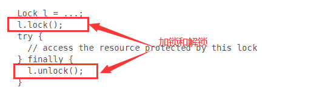

- 关于lock接口

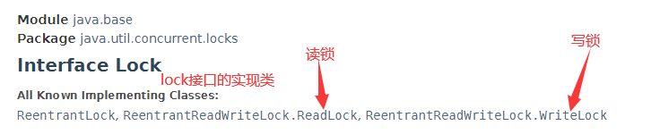

- 关于可重入锁 `ReentrantLock` （平常较常使用）

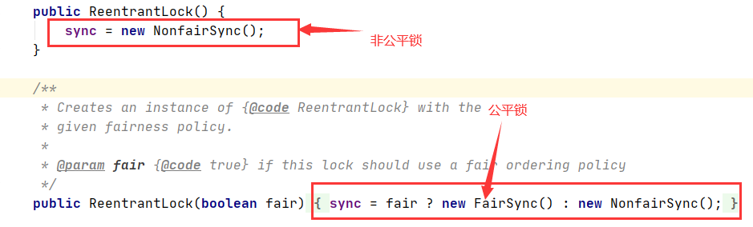

- 公平锁：十分公平，可以先来后到 --->后面等待的线程竞争锁的机制是先来后到	
- 非公平锁：不公平，可以插队--->即后面等待的线程竞争锁是根据cpu调度来的（默认）

## 3.2 Lock 和 Synchronized 的区别

1. Synchronized 为内置的java关键字，Lock 是一个java类
2. Synchronized 无法判断获取锁的状态，Lock 可以判断是否获得了锁
3. Synchronized 会自动释放锁，Lock必须要手动释放锁，如果不释放锁，死锁
4. Synchronized 线程1（获得锁，阻塞）、线程2（等待，永远地等待）； Lock锁就不一定会等待下去==> `lock.tryLock()`等不到锁就结束了
5. Synchronized 可重入锁，不可以中断的，非公平锁； Lock，可重入锁，可以判断锁，可以自己设置公平/非公平锁
6. Synchronized 适合锁少量的代码同步问题 ； Lock适合锁大量的同步代码

# 4 生产者消费者问题（Lock实现)

- **面试：单例模式，八大排序算法，生产者消费者问题**

- 解决虚假唤醒问题：

  - 判断条件应该在while循环体内（不要使用if判断） ====>因为 wait()的线程被唤醒后，是进入对象的锁池中，等待cpu调度来竞争锁，而**if判断只有一次**，也就是说，可能**在线程wait()阻塞的期间，有其他线程已经改变了 对象的值，而被唤醒 被调度的线程 进入运行状态，是不需要再进行判断的（因为在wait()之前已经进行了判断）===>但为了防止 线程在wait()阻塞期间，其他线程改变了对象的值，所以线程在进入运行状态后，应该重新进行判断， 所以用判断条件应该放在循环体内**

  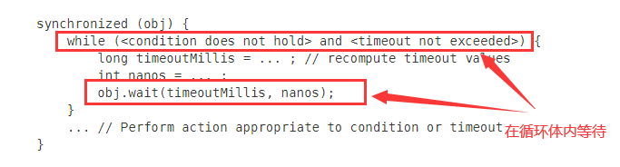


## 4.1 Condition 接口

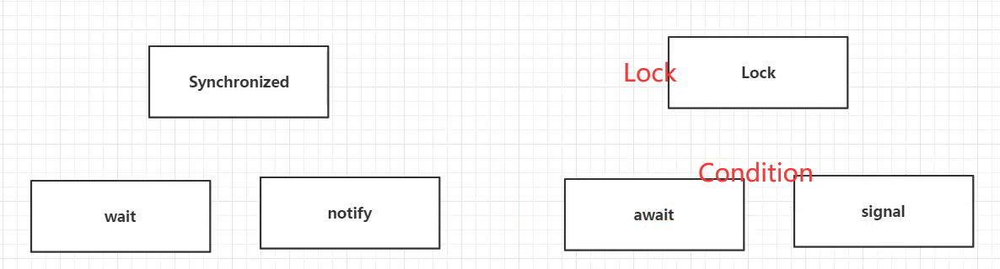

- 通过Lock 找到 Condition
- Condition 对应 同步监视器  Lock 对应 Synchronized
- 下图中使用两个 `Condition` ===>一个对象中 有两个等待池 ===>`Contidion`**使对象具有多个等待池，可能就是这样子来实现精确唤醒的？(没错！) 线程可以进入不同的等待池，但线程还是竞争同一个锁对象**

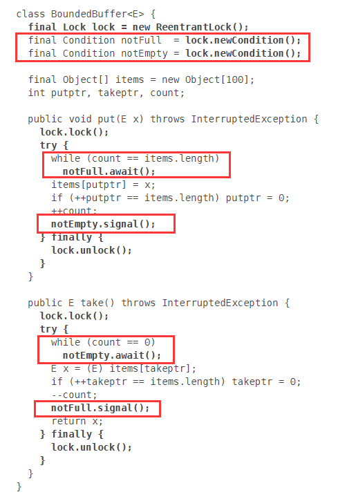


## 4.2**Condition 可以精确地通知和唤醒线程**（优势所在）

- 利用 `Condition`来指定线程执行顺序

```java
package com.zdp;

import java.util.concurrent.locks.Condition;
import java.util.concurrent.locks.Lock;
import java.util.concurrent.locks.ReentrantLock;

//创建 A B C三个线程 保证线程的执行顺序为 A->B->C
public class TestCondition {
    public static void main(String[] args) {
        //创建一个公共资源类
        Data1 data = new Data1();

        new Thread(()->{
            for (int i = 0; i < 5; i++) {
                data.printA();
            }
        },"A").start();

        new Thread(()->{
            for (int i = 0; i < 5; i++) {
                data.printB();
            }
        },"B").start();

        new Thread(()->{
            for (int i = 0; i < 5; i++) {
                data.printC();
            }
        },"C").start();

    }
}

class Data1{
    private Lock lock = new ReentrantLock();
    private Condition condition1 = lock.newCondition();
    private Condition condition2 = lock.newCondition();
    private Condition condition3 = lock.newCondition();
    private int Num=1;

    public void printA(){
        lock.lock();
        try{
            while(Num!=1){
                condition1.await();
            }
            System.out.println(Thread.currentThread().getName());
            Num = 2;
            condition2.signal();
        } catch (InterruptedException e) {
            e.printStackTrace();
        } finally {
            lock.unlock();
        }
    }

    public void printB(){
        lock.lock();
        try{
            while(Num!=2){
                condition2.await();
            }
            System.out.println(Thread.currentThread().getName());
            Num = 3;
            condition3.signal();
        } catch (InterruptedException e) {
            e.printStackTrace();
        } finally {
            lock.unlock();
        }
    }

    public void printC(){
        lock.lock();
        try{
            while(Num!=3){
                condition3.await();
            }
            System.out.println(Thread.currentThread().getName());
            Num = 1;
            condition1.signal();
        } catch (InterruptedException e) {
            e.printStackTrace();
        } finally {
            lock.unlock();
        }
    }

}
```


# 5 八锁现象（关于锁的八个问题）

1. 线程执行 没有用Synchroinzed 修饰的方法/代码块（普通方法） ===>没有锁 ，就不用竞争锁了===>线程的执行就不受锁的影响
2. `synchronized` 锁的对象 是方法的调用者 ===>线程调用不同对象的同步方法，互不影响，因为竞争的不是同一把锁
3. 静态的同步方法  ====> 因为 `synchronized` 锁的对象是方法的调用者，而静态方法的调用者是类，所以 `synchronized`锁的**该类对应的Class对象**====>线程调用不同对象的静态同步方法，竞争的是同一把锁（**该类对应的Class对象的锁,类对应的Class对象全局唯一**）
4. 静态同步方法和普通同步方法，同一个对象===> 静态同步方法和普通同步方法锁的对象不同，静态同步方法锁的是Class对象，而普通同步方法锁的是方法的调用者


# 6 集合安全类

## 6.1 CopyOnWriteArrayList

- 并发修改 不安全的集合类会产生异常 java.util.ConcurrentModificationException

```java
package com.zdp;

import java.util.ArrayList;
import java.util.List;
import java.util.UUID;

public class TestList {
    public static void main(String[] args) {

        List<String> list = new ArrayList<>();

        for (int i = 0; i < 10; i++) {
            new Thread(()->{
                list.add(UUID.randomUUID().toString().substring(0,5));
                System.out.println(list);
            },String.valueOf(i)).start();
        }
    }
}

```

- 运行结果图：

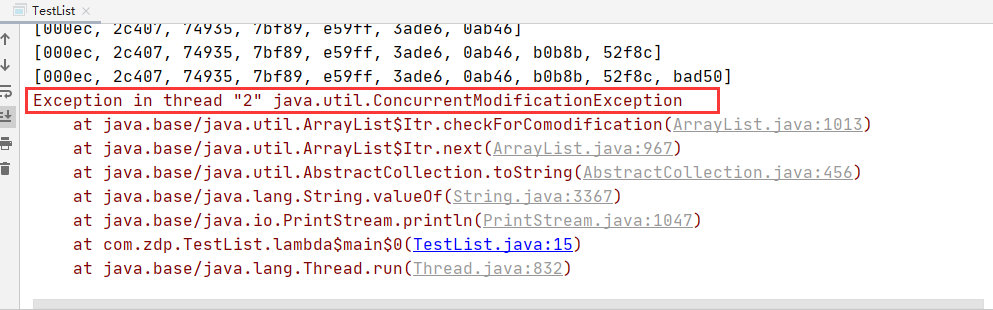

- 解决方法：

  - 使用工具类下的安全的集合类	`List<String> list = Collections.synchronizedList(new ArrayList<>());`
  - 使用`java.util.concurrent`包下的类

  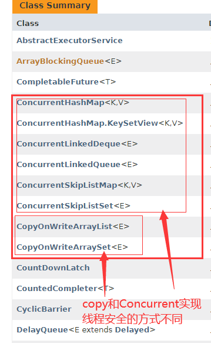

- 使用 `CopyOnWrite `类 ===>**写入时复制**  COW思想：计算基础程序设计领域的一种优化策略

  - `List<String> list = new CopyOnWriteArrayList<>();`
  - 多个线程调用的时候，list,读取的时候 是固定的 ； 写入的时候，复制一份对象中的数据，将复制的数据给调用者，调用者写入完成后，再将修改后的复制数据返还给对象，更新对象
  - 防止在多个线程同时写入的时候，因为数据覆盖而造成的数据问题

  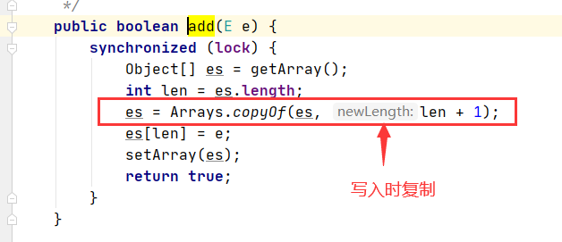


## 6.2 CopyOnWriteArraySet

- 跟 ArrayList没什么区别 ===>遇到异常找替代的方法，同ArrayList 的解决方法差不多

  - `Set<String> set = Collections.synchronizedSet(new HashSet<>());`
  - `Set<String> set = new CopyOnWriteArraySet<>();`

- HashSet的底层

  - 本质上是一个HashMap

  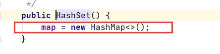

  - add方法

  

  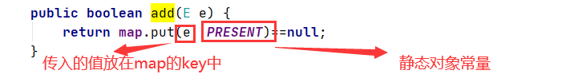


## 6.3 ConcurrentHashMap

- 没啥好写的，可以去深挖一下；


# 7.Callable

- Callable

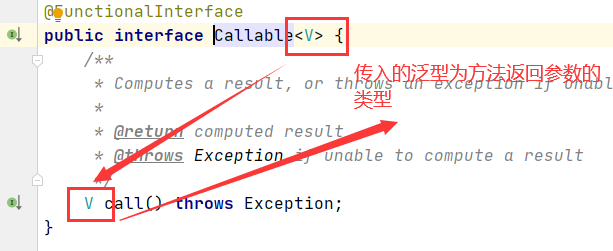

- `Thread()`只能实现 `Runnable `接口实现类 ====>如何让 `Thread() `来启动 Callable接口

  - 因为` Thread() `只能启动 `Runnable` 接口实现类，既然 `Thread()`无法启动 `Callable`接口，那么只能让`Callable `来与` Runnable`产生联系
  - 所以可以看一下` Runnable` 接口的实现类中是否有于` Callable`接口相关联的 ====>`FutureTask`  (Runnable接口实现类) 实现了Runnable接口的`run()`方法

  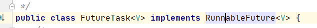

  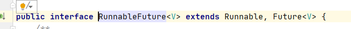

  - `FutureTask` 为适配类

  ```java
  class MyCallable implements Callable<Integer>{
      
      public Integer call(){
          sout("call()");
          return 1024;
      }
  }
  
  main(){
      MyCallable mycallable = new Mycallable();
      FutureTask task = new FutureTask(mycallable);
      new Thread(task,"A").start();
      new Thread(task,"B").start(); //call()会被打印一次 ===>为什么？ 可以去查一下 
      Integer result =(Integer) task.get();  //获得Callable 的返回结果 ，会产生阻塞，一般放到最后一行或者使用异步通信来处理
  }
  ```

- 为什么call()只被打印一次？？

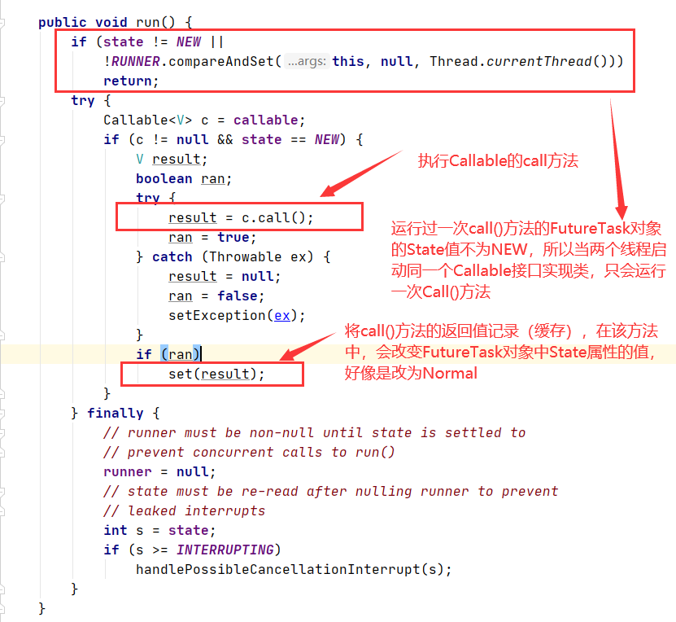

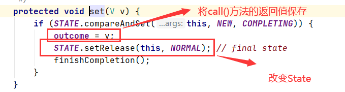

- 根据JDK文档介绍：

> Sets the result of this future to the given value unless this future has already been set or has been cancelled.
>
> This method is invoked internally by the [`RunnableFuture.run()`](RunnableFuture.html#run()) method upon successful completion of the computation.
>
> 意思大概是：将future的返回值设置为给定值，除非这个future的outcome已经被设置了。


# 8. 常用的辅助类（必会）

## 8.1 CountDownLatch

- 用来计数的（计数器，减法），是一个辅助工具类，结合代码理解？

```java
package com.zdp;

import java.util.concurrent.CountDownLatch;

public class TestCoutDownLatch {
    public static void main(String[] args) throws InterruptedException {
        //总数是6
        //在必须要先执行完某些任务才能往下执行时使用
        CountDownLatch countDownLatch = new CountDownLatch(6);
        //等待六个线程执行完毕
        for (int i = 1; i <= 6; i++) {
            new Thread(()->{
                System.out.println(Thread.currentThread().getName()+"Go out");
                countDownLatch.countDown();//数量-1
            },String.valueOf(i)).start();
        }

       //countDownLatch.await(); //等待计数器归零，计数器归零才向下执行
        System.out.println("close Door");
    }
}
```

- 运行结果图 :

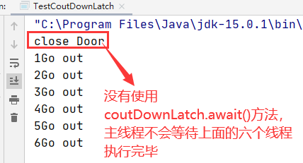

```java
package com.zdp;

import java.util.concurrent.CountDownLatch;

public class TestCoutDownLatch {
    public static void main(String[] args) throws InterruptedException {
        //总数是6
        //在必须要先执行完某些任务才能往下执行时使用
        CountDownLatch countDownLatch = new CountDownLatch(6);
        //等待六个线程执行完毕
        for (int i = 1; i <= 6; i++) {
            new Thread(()->{
                System.out.println(Thread.currentThread().getName()+"Go out");
                countDownLatch.countDown();//数量-1
            },String.valueOf(i)).start();
        }

       countDownLatch.await(); //等待计数器归零，计数器归零才向下执行
        System.out.println("close Door");
    }
}

```

- 运行结果图：

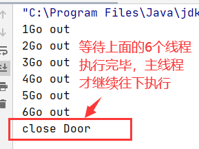

- 原理
  - `countDownLatch.countDown();`
  - `countDownLatch.await();`
  - 每次有线程调用 `countDown()`数量-1，等计数器变为0，调用`countDownLatch.await()`的线程就会被唤醒，继续执行；


## 8.2 CyclicBarrier（加法计数器）

- 构造方法

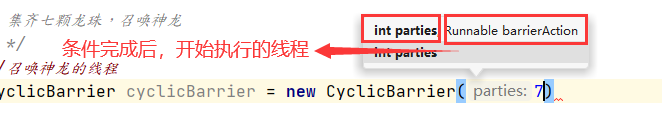

```java
package com.zdp;

import java.util.concurrent.BrokenBarrierException;
import java.util.concurrent.CyclicBarrier;

public class TestCyclicBarrier {
    public static void main(String[] args) {
        /*
        * 集齐七颗龙珠，召唤神龙
        * */
        //召唤神龙的线程
        CyclicBarrier cyclicBarrier = new CyclicBarrier(7,()->{
            System.out.println("召唤神龙成功");
        });
        for (int i = 0; i < 7; i++) {
            //lambda 如何操作i变量 ===》内部类的知识点
            final int temp = i;
            new Thread(()->{
                System.out.println("收集到了第"+(temp+1)+"颗龙珠");
                try {
                    cyclicBarrier.await();//等待这七个线程执行完毕，线程每执行完一个，parties+1，知道parties到7
                } catch (InterruptedException e) {
                    e.printStackTrace();
                } catch (BrokenBarrierException e) {
                    e.printStackTrace();
                }
            }).start();
        }
    }
}
```

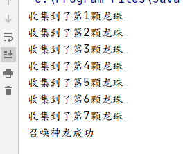

- 若将代码的执行计数器设置为8

  运行结果如下：（永远无法执行传入`CyclicBarrier`对象的`Runnable`线程）

  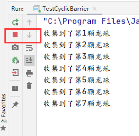


- 核心关键：`cyclicBarrier.await();`会进行计数，当条件达到，执行传入`CyclicBarrier`对象的`Runnable`接口实现类

## 8.3 Semaphore （操作系统中的信号量机制）（在并发中用的多）

- `Semaphore` ：代表可以使用的资源（可以使用的线程数）

- 主要方法：

  - `acquire()`：得到可使用的资源，信号量+1，该方法会造成阻塞（如果信号量<=0），直到资源被释放为止
  - `release()`：释放，信号量+1，唤醒等待的线程 ==>每个`acquire()`方法都要跟上一个`release()`
  - 构造方法：（boolean 决定公平锁和不公平锁）

  

  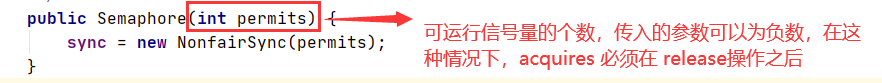

- 作用：**多个共享资源互斥的使用！并发限流，控制最大的线程数！**（可以去看看操作系统的信号量机制，可以去复习一波操作系统了）

- 代码：

```java
package com.zdp;

import java.util.concurrent.Semaphore;
import java.util.concurrent.TimeUnit;

public class TestSemaphore {
    public static void main(String[] args) {
        //限流的时候可以使用
        //模拟一个抢车位操作，可供使用的车位为3个，共有6辆车（线程）
        Semaphore semaphore = new Semaphore(3);
        for (int i = 0; i < 6; i++) {
            new Thread(()->{
                //首先获取可用资源
                try {
                    semaphore.acquire();
                    //获取到资源后，执行操作
                    System.out.println(Thread.currentThread().getName()+"抢到车位");
                    //模拟延时
                    TimeUnit.SECONDS.sleep(1);
                    System.out.println(Thread.currentThread().getName()+"离开车位");
                } catch (InterruptedException e) {
                    e.printStackTrace();
                }finally {
                    //acuqire() 方法必须与 release()方法配套
                    semaphore.release();
                }
            },String.valueOf(i+1)).start();
        }
    }
}

```

- 运行结果图：

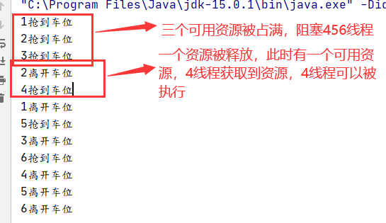


# 9. ReadWriteLock (读写锁)

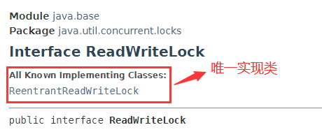

> A `ReadWriteLock` maintains a pair of associated [`locks`](Lock.html), one for read-only operations and one for writing. The [read lock](#readLock()) may be held simultaneously by multiple reader threads, so long as there are no writers. The [write lock](#writeLock()) is exclusive.
>
> 大概的意思就是：ReadWriteLock 中有一对 关联锁（读锁和写锁），一个进行只读操作，一个进行写操作。读锁 可以被多个读线程同时占有，只要没有写线程。（读锁和写锁不可同时拥有） 写锁是独占的

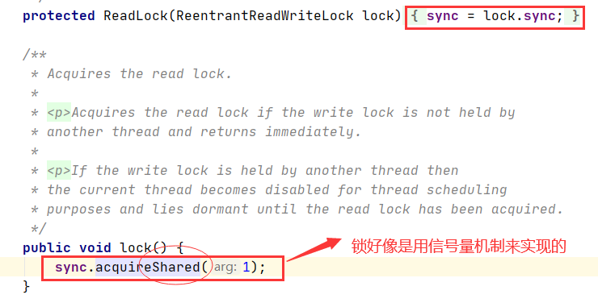

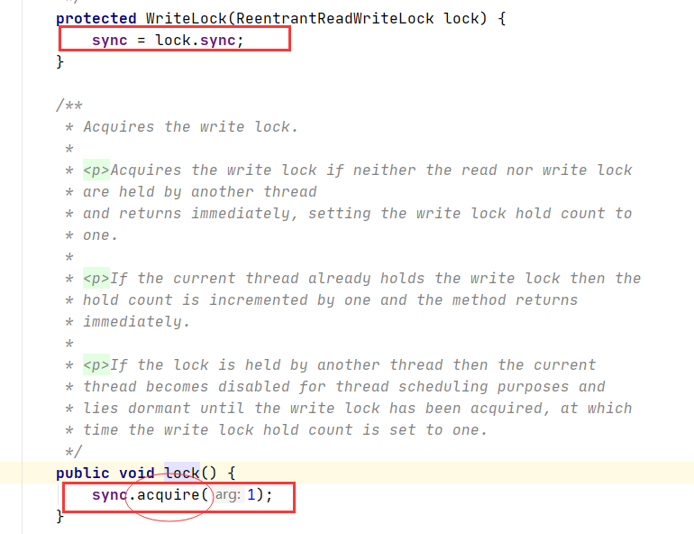

- `ReadWriteLock` 
  - 读-读 可以共存
  - 读-写 不可共存
  - 写-写 不可共存
- 独占锁（写锁） 一次只能被一个线程占有
- 共享锁（读锁） 多个线程可以同时占有

```java
package com.zdp;

import java.util.HashMap;
import java.util.Map;
import java.util.concurrent.TimeUnit;
import java.util.concurrent.locks.ReadWriteLock;
import java.util.concurrent.locks.ReentrantReadWriteLock;

public class TestReadWriteLock {
    public static void main(String[] args) {
        MyCache mycache = new MyCache();

        //写线程
        for (int i = 1; i < 6; i++) {
            final int temp = i;
            new Thread(()->{
                mycache.put(String.valueOf(temp),String.valueOf(temp));
            },String.valueOf(i)).start();
        }

        //读线程
        for (int i = 1; i < 6; i++) {
            final int temp = i;
            new Thread(()->{
                mycache.get(String.valueOf(temp));
            },String.valueOf(i)).start();
        }

    }
}

/*
* 自定义缓存
* */
class MyCache{
    private volatile Map<String,Object>map = new HashMap<>();
    //读写锁，更加细粒度的控制
    //写锁==>写操作只允许一个线程操作
    //读锁==>读操作可以允许多个线程操作
    private ReadWriteLock readWriteLock = new ReentrantReadWriteLock();

    //存操作，写入的时候，同时只能有一个线程操作
    //写与读不可以同时操作
    public void put(String key,String Object){
        //写锁加锁
        readWriteLock.writeLock().lock();
        try{
            System.out.println(Thread.currentThread().getName()+"写入"+key);
            map.put(key,Object);
            TimeUnit.SECONDS.sleep(1);
            System.out.println(Thread.currentThread().getName()+"写入"+key+"完毕");
        } catch (InterruptedException e) {
            e.printStackTrace();
        } finally {
            readWriteLock.writeLock().unlock();
        }
    }

    //读操作，读的时候可以同时多个线程读取
    public void get(String key){
        readWriteLock.readLock().lock();
        try{
            System.out.println(Thread.currentThread().getName()+"读取"+key);
            map.get(key);
            TimeUnit.SECONDS.sleep(1);
            System.out.println(Thread.currentThread().getName()+"读取"+key+"完毕");
        } catch (InterruptedException e) {
            e.printStackTrace();
        } finally{
            readWriteLock.readLock().unlock();
        }
    }
}
```

- 运行结果：

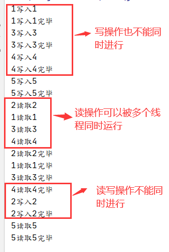


# 10 阻塞队列

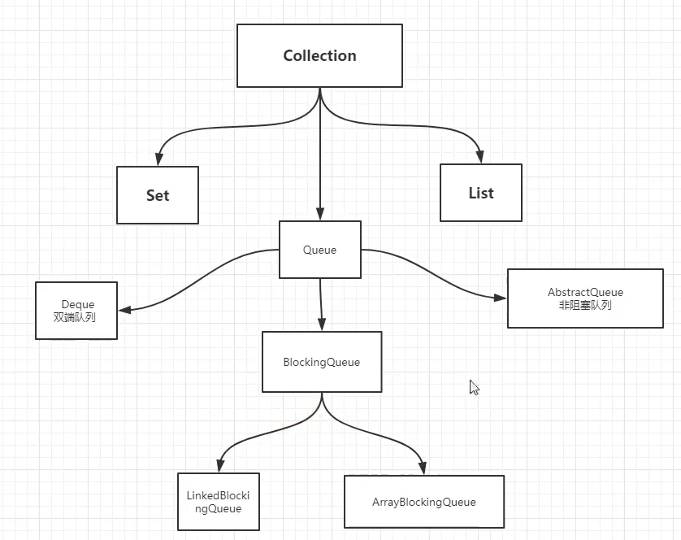

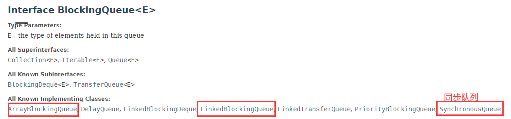

- 写入：如果队列满了，就必须阻塞等待读取
- 读取：如果队列是空，必须阻塞等待生产
- `BlockingQueue` 为接口
- 什么时候使用 阻塞队列： 线程池，多线程等（典型场景：生产者消费者问题 )

## 10.1 阻塞队列使用方法

- 构造方法 ===>要传入队列大小的参数

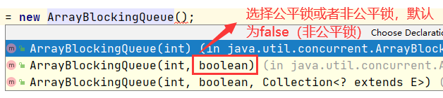

四组API

这些操作都好像有加锁，看**源码**

- 抛出异常  ===>添加时，队列已满，抛出异常  删除时，队列已空，抛出异常   获取队首时，队列为空，抛出异常
- 不会抛出异常 ===>offer()方法返回true/false, poll()方法返回被删除的值，如果队列为空，返回null, peek方法，队列为空，返回null
- 阻塞等待

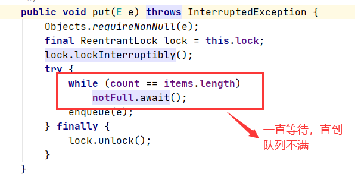

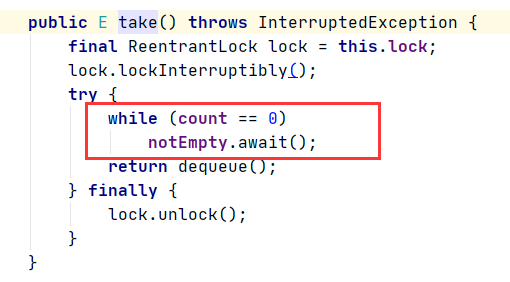

- 超时等待

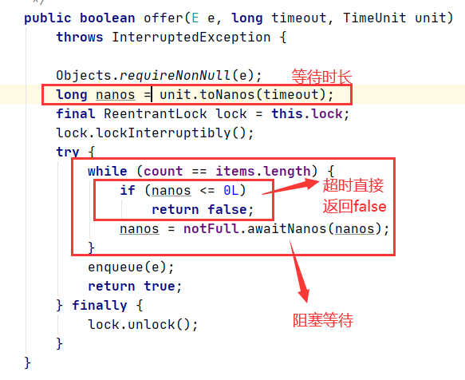

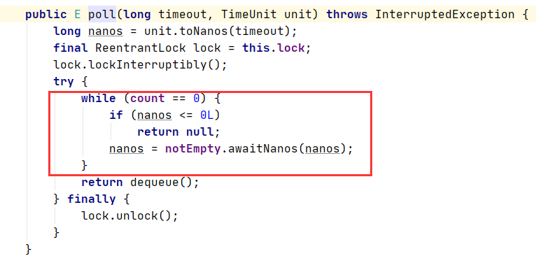

| 方式         | 抛出异常  | 有返回值，不抛出异常 | 阻塞等待 | 超时等待                  |
| ------------ | --------- | -------------------- | -------- | ------------------------- |
| 添加         | add(e)    | offer(e)             | put(e)   | offer(e,timeout,TimeUnit) |
| 删除         | remove()  | poll()               | take()   | poll(timeout,TimeUnit)    |
| 获得队首元素 | element() | peek()               |          |                           |

## 10.2  同步队列	SynchronizedQueue

- 容量为1，队列中放入一个元素，必须被取出来后，才可以再往里面放一个元素；否则会产生阻塞
- `put` `take`操作

```java
package com.zdp;

import java.util.concurrent.SynchronousQueue;
import java.util.concurrent.TimeUnit;

public class TestSynchronizedQueue {
    public static void main(String[] args) throws InterruptedException {
        SynchronousQueue synchronousQueue = new SynchronousQueue();
        //一个线程放
        new Thread(()->{
            try {
                synchronousQueue.put(1);
                System.out.println(Thread.currentThread().getName()+"放入了1");
                synchronousQueue.put(2);
                System.out.println(Thread.currentThread().getName()+"放入了2");
                synchronousQueue.put(3);
                System.out.println(Thread.currentThread().getName()+"放入了3");
            } catch (InterruptedException e) {
                e.printStackTrace();
            }
        },"放置线程").start();

        new Thread(()->{
            try {
                TimeUnit.SECONDS.sleep(1);
                System.out.println(Thread.currentThread().getName()+"===>"+synchronousQueue.take());
                TimeUnit.SECONDS.sleep(1);
                System.out.println(Thread.currentThread().getName()+"===>"+synchronousQueue.take());
                TimeUnit.SECONDS.sleep(1);
                System.out.println(Thread.currentThread().getName()+"===>"+synchronousQueue.take());
            } catch (InterruptedException e) {
                e.printStackTrace();
            }
        },"读取线程").start();
        TimeUnit.SECONDS.sleep(6);
    }
}

```


# 11 线程池

**池化技术**

- 程序运行===>占用系统资源====>优化资源的使用====>池化技术

  线程池、连接池、内存池、对象池..... （创建和销毁十分浪费资源）

  池化技术：事先准备好一些资源，有人需要使用，就来池子中拿，使用完毕后，归还

- **线程池的好处**

  - 降低资源的消耗
  - 提高响应的速度
  - 方便管理。
  - 线程可以复用，可以控制最大并发数，管理线程

> **线程池：三大方法，七大参数，四种拒绝策略**

- 规范：

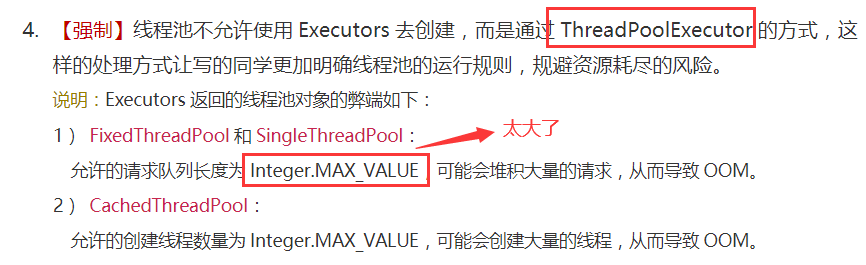

- 三大方法

  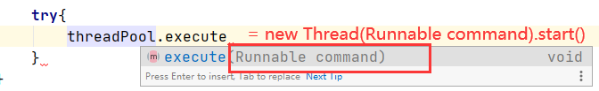

  ```java
  package pool;
  
  import java.util.concurrent.ExecutorService;
  import java.util.concurrent.Executors;
  
  //使用线程池 拿出线程
  //三大方法 1)创建线程池
  //2)执行线程
  //3）关闭线程池
  public class TestExecutors {
      public static void main(String[] args) {
         // ExecutorService threadPool = Executors.newSingleThreadExecutor();//单个线程
        ExecutorService threadPool = Executors.newFixedThreadPool(5);//创建一个固定大小的线程池
       // ExecutorService threadPool = Executors.newCachedThreadPool();//该线程池可以根据需要创建线程， 也会复用以前创建的线程
  
          try{
              for (int i = 0; i < 5; i++) {
                  threadPool.execute(()->{
                      System.out.println(Thread.currentThread().getName()+"执行");
                  });
              }
  
          }finally{
              threadPool.shutdown();
          }
      }
  }
  
  ```

- 七大参数

```java
 public static ExecutorService newSingleThreadExecutor() {
        return new FinalizableDelegatedExecutorService
            (new ThreadPoolExecutor(1, 1, // 核心线程数1，最大线程数1
                                    0L, TimeUnit.MILLISECONDS, //超时单位 毫秒
                                    new LinkedBlockingQueue<Runnable>()));
    }
public static ExecutorService newCachedThreadPool() {
        return new ThreadPoolExecutor(0, Integer.MAX_VALUE,//约为21亿
                                      60L, TimeUnit.SECONDS,
                                      new SynchronousQueue<Runnable>());
    }
public static ExecutorService newFixedThreadPool(int nThreads) {
        return new ThreadPoolExecutor(nThreads, nThreads, // 核心线程数和最大线程数为传入的参数nThreads
                                      0L, TimeUnit.MILLISECONDS,
                                      new LinkedBlockingQueue<Runnable>());
    }

```

可以看出来，三个创建线程池的方法，本质上都是调用 ThreadPoolExecutor()方法，只是传入的方法的参数有所不同而已

- `ThreadPoolExecutor()`
  - 核心线程池大小：===>一般情况下线程池内有多少个线程
  - 线程池最大大小：===>线程池内最多有几个线程
    - 最大线程大小如何定义？
    - 1. **CPU 密集型===>几核cpu 就定义为几，可以保证cpu的效率最高**
      2. **IO密集型==>判断程序中十分耗IO的线程有多少个，假设有15个大型任务，设置为30个（2倍）**
      3. 这两个概念去了解一下
  - `keepAliveTime` ===>超过一段时间没被使用的线程，将会被释放
  - 阻塞队列：==>线程池中的所有线程都在执行 Runnable，此时进来的Runnable 将进入阻塞队列，等待线程空闲
  - 拒绝策略：===>阻塞队列已满，还有Runnable 对象要进入线程池调用线程执行，线程池将拒绝这些Runnable

```java
public ThreadPoolExecutor(int corePoolSize, // 核心线程池大小
                              int maximumPoolSize, //线程池最大大小
                              long keepAliveTime, //保持存在的时间，如果超时还没有人调用，就会释放
                              TimeUnit unit,//超时时间单位
                              BlockingQueue<Runnable> workQueue,//阻塞队列
                              ThreadFactory threadFactory,//线程工厂，用于创建线程，一般不用修改
                              RejectedExecutionHandler handler // 拒绝策略) {
        if (corePoolSize < 0 ||
            maximumPoolSize <= 0 ||
            maximumPoolSize < corePoolSize ||
            keepAliveTime < 0)
            throw new IllegalArgumentException();
        if (workQueue == null || threadFactory == null || handler == null)
            throw new NullPointerException();
        this.corePoolSize = corePoolSize;
        this.maximumPoolSize = maximumPoolSize;
        this.workQueue = workQueue;
        this.keepAliveTime = unit.toNanos(keepAliveTime);
        this.threadFactory = threadFactory;
        this.handler = handler;
    }
```

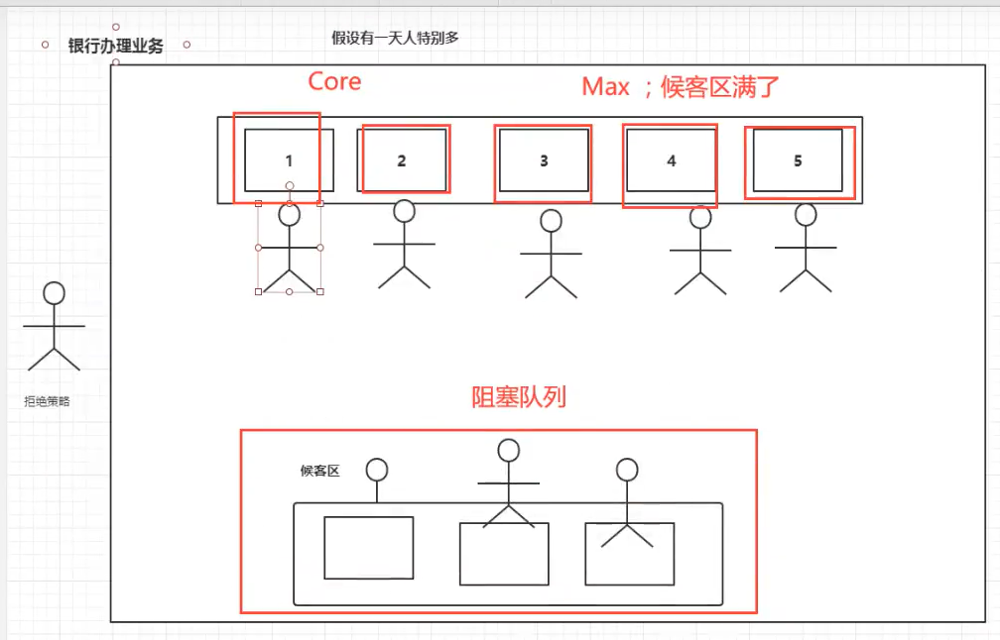

- 手动创建线程池

```java
package pool;

import java.util.concurrent.*;

public class CreatPool {
    public static void main(String[] args) {
        ExecutorService threadPool = new ThreadPoolExecutor(2,
                5,
                3,
                TimeUnit.SECONDS,
                new LinkedBlockingDeque<Runnable>(3),
                Executors.defaultThreadFactory(),
                new ThreadPoolExecutor.AbortPolicy() //ThreadPool默认的拒绝策略，当阻塞队列已满，还有Runnable 对象要处理，不受理这个对象，并抛出异常
                );
    }
}

```

- 四大拒绝策略：

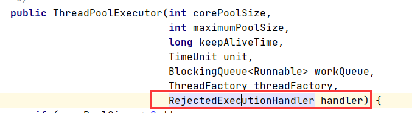

RejectedExecutionHandler接口的四个实现类:（四大拒绝策略）

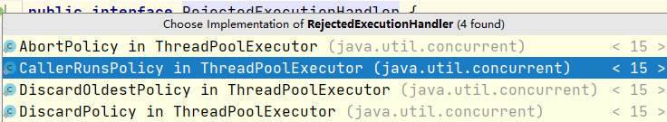

- `AbortPolicy`
- `CallerRunsPolicy` :哪儿来的去哪儿，比如 main线程 要 使用一个线程来处理Runnable，但线程池满了，只能由main线程来处理这个Runnable
- `DiscardOldestPolicy` ：队列满了，尝试和最早的竞争，不会抛出异常
- `DiscardPolicy`：队列满了，丢掉Runnablb对象，不会抛出异常


# 12.四大函数式接口（必须掌握）

- 需要掌握的：lambda表达式，链式编程，函数式接口，Stream流式计算

- 函数式接口：只有一个方法的接口 ====>一般有个注解 @FunctionalInterface

  - 简化编程模型，在新版本的框架底层大量应用

- 四大函数式接口： 在 java.util.function中

  - `Consumer`：消费型接口

    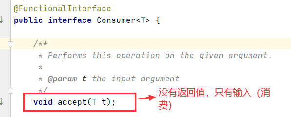

    ```java
    package function;
    
    import java.util.function.Consumer;
    
    public class TestConsumer {
        public static void main(String[] args) {
            Consumer<String> c = new Consumer<String>() {
                @Override
                public void accept(String s) {
                    System.out.println(s);
                }
            };
            Consumer<String> c1 = (s)->{
                System.out.println(s);
            };
            c.accept("1");
            c1.accept("2");
        }
    }
    ```

  - `Function`：函数型接口

    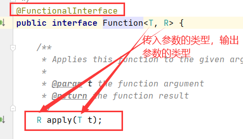

    ```java
    package function;
    
    import java.util.function.Function;
    
    public class TestFunction {
        public static void main(String[] args) {
           /* Function<String,String> f = new Function<String,String>() {
                @Override
                public String apply(String o) {
                    return o;
                }
            };*/
           Function<String,String> f = (o)->{
               return o;
           };
            System.out.println(f.apply("a"));
        }
    }
    
    ```

  - `Predicate`：断定型接口

    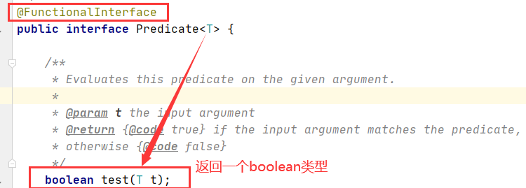

    ```java
    package function;
    
    import java.util.function.Predicate;
    
    public class TestPrediect {
        public static void main(String[] args) {
            Predicate<String> p = new Predicate<String>(){
                @Override
                public boolean test(String o) {
                    return o.isEmpty();
                }
            };
            Predicate<String> p1 = (o)->{
                return o.isEmpty();
            };
            System.out.println(p.test(""));
            System.out.println(p1.test(""));
        }
    }
    
    ```

  - `Supplier`：供给型接口（与consumer对应）

    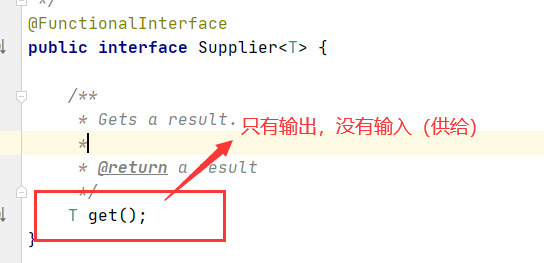

    ```java
    package function;
    
    import java.util.function.Supplier;
    
    public class TestSupplier {
        public static void main(String[] args) {
            Supplier<String> s = new Supplier<String>(){
                @Override
                public String get() {
                    System.out.println("生成了一个字符串s");
                    return "s";
                }
            };
            Supplier<String> s1 = ()->{
                System.out.println("生成了一个字符串s1");
                return "s1";
            };
            System.out.println(s.get());
            System.out.println(s1.get());
        }
    }
    ```


# 13 Stream流式计算

存储+计算

- 集合、mysql...本质就是用来存储东西的
- 计算都应该交给 流 来操作！

> 题目：一行代码实现
>
> 1. 现在有五个用户，筛选：
> 2. ID必须是偶数
> 3. 年龄必须大于23岁
> 4. 用户名转为大写字母
> 5. 用户名字母逆序
> 6. 只输出一个用户

- Stream 接口 --->几个常用的方法

  - 过滤元素

  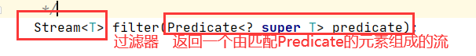

  - 有点类似映射，将原来流内的所有元素 映射为其他元素

  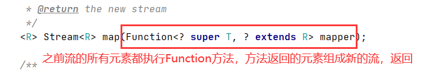

  - `Sorted` ===>对流内的元素进行排序

  

  - `forEach`  ===> 对流内的所有元素都执行这个方法

  

- 代码：

```java
package Stream;

import java.util.Arrays;
import java.util.List;
/*
* 1. 现在有五个用户，筛选：
2. ID必须是偶数
3. 用户名转为大写字母
4. 用户名字母逆序
5. 只输出一个用户
* */
public class Test {
    public static void main(String[] args) {
        User u1 = new User(1,"a",21);
        User u2 = new User(2,"b",22);
        User u3 = new User(3,"c",23);
        User u4 = new User(4,"d",24);
        User u5 = new User(5,"e",25);
        List<User> list = Arrays.asList(u1,u2,u3,u4,u5);

        //将计算交给Stream流
        list.stream()
                .filter(uu->{return uu.getId()%2==0;})
                .filter(uu->{return uu.getAge()>23;})
                .map((uu1)->{
                    uu1.setName(uu1.getName().toUpperCase());
                    return uu1;
                })
                .sorted((uu1,uu2)->{
                   return uu2.getName().compareTo(uu1.getName());
                }).limit(1).forEach((uu1)->{
            System.out.println(uu1);
        });
    }
}

```


# 14 ForkJoin (分支合并)

- ForkJoin 并行执行任务，提高效率。大数据量

- Map Reduce(大任务拆分为小任务（有点像归并算法）)

  

- ForkJoinPool 特点:  **工作窃取**

  - `ForkJoinPool`维护的都是双端队列===>两边都可以操作


- ForkJoin 操作


- `ForkJoinPool` 是 用于运行 `ForkJoinTask` 的 ExecutorService

- `ForkJoinPool`与其他的 ExecutorService 的不同点在于采取了**工作窃取**

- **ForkJoinPool** 方法

  

  - 执行一个提交的 ForkJoinTask<T>任务（也可以是在池子中等待的===>双端队列中等待）
  - 

  

  

-  **ForkJoinTask** 

  

  - 为一个抽象类，使用ForkJoinTask 就要 创建一个 ForkJoinTask 的实现类

  

  - 方法： `fork()`，将ForkJoinTask 任务压入线程队列;

    `join()` 任务结果

- ForkJoinTask 子类

  - `Class RecursiveAction`

    ```
    public abstract class RecursiveAction extends ForkJoinTask<Void>
     //是一个递归的 无结果的 ForkJoinTask
    //示例代码：对给定的long[]数组进行排序
     //ForkJoinTask 实现类
    static class SortTask extends RecursiveAction {
       final long[] array; final int lo, hi;
       SortTask(long[] array, int lo, int hi) {
         this.array = array; this.lo = lo; this.hi = hi;
       }
       SortTask(long[] array) { this(array, 0, array.length); }
       protected void compute() { // 实现类必须实现的抽象方法
         if (hi - lo < THRESHOLD)
           sortSequentially(lo, hi);
         else {
           int mid = (lo + hi) >>> 1; //===>划分子任务
           invokeAll(new SortTask(array, lo, mid),
                     new SortTask(array, mid, hi));
           merge(lo, mid, hi); //合并
         }
       }
       // implementation details follow:
       static final int THRESHOLD = 1000;
       void sortSequentially(int lo, int hi) {
         Arrays.sort(array, lo, hi);
       }
       void merge(int lo, int mid, int hi) {
         long[] buf = Arrays.copyOfRange(array, lo, mid);
         for (int i = 0, j = lo, k = mid; i < buf.length; j++)
           array[j] = (k == hi || buf[i] < array[k]) ?
             buf[i++] : array[k++];
       }
     }
    ```

  - `Class RecursiveTask<V>` 递归的，有返回值的 ForkJoinTask

    ```
    //斐波那契数列
     class Fibonacci extends RecursiveTask<Integer> {
       final int n;
       Fibonacci(int n) { this.n = n; }
       protected Integer compute() {
         if (n <= 1)
           return n;
         Fibonacci f1 = new Fibonacci(n - 1);
         f1.fork();
         Fibonacci f2 = new Fibonacci(n - 2);
         return f2.compute() + f1.join();
       }
     }
        
    ```

- ForkJoin使用步骤

  - 创建 ForkJoinPool 服务，用于执行ForkJoinTask
  - 创建 ForkJoinTask 实现类，实现抽象方法 compute()
  - 利用 ForkJoinPool 执行 ForkJoinTask 对象

  实现类：

  ```
  package ForkJoin;
  
  import java.util.concurrent.RecursiveTask;
  
  public class ForkJoinDemo extends RecursiveTask<Long> {
      private Long start;
      private Long end;
      private Long temp = 10000L;
  
      public ForkJoinDemo(Long start, Long end) {
          this.start = start;
          this.end = end;
      }
  
      @Override
      protected Long compute() {
          if((end-start)<temp){
              Long sum = 0L;
              for (Long i = start; i <= end; i++) {
                  sum += i;
              }
              return sum;
          }else{
              //分治
              Long middle = (end+start)>>>1;
              ForkJoinDemo task1 = new ForkJoinDemo(start,middle);
              task1.fork(); //将任务压入 线程队列中（安排在当前任务正在执行的池子中异步执行该任务）,类似start()
              ForkJoinDemo task2 = new ForkJoinDemo(middle+1,end);
              task2.fork();
              return task1.join()+task2.join();
              //join() 返回任务的计算结果
          }
  
      }
  }
  ```

  测试类:

  ```
  package ForkJoin;
  
  import java.util.concurrent.ExecutionException;
  import java.util.concurrent.ForkJoinPool;
  import java.util.concurrent.ForkJoinTask;
  import java.util.stream.LongStream;
  
  public class Test {
      public static void main(String[] args) throws ExecutionException, InterruptedException {
          long start = System.currentTimeMillis(); //计算执行时间
          Test1();
          Long end = System.currentTimeMillis();
          System.out.println("运行时间为"+(end-start));
          Test2();
          start = System.currentTimeMillis();
          System.out.println("运行时间为"+(start-end));
          Test3();
          end = System.currentTimeMillis();
          System.out.println("运行时间为"+(end-start));
  
  
      }
  
      static void Test1() throws ExecutionException, InterruptedException {
  
          ForkJoinPool forkJoinPool = new ForkJoinPool();
          ForkJoinTask<Long> task = new ForkJoinDemo(0L,10_0000_0000L);
          //将任务放到池子中运行
          ForkJoinTask<Long> submit = forkJoinPool.submit(task);
          //获取到运行的结果
          System.out.println("sum = "+submit.get());
      }
      static void Test2(){
          Long sum = 0L;
          for (long i = 0; i <= 10_0000_0000L; i++) {
              sum += i;
          }
          System.out.println("sum = "+sum);
      }
      //Stream并行计算
      static void Test3(){
          long sum = LongStream.rangeClosed(0L,10_0000_0000L).parallel().reduce(0,Long::sum);
          System.out.println("sum = "+sum);
      }
  }
  
  ```

- 运行结果图：（我也不懂为什么这个弱智ForkJoin还比人家慢=====>ForkJion适用于**大数据量**的情况）


# 15 异步回调


- 一个关键类 `CompletableFuture`
  - 一般就是 异步执行
  - 成功回调
  - 失败回调
- 代码：

```java
package Future;

import java.util.concurrent.CompletableFuture;
import java.util.concurrent.ExecutionException;
import java.util.concurrent.TimeUnit;

public class demo {
    public static void main(String[] args) throws ExecutionException, InterruptedException {
        //有无返回值，看使用的方法传入的函数式接口为什么
         //没有返回值的 runAsync 异步回调
        CompletableFuture<Void> completableFuture1 = CompletableFuture.runAsync(()->{
            try {
                TimeUnit.SECONDS.sleep(2);
            } catch (InterruptedException e) {
                e.printStackTrace();
            }
            System.out.println(Thread.currentThread().getName()+"runAsync=>Void");
        });

        completableFuture1.get(); // 获取阻塞执行结果
        System.out.println("1111");

        // 有返回值的 supplyAsync 异步回调
        // ajax，成功和失败的回调
        // 失败的回调==>exceptionally()
        //无论成功还是失败都会回调的函数 whenComplete
        CompletableFuture<Integer> completableFuture = CompletableFuture.supplyAsync(()->{
            System.out.println(Thread.currentThread().getName()+"supplyAsync=>Integer");
            int i = 10/0;
            System.out.println("是否正常完成");
            return 1024;
        });

        System.out.println(completableFuture.whenComplete((t, u) -> { //whenComplete，无论是否执行完毕，都会执行
            System.out.println("t=>" + t); // 正常的返回结果
            System.out.println("u=>" + u); // 错误信息：java.util.concurrent.CompletionException: java.lang.ArithmeticException: / by zero
        }).exceptionally((e) -> {
            System.out.println(e.getMessage());
            return 233; // 可以获取到错误的返回结果
        }).get());

    }
}

```

- 运行结果图：


# 16 JMM

> 对于Volatile 的理解

`Volatile` 是java虚拟机提供**轻量级的同步机制**

1. 保证可见性
2. **不保证原子性**
3. 禁止指令重排

如何保证可见性？

- 可见性与 JMM挂钩

> 什么是JMM

`JMM` : Java 内存模型，不存在的东西，只是一种概念，约定

**关于一些JMM的一些同步的约定**

1. 线程解锁前，必须把共享变量**立刻**返回主存 ====>线程如何操作共享变量
   - 线程会将 主存中的共享变量 拷贝一份到 线程自己的工作内存中
   - 线程对共享变量的操作，其实就是对在自己工作内存中的 共享变量的副本 进行操作
   - 线程解锁前，必须将 操作后的共享变量的副本 返回主存（覆盖主存中的共享变量）
2. 线程加锁前，必须读取主存中的最新值到工作内存中。
3. 加锁和解锁是同一把锁

**关于线程** 

1. 工作内存===>每个线程都有自己的工作内存和执行引擎
2. 主内存

 **JMM 里的八种约定（四组操作)**

- 四组操作，如下图所示


- 八种操作详细：

内存交互操作有8种，虚拟机实现必须保证每一个操作都是原子的，不可在分的（对于double和long类型的变量来说，load、store、read和write操作在某些平台上允许例外）

- lock   （锁定）：作用于主内存的变量，把一个变量标识为线程独占状态

- unlock （解锁）：作用于主内存的变量，它把一个处于锁定状态的变量释放出来，释放后的变量才可以被其他线程锁定
- read  （读取）：作用于主内存变量，它把一个变量的值从主内存传输到线程的工作内存中，以便随后的load动作使用
- load   （载入）：作用于工作内存的变量，它把read操作从主存中变量放入工作内存中
- use   （使用）：作用于工作内存中的变量，它把工作内存中的变量传输给执行引擎，每当虚拟机遇到一个需要使用到变量的值，就会使用到这个指令
- assign （赋值）：作用于工作内存中的变量，它把一个从执行引擎中接受到的值放入工作内存的变量副本中
- store  （存储）：作用于主内存中的变量，它把一个从工作内存中一个变量的值传送到主内存中，以便后续的write使用
- write 　（写入）：作用于主内存中的变量，它把store操作从工作内存中得到的变量的值放入主内存的变量中

JMM对这八种指令的使用，制定了如下规则：

- **不允许read和load、store和write操作之一单独出现**。即使用了read必须load，使用了store必须write

- 不允许线程丢弃他最近的assign操作，即工作变量的数据改变了之后，必须告知主存
- 不允许一个线程将没有assign的数据从工作内存同步回主内存
- 一个新的变量必须在主内存中诞生，不允许工作内存直接使用一个未被初始化的变量。就是怼变量实施use、store操作之前，必须经过assign和load操作
- 一个变量同一时间只有一个线程能对其进行lock。多次lock后，必须执行相同次数的unlock才能解锁
- 如果对一个变量进行lock操作，会清空所有工作内存中此变量的值，在执行引擎使用这个变量前，必须重新load或assign操作初始化变量的值
- 如果一个变量没有被lock，就不能对其进行unlock操作。也不能unlock一个被其他线程锁住的变量
- 对一个变量进行unlock操作之前，必须把此变量同步回主内存


问题引出 ：


- 程序不知道主内存的值已经被修改过了====>引出 **Volatile**


# 17 Volatile

> 验证 Volatile 的三大特性

1. 保证可见性   

   ```java
   // 对变量 加 volatile ===>线程1 就可以感知到该变量在主存中的变化了
   package com.kuang.tvolatile;
   
   import java.util.concurrent.TimeUnit;
   
   public class JMMDemo {
       // 不加 volatile 程序就会死循环！
       // 加 volatile 可以保证可见性
       private volatile static int num = 0;
   
       public static void main(String[] args) { // main
   
           new Thread(()->{ // 线程 1 对主内存的变化不知道的
               while (num==0){
   
               }
           }).start();
   
           try {
               TimeUnit.SECONDS.sleep(1);
           } catch (InterruptedException e) {
               e.printStackTrace();
           }
   
           num = 1;
           System.out.println(num);
   
       }
   }
   ```

2. **不保证原子性**

   - 原子性 : 不可分割  ====> 线程A在执行任务的时候，是不能被打扰的，也不能被分割，要么同时成功，要么同时失败；（数据库的事务）
   - 原子操作可以是一个步骤，也可以是多个操作步骤，但是其顺序不可以被打乱，也不可以被切割而只执行其中的一部分（不可中断性）。将整个操作视为一个整体是原子性的核心特征。
   - `Volatile`  不能保证 共享资源 的原子性（ 加锁可以保证原子性）

   ```java
   package com.kuang.tvolatile;
   
   import java.util.concurrent.atomic.AtomicInteger;
   
   // volatile 不保证原子性
   public class VDemo02 {
   
       // volatile 不保证原子性
       private volatile static int num = 0;
   
       public static void add(){
            num++; 
       }
   
       public static void main(String[] args) {
   
           //理论上num结果应该为 2 万
           for (int i = 1; i <= 20; i++) {
               new Thread(()->{
                   for (int j = 0; j < 1000 ; j++) {
                       add();
                   }
               }).start();
           }
   
           while (Thread.activeCount()>2){ // main  gc
               Thread.yield();
           }
   
           System.out.println(Thread.currentThread().getName() + " " + num);
       }
   }
   ```

   - **不使用 `lock` 和 `synchronized` ,如何保证原子性**

     - num++ 不是 一个原子性操作 （只要不是一步星的，都可能会产生原子性问题）

     

     - 使用 原子类 来解决原子性问题 （原子类的底层使用了CAS来实现）

       

       

       ```java
       package com.kuang.tvolatile;
       
       import java.util.concurrent.atomic.AtomicInteger;
       
       // volatile 不保证原子性
       public class VDemo02 {
       
           // volatile 不保证原子性
           // 原子类的 Integer
           private volatile static AtomicInteger num = new AtomicInteger();
       
           public static void add(){
               // num++; // 不是一个原子性操作
               num.getAndIncrement(); // AtomicInteger + 1 方法， CAS
           }
       
           public static void main(String[] args) {
       
               //理论上num结果应该为 2 万
               for (int i = 1; i <= 20; i++) {
                   new Thread(()->{
                       for (int j = 0; j < 1000 ; j++) {
                           add();
                       }
                   }).start();
               }
       
               while (Thread.activeCount()>2){ // main  gc
                   Thread.yield();
               }
       
               System.out.println(Thread.currentThread().getName() + " " + num);
       
       
           }
       }
       ```

     - 这些类的底层 都直接和操作系统挂钩 ===>在内存中修改值！ 了解Unsafe类 ，是一个很特殊的存在

3. 禁止指令重排

   - 什么是指令重排： 你编写的程序，计算机并不是按照你写的那样去执行的
   - **处理器在进行指令重排的时候，考虑：数据之间的依赖性**

   ```java
   int x = 1; //1
   int y = 2;//2
   x = x +5 ;//3
   y = x*x ;//4
   
   我们认为会这么执行：1->2->3->4   但可能执行的顺序是：2->1->3->4  1->3->2->4
   不过绝不可能是: 4->1->2->3  ===>要考虑数据之间的依赖性
   ```

   可能造成影响的结果：a b x y 默认为0

   | 线程A | 线程B |
   | ----- | ----- |
   | x = a | y=b   |
   | b = 1 | a = 2 |

   可以看到 线程a的x =a 和 b=1 之间没有依赖性，可以进行指令重排

   指令重排后

   | 线程A | 线程B |
   | ----- | ----- |
   | b=1   | a=2   |
   | x=a   | y=b   |

   指令重排可能导致获得不同的结果

   - Volatile 可以避免指令重排（由于内存屏障 来避免指令重排现象的产生）

     - 内存屏障：CPU指令 作用
       1. 保证特定的操作的执行顺序
       2. 保证某些变量的内存可见性（利用 这些特性， Volatile实现了可见性）

     


# 18 单例模式

- 饿汉式 DCL懒汉式 （深入了解）
- 单例模式：重要思想：构造器私有

> 饿汉式单例 ==> 类一旦加载，就将单例初始化完成，保证getInstance的时候，单例是已经存在的了。(是线程安全的)
>
> 懒汉式单例===>只有当调用getInstance的时候，才回去初始化这个单例。

- 饿汉式单例模式：（线程安全的）

```java
package single;

// 饿汉式单例
public class Hungry {

    // 可能会浪费空间 ===>类一加载，就将单例初始化完成，会造成空间的浪费
    private byte[] data1 = new byte[1024*1024];
    private byte[] data2 = new byte[1024*1024];
    private byte[] data3 = new byte[1024*1024];
    private byte[] data4 = new byte[1024*1024];

    private Hungry(){

    }

    private final static Hungry HUNGRY = new Hungry();

    public static Hungry getInstance(){
        return HUNGRY;
    }

}
```

- 懒汉式单例：

```java
package com.kuang.single;

import com.sun.corba.se.impl.orbutil.CorbaResourceUtil;

import java.lang.reflect.Constructor;
import java.lang.reflect.Field;

// 懒汉式单例
//多线程会产生错误===>要使用双重检测锁
public class LazyMan {
	
    private volatile static LazyMan lazyMan; 
	
    private LazyMan(){
        System.out.println(Thread.currentTHread.getName()+"ok");
    }
    
    // 双重检测锁模式的 懒汉式单例  DCL懒汉式
    public static LazyMan getInstance(){
        if (lazyMan==null){
            synchronized (LazyMan.class){
                if (lazyMan==null){
                    lazyMan = new LazyMan(); // 不是一个原子性操作
                }
            }
        }
        return lazyMan;
    }
    
    public static void main(String args[]){
        for(int i=0;i<10;i++){
            new Thread(()->{
                LazyMan.getInstance();
            }).start();
        }
    }
}

 //加Volatile 避免指令重排
  //创建对象操作并不是一个原子性操作(可能发生指令重排)，所以在多线程模式下 ，可能会产生如下情况：
/**
 * 1. 分配内存空间
 * 2、执行构造方法，初始化对象
 * 3、把这个对象指向这个空间
 *
 * 123
 * 132 A
 *     B // 此时lazyMan还没有完成构造，但却直接返回 lazyMan 造成错误， if语句没有被锁住
 */
```

- 双重锁检测也是不安全，因为可以通过反射来创建新的实例

```java
package single;
import java.lang.reflect.Constructor;
import java.lang.reflect.Field;

// 懒汉式单例
// 道高一尺，魔高一丈！
public class LazyMan {

    private static boolean qinjiang = false; //利用标识来防止反射===>反射也可以操作成员变量，依然是不安全的

    private LazyMan(){ 
        synchronized (LazyMan.class){ //在构造方法中加锁，来防止利用反射得到构造器，破坏单例
            if (qinjiang == false){
                qinjiang = true;
            }else {
                throw new RuntimeException("不要试图使用反射破坏异常");
            }
        }
    }

    private volatile static LazyMan lazyMan;

    // 双重检测锁模式的 懒汉式单例  DCL懒汉式
    public static LazyMan getInstance(){
        if (lazyMan==null){
            synchronized (LazyMan.class){
                if (lazyMan==null){
                    lazyMan = new LazyMan(); // 不是一个原子性操作
                }
            }
        }
        return lazyMan;
    }

    // 反射！
    public static void main(String[] args) throws Exception {
//        LazyMan instance = LazyMan.getInstance();

        Field qinjiang = LazyMan.class.getDeclaredField("qinjiang");
        qinjiang.setAccessible(true);

        Constructor<LazyMan> declaredConstructor = LazyMan.class.getDeclaredConstructor(null);
        declaredConstructor.setAccessible(true);
        
        LazyMan instance = declaredConstructor.newInstance();

        qinjiang.set(instance,false);

        LazyMan instance2 = declaredConstructor.newInstance();

        System.out.println(instance);
        System.out.println(instance2);
    }

}
```

- 可以利用枚举来防止单例模式被破坏 ===>为什么可以利用枚举？ 因为反射中得到的构造器的 newInstance()方法的源码中规定的
  - 可以去复习一波枚举


- 利用枚举来反正单例模式被反射破坏

```java
package single;

import java.lang.reflect.Constructor;
import java.lang.reflect.InvocationTargetException;

// enum 是一个什么？ 本身也是一个Class类
public enum EnumSingle {

    INSTANCE;

    public EnumSingle getInstance(){
        return INSTANCE;
    }

}

class Test{

    public static void main(String[] args) throws NoSuchMethodException, IllegalAccessException, InvocationTargetException, InstantiationException {
        EnumSingle instance1 = EnumSingle.INSTANCE;
        //这里反射获得 的 并不是 枚举的无参构造器===>枚举真正反编译得出的代码 ,构造器传入一个 String 和 int 类型的参数
        Constructor<EnumSingle> declaredConstructor = EnumSingle.class.getDeclaredConstructor(String.class,int.class);
        declaredConstructor.setAccessible(true);
        EnumSingle instance2 = declaredConstructor.newInstance();

        // NoSuchMethodException: com.kuang.single.EnumSingle.<init>()
        System.out.println(instance1);
        System.out.println(instance2);

    }

}
```

- 使用枚举类的有参构造器获取实例 运行结果图：


- 使用无参构造器获取实例 运行结果图：


- 有关枚举类：===>可以继续深入


可以创建一个继承枚举的类 来实现枚举

```java
class MyEnum extends Enum<E>
```


# 19 深入理解CAS

1. 什么是CAS ？ ===>比较当前工作内存中的值和主内存中的值，如果这个值是期望的，则执行更新操作，如果不是就一直循环（自旋锁）
   - CAS  `compareAndSet` : 比较并交换
   - 缺点：
     - 循环会耗时
     - 一次性只能保证一个原子性操作
     - 存在ABA问题

> 原子类 ==>封装了CAS操作方法

```java
package CAS;

import java.util.concurrent.atomic.AtomicInteger;

public class TestCas {
    public static void main(String[] args) {
        AtomicInteger integer = new AtomicInteger(100);
        //System.out.println(integer);
        //如果达到期望值，就将其更新 ===> 100 就会更新到 101
        System.out.println(integer.compareAndSet(100, 101));
        System.out.println(integer);
        System.out.println(integer.compareAndSet(100, 105));
        System.out.println(integer);
        
    }

}
```

- `compareAndSet`的方法详情：===>最终还是交由底层的c++方法去执行（因为要操作到内存)


> Unsafe 类

- 由原子类引出 Unsafe类

```java
package CAS;

import java.util.concurrent.atomic.AtomicInteger;

public class TestCas {
    public static void main(String[] args) {
        AtomicInteger integer = new AtomicInteger(100);
        integer.getAndIncrement();
        System.out.println(integer);
    }

}
```

- 深入 `getAndIncreament()`方法


- 查看 Unsafe类


> CAS ： ABA问题

- 举个例子

```txt
A 线程 ===> CAS(1,2)
												主存： 1
B 线程 ===> CAS(1,3)   CAS(3,1)

A线程拿到内存的1 ===> B线程开始执行，拿到内存中的1，将其修改为3，再将其修改为1
此时 内存的1 不再是 A线程当初拿到的内存1，但A线程的CAS操作仍然可以成功 ===>A线程的CAS操作无法分辨当前内存中的值是否发送过变化
```

- 如何解决？===>使用乐观锁的原理===>java中可以使用原子引用来解决


# 20 原子引用

- 原子引用：带版本的原子操作===>可以让线程感知到内存中的值是否发生过变化（通过版本号)

```java
package com.kuang.cas;

import java.util.concurrent.TimeUnit;
import java.util.concurrent.atomic.AtomicStampedReference;
import java.util.concurrent.locks.Lock;
import java.util.concurrent.locks.ReentrantLock;

public class CASDemo {

    //AtomicStampedReference 注意，如果泛型是一个包装类，注意对象的引用问题

    // 正常在业务操作，这里面比较的都是一个个对象
    static AtomicStampedReference<Integer> atomicStampedReference = new AtomicStampedReference<>(1,1);

    // CAS  compareAndSet : 比较并交换！
    public static void main(String[] args) {

        new Thread(()->{
            int stamp = atomicStampedReference.getStamp(); // 获得版本号
            System.out.println("a1=>"+stamp);

            try {
                TimeUnit.SECONDS.sleep(1);
            } catch (InterruptedException e) {
                e.printStackTrace();
            }

            Lock lock = new ReentrantLock(true);

            atomicStampedReference.compareAndSet(1, 2,
                    atomicStampedReference.getStamp(), atomicStampedReference.getStamp() + 1);

            System.out.println("a2=>"+atomicStampedReference.getStamp());


            System.out.println(atomicStampedReference.compareAndSet(2, 1,
                    atomicStampedReference.getStamp(), atomicStampedReference.getStamp() + 1));

            System.out.println("a3=>"+atomicStampedReference.getStamp());

        },"a").start();


        // 乐观锁的原理相同！
        new Thread(()->{
            int stamp = atomicStampedReference.getStamp(); // 获得版本号
            System.out.println("b1=>"+stamp);

            try {
                TimeUnit.SECONDS.sleep(2);
            } catch (InterruptedException e) {
                e.printStackTrace();
            }

            System.out.println(atomicStampedReference.compareAndSet(1, 6,
                    stamp, stamp + 1));

            System.out.println("b2=>"+atomicStampedReference.getStamp());

        },"b").start();

    }
}

```

- **Integer 使用了对象缓存机制，默认范围为-128~127，推荐使用静态工厂方法valueOf来获取对象实例，而不是new，因为valueOf会使用缓存机制，而new一定会创建新的对象分配新的内存空间**


# 21 各种锁的理解

## 21.1 公平锁，非公平锁

公平锁：不能够插队，必须先来后到

非公平锁：可以插队（默认都为非公平锁)

- 如何设置？====> 锁的一些重载构造器


## 21.2 可重入锁

- 可重入锁（递归锁):可重复可递归调用的锁


# 21.3 自旋锁


不断尝试，直到成功为止；

- 自定义一个锁（锁的底层使用自旋锁的原理 ==>用CAS实现）

锁类：

```java
package Lock;

import java.util.concurrent.atomic.AtomicReference;

public class SpinlockDemo1 {
   private AtomicReference<Thread> threads  = new AtomicReference<>();

   public void myLock(){
       //加锁方法
       //如果当前的 threas 中没有线程，就加锁(将当前线程加入)，如果有，就等待（等待当前线程解锁）
       Thread thread = Thread.currentThread();
       System.out.println(thread.getName()+"将要进行加锁操作");
       while(!threads.compareAndSet(null,thread)){}
       System.out.println(thread.getName()+"加锁成功");
   }

   public void myUnLock(){
       //解锁方法
       //将当前在 threads 中的线程移除
       Thread thread = Thread.currentThread();
       System.out.println(thread.getName()+"将要进行解锁操作");
       threads.compareAndSet(thread,null);
       System.out.println(thread.getName()+"解锁成功");
   }
}

```

测试类:

```java
package Lock;

import java.util.concurrent.TimeUnit;

public class TestSpinlock1 {
    public static void main(String[] args) throws InterruptedException {
        //测试自己的锁哦
        SpinlockDemo1 lock = new SpinlockDemo1();

        new Thread(()->{
            //加锁
            lock.myLock();
            try{
                TimeUnit.SECONDS.sleep(3);
            } catch (InterruptedException e) {
                e.printStackTrace();
            } finally{
                lock.myUnLock();
            }
        },"A").start();

        TimeUnit.SECONDS.sleep(1);

        new Thread(()->{
            lock.myLock();
            try{

            }finally{
                lock.myUnLock();
            }
        },"B").start();
    }
}

```

- 运行结果图：


## 21.4 死锁

> 创建死锁

```java
package Lock;


import java.util.concurrent.TimeUnit;

public class DeadLockDemo {
    public static void main(String[] args) {

        String lockA = "lockA";
        String lockB = "lockB";

        new Thread(new MyThread(lockA, lockB), "T1").start();
        new Thread(new MyThread(lockB, lockA), "T2").start();

    }
}


class MyThread implements Runnable{

    private String lockA;
    private String lockB;

    public MyThread(String lockA, String lockB) {
        this.lockA = lockA;
        this.lockB = lockB;
    }

    @Override
    public void run() {
        synchronized (lockA){
            System.out.println(Thread.currentThread().getName() + "lock:"+lockA+"=>get"+lockB);

            try {
                TimeUnit.SECONDS.sleep(2);
            } catch (InterruptedException e) {
                e.printStackTrace();
            }

            synchronized (lockB){
                System.out.println(Thread.currentThread().getName() + "lock:"+lockB+"=>get"+lockA);
            }

        }
    }
}
```

- 运行结果：


> 如何排查死锁

- 使用 `jps -l` 定位进程号


- 使用 `jstack 进程号` 找到死锁问题


- 面试，工作中 排查问题 
  1. 日志
  2. 堆栈信息


  

  


