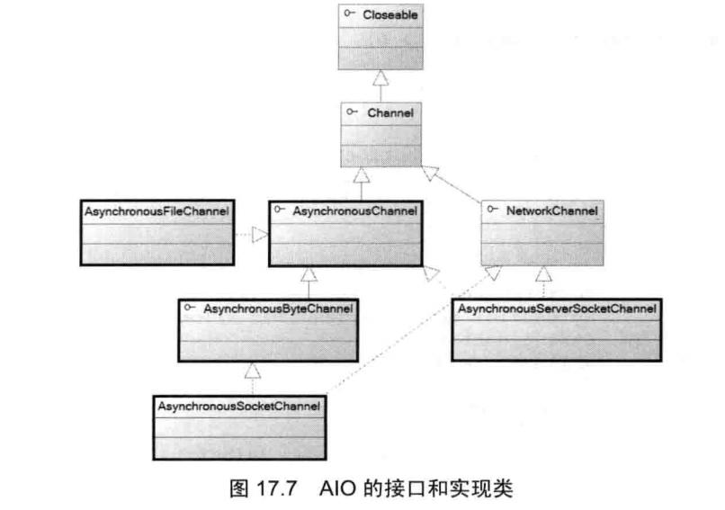
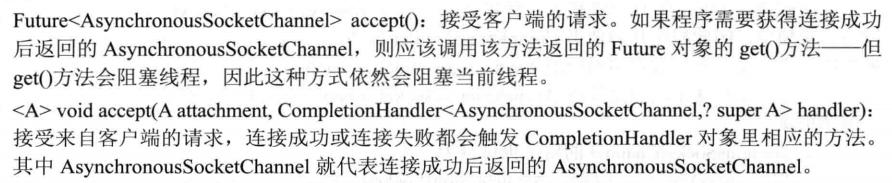
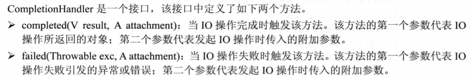
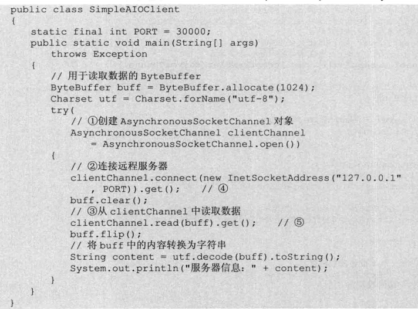
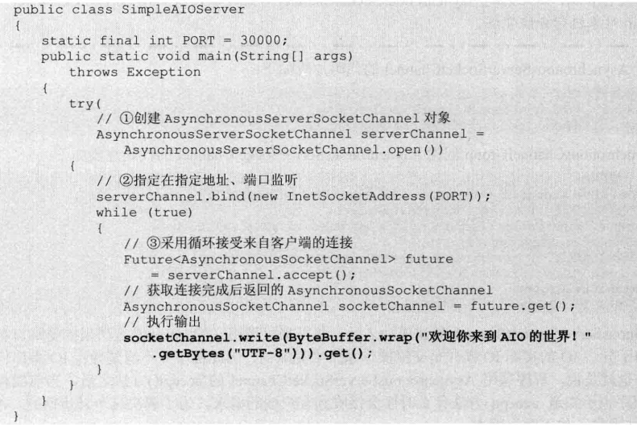
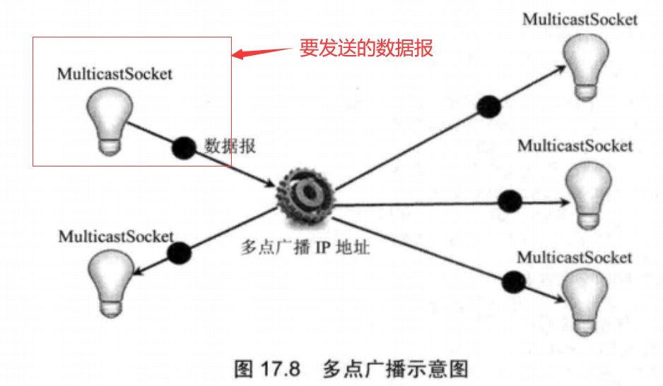

# 1.NIO实现非阻塞Socket通信

## 1.1几个重要类

1. Selector: **SelectableChannel注册在Selector上**
2. SelectionKey：**代表了SelectableChannel和Selector之间的注册关系**
3. ServerSocketChannel：**类似于ServerSocket类，负责监听，也需要注册到Selector上**
4. SocketChannel：**类似于Socket类，该类还实现了ByteChannel接口，ScatteringByteChannel接口和GatheringByteChannel接口，所以可以直接通过SocketChannel来读写ByteBuffer对象（NIO的缓存）**

---

## 1.2 大概步骤吧

### 1.2.1 服务端

1. 通过open方法创建一个Selector实例

2. 通过open方法打开一个未绑定的ServerSocketChannel,用于监听客户端的请求或者IO流

3. ServerSocketChannel实例绑定到指定的IP地址和端口

4. 设置ServerSocketChannel以非阻塞的方式工作

5. 将该ServerSocketChannel注册到Selector中

   ```java
   selector = Selector.open();
   ServerSocketChannel server = ServerSockerChannel.open();
   InetSocketAddress isa = new InetSocketAddress("127.0.0.1",PORT);
   //绑定IP地址和端口
   server.blind(isa);
   server.configureBlocking(false);
   //注册
   server.register(selector,SelectionKey.OP_ACCEPT);
   ```

6. 将ServerSocketChannel注册到Selector后，就可以用Selector的selet()来监听客户端的请求或者发送的数据了

7. 获取需要处理的Selector上的SelectionKey集合

8. 判断需要处理的SelectionKey是连接请求还是数据，不同的信息需要不同的处理方式

9. 如果是连接请求，则通过Selector的accpet()方法产生一个代表客户端Socket的SocketChannel，并将其注册到Selector中（记得设置非阻塞模式）

10. 如果是数据传输，则获取到该SelectionKey所对应的SocketChannel，然后对该Channel进行数据的读取操作

11. （如果是数据传输）将获取的数据传输到所有的客户端SocketChannel的输出流中

    ```java
    while(selector.select()>0){//说明有需要处理的IO操作
        for(SelectionKey sk : selector.selectedKey()){
            //遍历被选择的SelectionKey集合
            //将当前SelectionKey 从 被选择的SelectionKey集合中删除
            selector.selectedKeys().remove(sk); //因为该集合是代表要处理的SelectionKey集合，而当前的SelectionKey已经在处理了
            
            //判断是否包含客户端连接请求
            if(sk.isAcceptable()){
                //调用accept方法接受连接，产生服务器端的SocketChannel(这个socket代表客户端的Socket)
                SocketChannel sc = server.accept();
                sc.configureBlocking(false);
              	sc.register(selector,SelectionKey.OP_READ);
                //将sk对应的Channel设置成准备接受其他请求
                sk.interestOps(SelectionKey.OP_ACCEPT);
            }
            if(sk.isReadable()){
                //sk对应的是数据的传输
                SocketChannel sc = (SocketChannel)sk.channel();
                //提取sc中输入流的数据
                ByteBuffer buff = ByteBuffer.allocate(1024);
                String content = "";
                try{
                    while(sc.read(buff)>0){
                        buff.flip(); //将position置为0
                        content += charset.decode(buff);
                    }
                    //这边就是设置每个SocketChannel所代表的职责
                    sk.interestOps(SelectionKey.OP_READ);
                }catch(...){
                    ....
                }
              //处理完毕了 
               //将数据传输到客户端
                if(content.length()>0){
                    for(SelectionKey key : selector.keys()){
                        Channel targetChannel = key.channel();
                        //如果该channel是SocketChannel对象（代表客户端的Socket）
                        if(targetChannel instanceof SocketChannel){
                            SocketChannel dest = (SocketChannel)targetChannel;
                            dest.write(charset.encode(content));
                        }
                        
                    }
                }
            }
        }
    }
    ```

---

### 1.2.2 客户端

客户端的实现比较简单，需要两个线程，一个线程负责读取用户的键盘输入，一个线程负责将服务端返回的数据打印；

1. 首先创建一个SocketChannel ,然后绑定到服务端的ip和端口，然后注册到Selector上
2. 启动读取服务端数据的线程
3. 不断读取键盘输入，并将读取的内容写入到SocketChannel的输出流

---

## 1.3 注意事项

1. 主要是用Selector的select()来代替的各个线程的accept()方法，select()会返回需要处理的SelectionKey的个数，然后在一个线程里遍历这些需要处理的SelectionKey，并进行处理；
2. 当Selector上注册的所有Channel都没有需要处理的IO操作时，select()方法将阻塞，调用该方法的线程被阻塞；
3. 使用ServerSocketChannel和SocketChannel都需要使用blind来绑定ip地址和端口号，需要设置非阻塞模式，需要注册到Selector上。
4. 读取和写入数据则是使用NIO中的操作，可以去回顾一下；

---

# 2 使用java7的AIO实现非阻塞




## 2.1 相关类

1. AsynchronousServerSocketChannel ： 一个负责监听的Channel，与ServerSocketChannel相似

   1. 如何创建？ ==>调用open()静态方法来创建一个 **未监听**端口的AsynchronousServerSocketChannel 

      - open():创建一个默认的AsynchronousServerSocketChannel 
      - open(AsynchronousChannelGroup group):使用指定的AsynchronousChannelGroup  来创建AsynchronousServerSocketChannel 

   2. 什么是AsynchronousChannelGroup ？==>AsynchronousChannelGroup 是异步Channel的分组管理器，它可以实现资源共享。创建AsynchronousChannelGroup 时休要传入一个ExecutorService（即绑定一个线程池），该线程池负责两个任务：处理IO事件和触发CompletionHandler;

   3. 如何绑定端口？===>调用AsynchronousServerSocketChannel 的blind()方法指定该Channel在指定地址，指定端口进行监听;

      ```java
      //创建AsynchronousServerSocketChannel 的两种方法
      //1
      serverChannel = AsynchronousServerSocketChannel.open().blind(new InetSocketAddress(PORT));
      //2.首先创建线程池    以指定线程池来创建一个AsynchronousChannelGroup  
      //3.根据AsynchronousChannelGroup 来创建一个创建AsynchronousServerSocketChannel
      ExecutorService executor = Executors.newFixedThreadPool(80);
      AsynchronousChannelGroup channelGroup = AsynchronousChannelGroup.withThreadPool(executor);
      serverChannel = AsynchronousServerSocketChannel.open(channelGroup).blind(new InetSocketAddress(PORT));
      ```

   4. 创建成功之后应该调用其accpet()方法来接受客户端的连接请求，但因为异步Io的实际IO操作是交由操作系统来完成的，程序并不清楚异步IO操作什么时候完成===>程序调用AsynchronousServerSocketChannel的accept()方法后，当前线程不会阻塞，但程序也不知道accept()方法什么时候会接受到客户端的请求 ===>如何解决？

      1. AIO为accpet()方法提供两个版本

         

      2. CompletionHandler是一个接口，程序使用CompletionHandler对象来监听IO操作是否完成。

         

2. AsynchronousSocketChannel:类似之前的Socket（主要是客户端在使用这个）

   1. 调用静态open()方法创建AsynchronousSocketChannel。调用open()方法时同样可以指定一个AsynchronousChannelGroup来作为分组管理器

   2. 调用AsynchronousSocketChannel的connect()方法来连接到指定的ip地址，指定端口的服务器

   3. 调用AsynchronousSocketChannel的read(),write()方法来进行读写

      connect(),read(),write()都有两个版本，一个返回Future对象，一个需要传入CompletionHandler参数的版本。对于返回Futrure对象的版本，必须等到Future对象的get()方法返回时IO操作才真正完成；对于需要传入CompletionHandler参数的版本，则可以通过CompletionHandler在IO操作完成时触发相应的方法

      1. 返回Future对象的read()方法来读取服务端响应数据

         

         （为什么要使用get(),这里的操作并没有使用到get()方法的返回值===>（**其实就是为了确认异步IO操作已经完成**）因为这里是异步IO，这里并没有传入CompletionHandler监听器（程序无法通过该监听器在IO操作完成时触发特定的动作），所以就要调用Future返回值的get()方法，并得到get()方法完成后才能确定异步IO操作已经执行完成）

   ### 2.1.1 使用AsynchronousServerSocketChannel

   1. 调用open()静态方法创建AsynchronousServerSocketChannel
   2. 调用AsynchronousServerSocketChannel的blind()方法绑定ip和端口（在该位置监听来自客户端的连接请求)
   3. 调用AsynchronousServerSocketChannel的accept()方法来接受连接请求（可以获得一个代表客户端的AsynchronousSocketChannel)

   


# 3.基于UDP协议的网络编程

## 3.1 UDP协议介绍

1. UDP协议是一种不可靠的网络协议（TCP是端对端的，是可靠的网络协议），它在通信实例的两端各建立一个Socket，但这两个Socket之间并没有虚拟链路，这两个Socket只是发送、接受数据报的对象。
2. java提供了**DatagramSocket**对象作为基于UDP协议的Socket，使用DatagramPacket代表DatagramSocket发送、接受的数据报。
3. UDP协议是一种面向非连接的协议，即在正式通信之前不必与对方先建立连接，不管对方的状态就进行发送。（所以无法控制对方是否可以接受到这些数据内容）   
（UDP协议适用于一次只传送少量数据，对可靠性要求不高的应用环境）   
4. UDP协议的主要作用就是完成网络流和数据报之间的转换；   
## 3.2 使用DatagramSocket发送、接收数据
- DatagramSocket代表UDP协议的Socket，不维护状态，不能产生IO流，用于接收和发送数据报（类似码头，就是用来放东西，收东西，自己不能产生东西）
- DatagramPacket代表数据报，DatagramSocket接收和发送的数据都是通过DatagramPacket对象完成的；

### 3.2.1 DatagramSocket创建与主要方法

- 构造器

  - `DatagramSocket()` 绑定到本机默认IP地址，本地所有可用端口中随机选择一个端口
  - `DatagramSocket(int port) `指定端口
  - `DatagramSocket（int port,InetAddress laddr) `指定ip和端口

- 接收，发送数据

  - `receive(DatagramPacker p)`:从该DatagramSocket中接收数据报（应该是将要接收的数据读取到DatagramPacker对象吧  我猜的）该方法会阻塞线程，直到收到一个数据报为止
  - `send(DatagramPacker p)`:以该DatagramSocket对象向外发送数据报

  （根据上面方法传入的参数可以大概看出，DatagramSocket并不知道要将数据的目的地，数据的目的地集成在**DatagramPacker**对象中）

### 3.2.2 DatagramPacket 创建和使用

**UDP协议并没有明显的客户端和服务端，因为双方都需要创建一个DatagramSocket对象来接收、发送数据报（而Tcp协议中，服务端会创建一个ServerSocket用来监听客户端的请求连接）。使用DatagramPacket 对象作为传输数据的载体，通常将固定IP地址，固定端口的DatagramSocket对象所在的程序被称为服务器，因为该DatagramSocket可以主动接收客户端数据**

- 构造器
  - `DatagramPacket(byte[] buf,int length)`:以一个空数组来创建DatagramPacket 对象，该对象的作用是接收DatagramSocket中的对象（因为没有指定目的地的ip地址和端口，所以只能用来接收数据）
  - `DatagramPacket(byte[] buf,int length,InetAddress addr, int port)`:以一个**包含数据的数组**来创建DatagramPacket对象，创建该DatagramPacket对象时还**指定了Ip地址和端口**===>决定了数据报的目的地（用于发送数据）
  - `DatagramPacket(byte[] buf,int offset , int length)` ：以一个空数组来创建DatagramPacket对象，并指定接收到的数据放入buff数组中从offset来时，最多放length个字节；
  - ``DatagramPacket(byte[] buf, int offset ,int length,InetAddress addr, int port)` :创建一个用于发送数据的DatagramPacket对象，指定发送buf数组中从offset开始，总共length各字节；
- DatagramPacket的使用

```java
//创建一个接收数据的DatagramPacket对象
DatagramPacket packet = new DatagramPacket(buff,255);
//接收数据包
socket.receive(packet);

//创建一个发送数据的DatagramPacket对象
DatagramPacket packet = new DatagramPacket(buff,length,address,port);
//发送数据报
socket.send(packet);
```

- 获取IP地址和端口方法

  - `InetAddress getAddress()`:获取要发送的数据报的IP地址 + 获取接收到的数据报的发送主机的IP地址
  - `int getPort()`:获取要发送的数据报的目标端口 + 获取接收到的数据报的发送主机的端口
  - `SocketAddress getSocketAddress()`:获取要发送的数据报的目标SocketAddress+ 获取接收到的数据报的发送主机的SocketAddress

  (**SocketAddress中封装了了端口和Ip地址信息**)

### 3.2.3 使用DatagramSocket实现Server/Client结构的网络通信

（**服务端使用循环1000次来读取DatagramSocket中的数据报，每当读取到内容之后便向该数据报的发送者送回一条信息**）

- 服务端代码

```java
package com.UDP;

import java.io.IOException;
import java.net.DatagramPacket;
import java.net.DatagramSocket;

//服务端代码
public class UdpServer {
    public static final int PORT = 30000;
    //定义每个数据报的大小为4kb
    private static final int DATA_LEN = 4096;
    //定义接收网络数据的字节数组
    byte[] inBuff = new byte[DATA_LEN];
    //以指定字节数组创建准备接收数据的DatagramPacket对象
    private DatagramPacket inPacket = new DatagramPacket(inBuff,inBuff.length);
    //定义一个用于发送数据的DatagramPacket对象
    private DatagramPacket outPacket;
    //定义一个字符串数组，服务端发送该数组的元素
    String[] books = new String[]{
            "郑达平",
            "oyq",
            "疯狂java",
            "灌灌灌灌灌"
    };
    public void init() throws IOException {
        try(
                //创建DatagramSocket对象
                DatagramSocket socket = new DatagramSocket(PORT);
                )
        {
            //采用循环接收数据
            for(int i=0;i < 1000;i++){
                //读取Socket中的数据，读到的数据放入inPacket封装的byte数组中
                socket.receive(inPacket); //该方法会阻塞线程
                //判断inPakcet.getData()和inBuff是否是同一个数组
                System.out.println(inBuff == inPacket.getData());
                //将接收到的内容转换成字符串后输出
                System.out.println(new String(inBuff,0,inPacket.getLength()));
                //从字符串数组中取出一个元素作为发送数据
                byte[] senData = books[i%4].getBytes();
                //以指定字节数组作为发送数据，以刚才接收到的DatagramPacket的源SocketAddress
                // 作为目标SocketAddress创建DatagramPacket
                outPacket = new DatagramPacket(senData,senData.length,inPacket.getSocketAddress());
                //发送数据
                socket.send(outPacket);

            }
        }
    }

    public static void main(String[] args) throws IOException {
        new UdpServer().init();
    }
}

```

- 客户端代码

```java
package com.UDP;

import java.io.IOException;
import java.net.DatagramPacket;
import java.net.DatagramSocket;
import java.net.InetAddress;
import java.util.Scanner;

public class UdpClient {
    //定义发送数据报的目的地
    public static final int DEST_PORT = 30000;
    public static final String DEST_IP = "127.0.0.1";
    //定义每个数据报的大小为4kb
    private static final int DATA_LEN = 4096;
    //定义接收网络数据的字节数组
    byte[] inBuff = new byte[DATA_LEN];
    //以指定字节数组创建准备接收数据的DatagramPacket对象
    private DatagramPacket inPacket = new DatagramPacket(inBuff,inBuff.length);
    //定义一个用于发送数据的DatagramPacket对象
    private DatagramPacket outPacket;

    public void init() throws IOException{
        try(
                //创建一个客户端DatagramSocket,使用随机端口（用于接收服务端“反馈”的信息）
                DatagramSocket socket = new DatagramSocket();
                )
        {
            //初始化用于发送的DatagramPacket,它包含一个长度为0的字节数组
            outPacket = new DatagramPacket(new byte[0],0, InetAddress.getByName(DEST_IP),DEST_PORT);
            //创建键盘输入流
            Scanner scan = new Scanner(System.in);
            //不断地读取键盘输入
            while(scan.hasNextLine()){
                //将键盘输入的一行字符串转换为字节数组
                byte[] buff = scan.nextLine().getBytes();
                //设置发送用的DatagramPacket中的字节数据
                outPacket.setData(buff); //重新设置要发送的数据
                //发送数据报
                socket.send(outPacket);
                //读取Socket中的数据，读到的数据放在inPacket所封装的字节数组中
                socket.receive(inPacket);
                System.out.println(new String(inBuff,0,inPacket.getLength()));
            }
        }
    }

    public static void main(String[] args) throws IOException {
        new UdpClient().init();
    }
}
```

- 注意一个问题，使用DatagramSocket进行网络通信时，服务端**无须也无法**保存每个客户端的状态，客户端把数据报发送到服务端后，完全有可能立即退出，但不管客户端是否有退出，服务端都无法知道客户端的状态。


## 3.3使用MulticastSocket实现多点广播

- DatagramSocket 与 MulticastSocket 的比较
  - DatagramSocket 只允许数据报发送给指定的目标地址
  - MulticastSocket  可以将数据报以广播方式发送给多个客户端
- 多点广播==>需要让一个数据报拥有多个IP地址和端口（具有一组目标主机地址）==>实现将一份信息发送到多个接收者的广播
- 实现思想：设置一组特殊网络地址作为多点广播地址，**每一个多点广播地址都被看做一个组**，当客户端需要**发送，接收**广播信息时，**加入到该组**即可。（服务端也是如此，加入该组才可以分享）
  - IP协议 提供 多点广播的特殊IP地址 ： 范围： 224.0.0.0 ~ 239.255.255.255
  - 发送的数据报依然是DatagramPacket对象

示意图如下：

!

**（当 MulticastSocket 将一个 DatagramPacket 发送到多点广播IP地址（类似于一个组的标识），该数据报将被自动广播到加入该地址的所有MulticastSocket  ）**

### 3.3.1 MulticastSocket  的使用

MulticastSocket  是 特殊的 DatagramSocket

- 构造器

  - `public MulticastSocket()`:使用本地默认地址，随机端口来创建 MulticastSocket  
  - `public MulticastSocket(int portNumber)`:使用本地默认地址，指定端口来创建 MulticastSocket  
  - `public MulticastSocket(SocketAddress bindaddr)  `:使用本机**指定IP地址**、指定端口来创建 MulticastSocket  

- 加入、脱离组

  - `joinGroup(InetAddress multicastAddr)`: 将该 MulticastSocket  加入指定的多点广播地址
  - `leaveGroup(InetAddress multicastAddr)`:让该 MulticastSocket  离开指定的多点广播地址
  - 这边可以看到 多点广播地址，一个地址代表一个组

- 设置，查询监听的网络接口 (有些系统可能会有多个网络接口，可能会给多点广播带来问题，所以程序需要在一个指定的网络接口上监听)

  - `setInterface()` 强制 MulticastSocket  使用指定的网络接口
  - `getInterface()` 查询 MulticastSocket  监听的网络接口

- 创建仅用于发送数据报的 MulticastSocket  ，使用默认地址，随机端口即可；

- 创建接收用的 MulticastSocket  ，则该 MulticastSocket  对象必须具有指定端口，否则发送方无法确定**发送数据报的目标端口**

- MulticastSocket  的发送和接收数据报与 DatagramSocket一致，不同点：多个了`setTimeToLive(int ttl)`方法

  - ttl参数用于设置数据报最多可以跨过多少个网络，默认值为1
  - ttl = 0 :数据报停留在本地主机
  - ttl  =1 :数据报发送到本地局域网
  - ttl  = 32: 只能发送到本站点的网络上
  - ttl = 64: 数据报应保留在本地区
  - ttl = 128: 数据报应保留在本大洲
  - ttl = 255: 数据报可以发送到任何地方

- MulticastSocket  的使用步骤

  - 创建 MulticastSocket  ，根据 MulticastSocket  的功能来决定是否需要指定端口
  - 将 MulticastSocket  对象加入指定的多点广播地址（成组）
  - 设置 MulticastSocket  对象发送的数据报是否会被回送到本身
  - 初始化 发送/接收数据报的 DatagramPacket 对象
  - 如果是发送数据报，则获取要发送的数据，设置 DatagramPacket 中的数据内容，然后通过MulticastSocket  发送数据
  - 如果是接收数据报，则直接通过 MulticastSocket  接收数据

  代码如下：

  ```java
  //创建用于接收、发送数据报的 MulticastSocket  对象
  MulticastSocket  socket = new MulticastSocket(BROADCAST_PORT);
  
  //加入多点广播地址
  InetAddress broadcastAddress = InetAddress.getByName("230.0.0.1");
  socket.joinGroup(broadcastAddress);
  
  //设置 MulticastSocket  对象发送的数据报不会被回送到本身
  socket.setLoopbackMode(false);
  
  //初始化发送数据报的DatagramPacket对象 ===》 目的地的IP地址为多点广播地址，端口 则是 大家统一设置为 BROADCAST_PORT
  DatagramPacket outPacket = new DatagramPacket(new byte[0],0,broadcastAddress,BROADCAST_PORT);
  
  //获取要发送的数据内容，设置 DatagramPacket 中的数据内容
  byte[] buff = scan.nextLine().getBytes();
  outPacket.setData(buff);
  
  //发送数据报
  socket.send(outPacket);
  
  //创建接收数据报的 DatagramPacket 对象
  byte[] inBuff = new byte[DATA_LEN];
  DatagramPacket inPakcet = new DatagramPacket(inBuff,inBuff.length);
  
  //读取数据报
  while(true){
      socket.receive(inPacket);
      System.out.println(new String(inBuff,0,inPacket.getLength()));
  }
  ```


# 4.使用代理服务器

## 4.1 什么是代理服务器

- 代理服务器 是介于 浏览器 和 服务器 之间的一台服务器， 本来应该是浏览器向Web服务器发送请求，Web服务器返回响应给浏览器；加入代理服务器后，就变成 浏览器请求先发送给代理服务器，由代理服务器向Web服务器发送请求，并得到浏览器需要的响应，然后再将响应返回给浏览器；
- 为什么要加入代理服务器？
  - 大部分代理服务器都具有缓冲功能，它会不断地将新取得的数据存储到代理服务器的本地存储器上，如果浏览器所请求的数据在它的本地的存储器上已经存在而且是最新的，那么它就无须从Web服务器中取数据，而是直接将本地存储器上的数据送回给浏览器，这样可以显著提高浏览速度
  - 突破自身IP限制，对外隐藏自身IP地址。突破IP限制包括访问国外受限站点，访问国内特定单位，团体的内部资源
  - 提高访问速度，代理服务器提供的缓冲功能可以避免每个用户都直接访问远程主机，从而提高客户端访问速度
- 代理服务器的功能概括起来就是：代理用户去取得网络信息，用户只需与代理服务器交互即可。

## 4.2 相关类包

- java.net包下
  - Proxy类：代表一个代理服务器，可以在打开URLConnection 连接时指定Proxy, 创建 Socket连接时也可以指定 Proxy;
  - ProxySelector:代表一个代理选择器，提供了对代理服务器更加灵活的控制，可以对HTTP，HTTPS，FTP，SOCKS等进行分别设置，还可以设置不需要通过代理服务器的主机和地址。

## 4.3 使用Proxy创建连接

- 构造器
  - `Proxy(Proxy.Type type,SocketAddress sa)` :sa指定代理服务器的地址，type表示代理服务器的类型，类型如下
    - `Proxy.Type.DIRECT`:直接连接，不使用代理
    - `Proxy.Type.HTTP`:支持高级协议代理，如HTTP或FTP
    - `Proxy.Type.SOCKS`:表示SOCKS(V4或 V5)代理
- 创建Proxy对象后，可以在打开URLConnection 连接时指定Proxy, 也可以在创建 Socket连接时也可以指定 Proxy，使其作为本次连接所使用的代理服务器
- 代码，在URLConnection中使用代理服务器

```java
package com.Proxy;

import java.io.IOException;
import java.io.PrintStream;
import java.net.*;
import java.util.Scanner;

//在URLConnection中使用代理服务器
public class ProxyTest {
    
    //代理服务器的地址和端口
    final String PROXY_ADDR = "129.82.12.188";
    final int PROXY_PORT = 3124;
    //定义需要访问的网站
    String urlStr = "http://www.carzyit.org";
    
    public void init() throws IOException, MalformedURLException {
        URL url = new URL(urlStr);
        //创建一个代理服务器
        Proxy proxy = new Proxy(Proxy.Type.HTTP,new InetSocketAddress(PROXY_ADDR,PROXY_PORT));
        //使用指定服务器打开连接
        URLConnection conn = url.openConnection(proxy);
        //设置超时时长
        conn.setConnectTimeout(3000);
        try(
                //通过代理服务器读取数据的Scanner
                Scanner scan = new Scanner(conn.getInputStream());
                PrintStream ps = new PrintStream("index.htm");
                )
        {
            while(scan.hasNextLine()){
                String line = scan.nextLine();
                System.out.println(line);
                ps.println(line);
            }
        }
    }

    public static void main(String[] args) throws IOException ,MalformedURLException {
        new ProxyTest().init();
    }
}

```

## 4.4 使用ProxySelector 自动选择代理服务器

ProxySelector 是一个抽象类，需要继承ProxySelector 来实现自己的代理选择器

实现步骤：

- 定义一个继承 ProxySelector 的类，实现两个抽象方法
  - `List<Proxy> select(URL uri)`:根据业务需要返回代理服务器列表，如果该方法返回的集合中只包含一个Proxy,该Proxy将会作为默认的代理服务器
  - `connectFailed(URL uri,SocketAddress sa,IOException ioe)`:连接代理服务器失败时回调该方法
- 实现了 ProxySelector 类后，调用 ProxySelector 的 `setDefault(ProxySelector ps)`静态方法来注册该代理选择器即可
- 代码：

```java
package ProxySelector;

import java.io.IOException;
import java.net.*;
import java.util.ArrayList;
import java.util.List;

//让自定义的roxySelector 来自动选择代理服务器
public class ProxySelectorTest {
    //代理服务器地址和端口
    final  String PROXY_ADDR = "139.82.18.188";
    final int PROXY_PORT = 3124;

    //定义需要访问的网站地址
    String urlStr = "http://www.crazyit.org";

    public void init() throws IOException, MalformedURLException {
        //注册默认的代理服务器
        ProxySelector.setDefault(new ProxySelector() {
            //根据业务需要返回特定的对应的代理服务器
            @Override
            public List<Proxy> select(URI uri) {
                //本程序总是返回某个固定的代理服务器
                List<Proxy> result = new ArrayList<>();
                result.add(new Proxy(Proxy.Type.HTTP,new InetSocketAddress(PROXY_ADDR,PROXY_PORT)));
                return result;
            }

            @Override
            public void connectFailed(URI uri, SocketAddress sa, IOException ioe) {
                System.out.println("无法连接到指定服务器");

            }
        });
        URL url = new URL(urlStr);
        //不用指定代理服务器，直接打开
        URLConnection conn = url.openConnection();//代理选择器会自动选择一个代理服务器打开链接
    }

}

```

## 4.5 ProxySelector的实现类 sun.net.spi.DefaultProxySelector

(**尽量避免直接使用该API，这是一个未公开的API**)

- 系统将DefaultProxySelector 注册成默认的代理选择器
- 调用 `ProxySelector.getDefault()`来获取DefaultProxySelector 实例

- 实现了两个抽象方法
  - `connectFailed()` 如果连接失败，DefaultProxySelector 将会尝试不使用代理服务器，直接连接远程资源
  - `select()` DefaultProxySelector 会根据系统属性来决定使用哪个代理服务。ProxySelector 会检查系统属性与URL之间的匹配。然后决定使用响应的属性值作为代理服务器。 常用属性名：
    - `http.proxyHost`:设置HTTP访问所使用的代理服务器的主机地址。该属性名的前缀可以改为https,ftp等，分别用于设置HTTPS访问和FTP访问所用的代理服务器的主机地址
    - `http.proxyPort` :设置HTTP访问所使用的代理服务器的端口，该属性名的前缀可以改为https,ftp等，分别用于设置HTTPS访问和FTP访问所用的代理服务器的端口
    - `http.nonProxyHosts`:设置HTTP访问中不需要使用代理服务器的主机，支持使用*通配符；支持指定多个地址，多个地址之间用|来分隔
- 代码示范：

```java
package ProxySelector;

import java.io.IOException;
import java.net.*;
import java.util.Properties;
import java.util.Scanner;

public class DefaultProxySelectorTest {

    static String urlStr = "http://www.crazyit.org";

    public static void main(String[] args) throws URISyntaxException, IOException {
        //获取系统的默认属性
        Properties props = System.getProperties();

        //通过系统属性设置 HTTP访问所用的代理服务器的主机地址和端口
        props.setProperty("http.proxyHost","192.168.10.96");
        props.setProperty("http.proxyPort","8080");
        //设置Http访问无须使用代理服务器的主机
        props.setProperty("http.nonProxyHosts","localhost|192.168.10.*");

        //通过系统属性设置 HTTPs访问所用的代理服务器的主机地址和端口
        props.setProperty("https.proxyHost","192.168.10.96");
        props.setProperty("https.proxyPort","443");
        //DefaultProxySelector 不支持https.nonoProxyHosts属性
        //DefaultProxySelector 直接按http.nonProxyHosts的设置规则处理

        //通过系统属性设置 FTP访问所用的代理服务器的主机地址和端口
        props.setProperty("ftp.proxyHost","192.168.10.96");
        props.setProperty("ftp.proxyPort","2121");
        //设置Ftp访问无须使用代理服务器的主机
        props.setProperty("ftp.nonProxyHosts","localhost|192.168.10.*");

        //通过系统属性设置 SOCKS访问所用的代理服务器的主机地址和端口
        props.setProperty("socks.proxyHost","192.168.10.96");
        props.setProperty("socks.proxyPort","1080");

       //获取系统默认的代理选择器
        ProxySelector selector = ProxySelector.getDefault();
        System.out.println("系统默认的代理选择器 "+ selector);

        //根据URI动态决定所使用的代理服务器
        System.out.println("系统为ftp://www.crazyit.org 选择的代理服务器为："+
                ProxySelector.getDefault().select(new URI("ftp://www.crazyit.org")));
        URL url = new URL(urlStr);

        //直接打开连接，默认的代理选择器会使用http.proxyHost,http.proxyPort系统属性设置的代理服务器
        //如果无法连接代理服务器，则默认的代理选择器会尝试直接连接Web服务器
        URLConnection conn = url.openConnection();

        //设置超时时长
        conn.setConnectTimeout(3000);
        try(
                Scanner scan = new Scanner(conn.getInputStream(),"utf-8");
                )
        {
            //读取远程主机的内容
            while(scan.hasNextLine()){
                System.out.println(scan.nextLine());
            }
        }


    }
}

```

# 5 java多线程下载（关于UrlConnection)

```java
public class DownUtil{
	private String path;
	private String targetFile;
	private int threadNum;
	private DownThread[] threads; //定义下载的线程对象
	private int fileSize; //下载文件的总大小

	public DownUtil(String path,String targetFile,int threadNum){
		this.path = path;
		this.targetFile = targetFile;
		this.threadNum = threadNum;
		threads = new DownThread(threadNum); //初始化threads数组
	}

	public void download() throws Exception{
		URL url = new URL(path);
		HttpURLConnection conn = (HttpURLConnection) url.openConnection();
		conn.setConnectTimeout(5*1000);
		conn.setRequestMethod("GET");
		conn.setRequestProperty(
			"Accept",
			"image/gif, image/jpeg, image/pjpeg, image/pjpeg,"+
			"application/x-shockwave-flash, application/xaml+xml,"+
			"application/vnd.ms-xpsdocument,application/x-ms-xbap,"+
			"application/x-ms-application,application/vnd.ms-excel,"+
			"application/vnd.ms-powerpoint,application/msword,*/*");
		conn.setRequestProperty("Accept-Language","zh-CN");
		conn.setRequestProperty("Charset","UTF-8");
		conn.setRequestProperty("Connection","Keep-Alive");
		//得到文件大小
		fileSize = conn.getContentLength();
		conn.disconnect();
		int currentPartSize = fileSize / threadNum+1;
		RandomAccessFile file = new RandomAccessFile(targetFile,"rw");
		//设置本地文件大小
		file.setLength(fileSize);
		file.close();
		for(int i=0;i<threadNum;i++){
			int startPos = i*currentPartSize; //计算每个线程下载的开始位置
			//每个线程使用一个RandomAccessFile进行下载
			RandomAccessFile currentPart = new RandomAccessFile(targetFile,"rw");
			//定位该线程的下载位置
			currentPart.seek(startPos);
			//创建下载线程
			threads[i] = new DownThread(startPos,currentPartSize,currentPart);
			threads[i].start();
		}
	}
	//获取下载的完成百分比
	public double getCompleteRate(){
		int sumSize = 0;
		for(int i=0;i<threadNum;i++){
			sumSize += therads[i].length;
		}
		return sumSize*1.0/fileSize;
	}
	private class DownThread extends Thread{
		//下载线程
		private int startPos; //当前线程的下载位置
		private int currentPartSize; //定义当前线程负责下载的文件大小
		private RandomAccessFile currentPart; //当前线程需要下载的文件块
		// 定义该线程已下载的字节数
		public int length;
		public DownThread(int startPos, int currentPartSize,RandomAccessFile currentPart){
			this.startPos = startPos;
			this.currentPartSize = currentPartSize;
			this.currentPart = currentPart;
		}
		public void run(){
			try{
				URL url = new URL(path);
				HttpURLConnection conn = (HttpURLConnection) url.openConnection();
				conn.setConnectTimeout(5*1000);
				conn.setRequestMethod("GET");
				conn.setRequestProperty(
					"Accept",
					"image/gif, image/jpeg, image/pjpeg, image/pjpeg,"+
					"application/x-shockwave-flash, application/xaml+xml,"+
					"application/vnd.ms-xpsdocument,application/x-ms-xbap,"+
					"application/x-ms-application,application/vnd.ms-excel,"+
					"application/vnd.ms-powerpoint,application/msword,*/*");
				conn.setRequestProperty("Accept-Language","zh-CN");
				conn.setRequestProperty("Charset","UTF-8");
				InputStream inStream = conn.getInputStream();
				//跳过startPos个字节，表明该线程只下载自己负责的那部分文件
				instream.skip(this.startPos);//将指针定位到startPos位置
				byte[] buffer = new byte[1024];
				int hasRead = 0 ;
				// 读取网络数据，并写入本地文件
				while(length< currentPartSize && (hasRead = inStream.read(buffer))!=-1){
					currentPart.write(buffer,0,hasRead);
					length += hasRead;
				}
				currentPart.close();
				inStream.close();
			}catch(Exception e){
				e.printStackTrace();
			}
		}
	}
}
```


