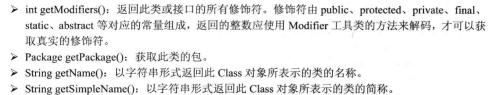

# 1.类的加载、连接和初始化

## 1.1 JVM和类

- 运行一个java程序，会启动一个**java虚拟机进程**，在该程序中启动的线程，定义的变量，都处于该java虚拟机进程当中。它们都**使用该JVM进程的内存区**（线程共享进程的资源）。
- JVM进程何时终止？（从下可以看出，java程序运行结束，该程序对应的JVM进程也随之结束）
  - 程序运行到最后正常结束
  - 程序运行到使用System.exit()或者Runtime.getRuntime().exit()代码处结束程序
  - 程序执行过程中遇到未捕获的异常或错误结束
  - 程序所在的平台强制结束了JVM进程。
- JVM进程结束，该进程在内存中的状态将会丢失。（进程之间不共享数据，要共享数据需要通过传输数据【比如管道传输等方法】）


## 1.2 类的加载

- 类加载/类初始化是指 将**类的class文件读入内存**，并**为之创建一个java.lang.Class对象**。==>当程序中使用任何类的时候，系统都会为其创建一个java.lang.Class对象（**没想到吧，类也是一种对象，万物皆对象**）
- 类加载/类初始化步骤： 加载、连接、初始化 ===>完成对该类的初始化==>JVM将会**连续完成**这三个步骤


### 1.2.1 类加载器完成加载步骤

- 类加载器一般由JVM提供，这些类加载器是所有java程序运行的基础
- JVM 提供的类加载器被称为 系统类加载器 ==>开发者可以创建自己的类加载器 ，通过继承ClassLoader 基类
- 使用不同的类加载器，可以从**不同来源**加载类的二进制数据

  - 从本地文件系统加载 class文件
  - 从 JAR 包中加载 class 文件
  - 通过网络加载 class 文件
  - 把一个 java 源文件动态编译，并执行加载
- 类加载器 一般 无须等到 “首次使用” 该类时才加载该类，JVM规范 允许系统预先加载某些类    
- 当类被加载后，系统为之生成一个Class对象

### 1.2.2 类的连接

- 连接阶段：负责将类的二进制数据合并到JRE中，分为三个阶段
  - 验证：检验被加载的类是否具有正确的内部结构，并且跟其他类协调一致
  - 准备 ：负责为类的类变量分配内存，并设置默认初始值
  - 解析 ：将类的二进制数据中的符号引号替换成直接引用
- JRE是什么？ JAVA运行环境
    - JRE为Java Runtime Environment的简称，Java Runtime Environment（包括Java Plug-in）是[Sun](https://baike.baidu.com/item/Sun)的产品，包括两部分：Java Runtime Environment和Java Plug-in。JavaRuntimeEnvironment(JRE)是可以在其上运行、测试和传输应用程序的Java平台。**它包括Java[虚拟机](https://baike.baidu.com/item/虚拟机)（jvm）、Java核心类库和支持文件。它不包含开发工具(JDK)--[编译器](https://baike.baidu.com/item/编译器)、调试器和其它工具。**


### 1.2.3 类的初始化

- 虚拟机负责对类进行初始化，主要就是对类变量进行初始化
  - 类变量指定初始值：
    - 声明类变量时指定初始值：`static int a =5;`
    - 使用静态代码块为类变量指定初始值： ` static{ b =5; }`
- JVM初始化类步骤
  - 若该类 还未被加载和连接 ==>程序先加载和连接该类
  - 若该类的**直接父类**还没有被初始化，则先初始化其直接父类（向上递归操作，保证该类的所有父类都会被初始化，这里可以与类的new一个新对象结合来看 5.9.3节）
  - 若该类中有**初始化语句**（静态代码块，声明类变量时指定初始值），则系统依次执行这些初始化语句

### 1.2.4 类初始化的时机

Java程序**首次**通过以下方式来**使用**某个类或者接口，系统就会初始化该类或接口

- 创建类的实例
  - new操作符创建
  - 通过反射来创建实例
  - 通过反序列化的方式来创建实例
- 调用某个类的类方法
- 访问某个类或接口的类变量，或者为该类变量赋值（就是使用到该类变量了）
- 使用反射方式来强制创建某个类或接口对应的 java.lang.Class对象
- 初始化某个类的子类
- 直接使用 java.exe 命令来运行某个朱磊，当运行某个主类时，程序会先初始化该主类(含main函数的类，且类名与文件名一致)

一些特殊情况：

- 对于final型的类变量，如果该类变量的值可以在编译时确定下来，那么这个类变量相当于"宏变量"。对于宏变量，java编译器会在编译时将这个类变量出现的地方直接替换成它的值。所以在程序中使用该静态类变量，不会导致类的初始化；
  - `static final String compileConstant = "疯狂"` :这个类变量就是一个宏变量，可以在编译时确定下来
  - `static final String compileConstant = System.currentTimeMillis()+"";`:这个类变量虽然用final修饰，但它的值并不能在编译时确定下来，所以如果程序首次访问这个类变量，还是会导致该类初始化
- 使用ClassLoader 类的`loadClass()`方法来加载某个类时，该方法**仅仅只是加载类**，并**不执行类的初始化**。 使用Class的`forName()`静态方法才会导致强制初始化该类（这个forName好像在JDBC的驱动加载那边用到过）


## 1.3 类加载器

类加载器负责将.class文件加载到内存中，并为止生成对应的java.lang.Class对象

### 1.3.1类加载器简介

- 类加载器负责加载所有类，系统为所有加载进入内存的类生成一个`java.lang.Class`对象。一旦一个类被加载进JVM中，同一个类就不会被再次载入了 ==>如果区分是不是同一个类？

  - 载入JVM中的类有一个唯一的标识符，由 该类的全限定类名(包名+类名) 和其类加载器作为其唯一的标识符
    - 一个在包zdp 中的 类 P 被类加载器ClassLoader 的实例 c1负责加载，则该类在JVM中的标识符为(P,zdp,c1) ===>也就是说，同一个类，由不同的类加载器实例加载，它们在JVM中是完全不同的，互不兼容的。

- 初始类加载器结构（由三个类加载器组成，在JVM启动时组成）

  - `Bootstrap ClassLoader`:根类加载器

    - 被称为引导（原始/根）类加载器，负责加载Java的核心类。
    - JVM中，执行`java.exe`命令时，使用`-Xbootclasspath`选项或者使用 -D 选项指定 sun.boot.class.path 系统属性值可以指定加载**附加的类**
    - 根类加载器 是由JVM自身实现的，不是 `java.lang.ClassLoad`的子类

    ```java
    //获得根类加载器所加载的核心类库
    public class BootstrapTest{
        public static void main(String[] args){
            //获取根类加载器所加载的全部URL数组
            URL[] urls = sun.misc.Launcher.getBootstrapClassPath().getURLs();
            //输出
            for(int i=0;i<urls.length;i++){
                System.out.println(urls[i].toExternalForm());
            }
        }
    }
    ```

    

  - `Extension ClassLoader` 扩展类加载器

    - 负责加载 JRE 的扩展目录 （%JAVA_HOME%jre/lib/ext 或者由java.ext.dirs 系统属性指定的目录)中JAR包的类
    - 可以将自己开发的类 打包成JAR包，放到该扩展目录下，就可以为java扩展核心类以外的新功能

  - `System ClassLoader` 系统类加载器（应用类加载器）

    - 负责在JVM启动时 加载来自java命令的 -classpath选项，`java.class.path` 系统属性，或**CLASSPATH环境变量**所指定的JAR包和类路径。
    - 程序可以通过 ClassLoader 的静态方法 `getSystemClassLoader()`来获取系统类加载器。
    - 一般用户自定义的类加载器都以系统类加载器作为父加载器
    - 若操作系统没有指定 CLASSPATH 环境变量，则默认以当前路径作为系统类加载器的加载路径（程序运行的当前路径）

### 1.3.2 类加载机制

- 全盘负责：当一个类加载器负责加载某个Class时，该Class所依赖和引用的其他Class也由这个类加载器负责载入，除非显式使用另一个类加载器来载入
- 父类委托：先让parent(父)类加载器试图加载该Class，只有当父类加载器无法加载该类时才尝试从自己的类路径中加载该类
- 缓存机制：缓存机制保证所有加载过的Class都会被缓存，当程序需要使用某个Class时，类加载器先从缓存区中搜寻该Class，只有当缓存区不存在该CLass对象时，系统才会读取该类对应的二进制数据，并将其转换为Class对象，存入缓存区中；===>所以修改了Class之后，必须要重新启动JVM，程序所做的修改才会生效

JVM中4种类加载器的层次结构


- 访问JVM的类加载器

```java
import java.io.IOException;
import java.net.URL;
import java.util.Enumeration;

//访问JVM的类加载器
public class ClassLoadPropTest {
    public static void main(String[] args) throws IOException {
        //获取系统类加载器
        ClassLoader systemLoader = ClassLoader.getSystemClassLoader();
        System.out.println("系统类加载器 ："+systemLoader);
        /**
         * 获取系统类加载器的加载路径---通常由操作系统的环境变量 CLASSPATH指定的
         * 如果操作系统没有指定CLASSPATH ，则默认以当前路径作为系统类加载器的加载路径
         */

        Enumeration<URL> eml = systemLoader.getResources("");
        while(eml.hasMoreElements()){
            System.out.println(eml.nextElement());
        }
        
        //获取系统类加载器的父类加载器，即扩展类加载器
        ClassLoader extensionLoader = systemLoader.getParent();
        System.out.println("扩展类加载器 ："+ extensionLoader);
        System.out.println("扩展类加载器的加载路径："+ System.getProperty("java.ext.dirs"));
        System.out.println("扩展类加载器的父类加载器："+extensionLoader.getParent());

    }
}

```

- 运行结果：

这波可能是我的JDK版本太高，所以这边扩展类加载器的加载路径变了吧

扩展类加载器的父类加载器 应该是 根加载器，但因为根加载器 不是 Java实现的，所以输出Null


### 1.3.3 类加载加载Class

1. 检测此Class是否载入过（是否在缓存区中），如果有直接进入第8步

2. 如果父类加载器不存在（如果没有父类加载器，则要么父类是根加载器，要么本身就是根加载器），则跳到第四步执行，如果父类加载器存在，执行下一步
3. 请求使用父类加载器去载入目标类，如果成功载入跳到第8步，否则执行第5步
4. 请求使用根类加载器来载入目标类，如果成功载入跳到第8步，否则执行第7步
5. 当前类加载器尝试寻找Class文件（从与此ClassLoader相关的类路径中寻找），如果找到则执行第6步，找不到则执行第7步
6. 从文件中载入Class,成功载入后跳到第8步
7. 抛出ClassNotFoudException 异常
8. 返回对应的` java.lang.Class`对象

可以重写ClassLoader的`findClass()`方法来实现自己的载入策略，甚至重写`loadClass()`方法来实现自己的载入过程。

（我来总结一下: 就是先从缓存区中找Class对象，找不到的话就要进行类加载操作了；类加载器 加载一个类，先用其 父类加载器 加载（也是递归向上加载，也就是说，一个类的加载，总是根加载器先加载它），如果父类加载器可以加载，就让父类加载器加载，如果父类加载器不能加载，就由 本身这个类加载器来加载 ，载入成功的标志是返回`java.lang.Class`对象）

## 1.4 创建并使用自定义的类加载器

JVM 中除了根类加载器之外的所有类加载器都是 `ClassLoader`子类的实例，所以我们可以继承该类，并重写该类的方法来创建和使用 自定义类加载器

- ClassLoader类的关键方法
  - `loadClass(String name,boolean resolve)`:该方法为ClassLoader的入口点，根据指定名称来加载类，系统就是调用ClassLoader的该方法来获取指定类对应的Class对象
    - 执行步骤：
    - 用`findLoaderClass(String)`来检查是否已经加载类，如果已经加载直接返回
    - 在父类加载器上调用`loadClass()`方法，如果父类加载器为null，则使用根类加载器来加载
    - 调用`findClass(String)`方法来查找类
  - `findClass(String name)` 根据指定名称来查找类
  - `Class defineClass(String name,byte[] b,int off,int len)`:负责将指定类的字节码文件（即Class文件，Hello.class)读入字节数组byte[] b 内，并将其转换成Class对象，该字节码文件可以来源于文件、网络等。（关键方法）
  - `findSystemClass(String name)`:从本地文件系统装入文件。它在本地文件系统中寻找类文件，如果存在，就用`defineClass()`方法将原始字节转换成Class对象，将该文件转换为类
  - `static getSystemClassLoader()` 返回系统类加载器
  - `getParent()` 获取该类的父类加载器
  - `resolveClass(Class<?> c)`:链接指定的类c。
  - `findLoaderClass(String name)` 如果此java虚拟机已经加载了名为name 的类，则直接返回该类对应的Class对象，否则返回null。 ==>用于Java类加载缓存机制
- 一般重写 `findClass`方法，根据`loadClass()`的执行步骤可以看出，如果重写`loadClass()`方法，需要实现加载器的父类委托和缓冲机制两种策略，实现逻辑复杂，而重写`findClass()`方法就可以避免这个问题

代码演示：

```java
import java.io.File;
import java.io.FileInputStream;
import java.io.IOException;
import java.lang.reflect.InvocationTargetException;
import java.lang.reflect.Method;

public class CompileClassLoader extends ClassLoader{
    //读取一个文件的内容
    private byte[] getBytes(String filename) throws IOException {
        File file = new File(filename);
        long len = file.length();
        byte[] raw = new byte[(int) len];
        try(
                FileInputStream fin = new FileInputStream(file);
                )
        {
            //一次性读取Class文件的全部二进制数据
            int r = fin.read(raw);
            if(r!=len){
                throw new IOException("无法读取全部文件 ："+r+" ! ="+len);
            }
            return raw;
        }
    }
    //定义编译指定java文件的方法
    private  boolean compile(String javaFile) throws IOException {
        System.out.println("CompileClassLoader:正在编译 "+javaFile +"...");
        //调用系统的javac命令
        //执行command命令行命令
        Process p = Runtime.getRuntime().exec("javac "+javaFile);
        try {
            //其他线程都应该等待这个线程完成
            p.waitFor();
        } catch (InterruptedException e) {
            System.out.println(e);
        }
        //获取java线程的退出值
        int ret = p.exitValue();
        //返回编译是否成功
        return ret==0;
    }
    //重写ClassLoader的findClass()方法
    protected Class<?> findClass(String name) throws ClassNotFoundException{
        Class clazz = null;
        //将包路径中的点(.)替换成斜线
        String fileStub = name.replace(".","/");
        String javaFilename = fileStub + ".java";
        String classFilename = fileStub +".class";
        File javaFile = new File(javaFilename);
        File classFile = new File(classFilename);
        //当指定java源文件存在，且class文件不存在，或者java源文件的修改时间比class文件的修改事件更晚，重新编译
        if(javaFile.exists() && (!classFile.exists()||javaFile.lastModified() > classFile.lastModified())){
            try{
                //如果编译失败，或者该class文件不存在
                if(!compile(javaFilename)||!classFile.exists()){
                    throw new ClassNotFoundException("ClassNotFoundException:" + javaFilename);
                }
            } catch (IOException e) {
                e.printStackTrace();
            }
        }
        //如果class文件存在，系统负责将该文件转换为Class对象
        if(classFile.exists()){
            try{
                //将class文件的二进制数据读入数组
                byte[] raw = getBytes(classFilename);
                //调用ClassLoader的defineClass方法将二进制数据转换为Class对象
                clazz = defineClass(name,raw,0,raw.length);
            } catch (IOException e) {
                e.printStackTrace();
            }
        }
        //如果clazz为null，表示加载失败，抛出异常
        if(clazz == null){
            throw new ClassNotFoundException(name);
        }
        return clazz;
    }

    //定义一个主方法
    public static void main(String[] args) throws Exception {
        //如果运行该程序时没有参数，即没有目标类
        if(args.length<1){
            System.out.println("缺少目标类，请按如下格式运行java源文件");
            System.out.println("java CompileClassLoader ClassName");
        }
        //第一个参数是需要运行的类
        String progClass = args[0];
        //剩下的参数将作为运行目标类时的参数
        String[] progArgs = new String[args.length-1];
        System.arraycopy(args,1,progArgs,0,progArgs.length);
        CompileClassLoader ccl = new CompileClassLoader();
        //加载需要运行的类
        Class<?> clazz = ccl.loadClass(progClass);
        //获取需要运行的类的主方法 (这里的代码看不懂)
        Method main = clazz.getMethod("main",(new String[0]).getClass());
        Object argsArray[] = {progArgs};
        main.invoke(null,argsArray);
    }
}

```

## 1.5 URLClassLoader类

URLClassLoader 可以从本地文件系统获取二进制文件来加载类，也可以从远程主机获取二进制文件来加载类

- 构造器（可以在应用程序中直接使用URLClassLoader加载类）
  - `URLClassLoader(URL[] urls)`:使用默认的父类加载器创建一个ClassLoader对象，该对象将从urls所指定的系列路径来查询并加载类
  - `URLClassLoader(URL[] urls,ClassLoader parent)`:使用指定的父类加载器创建一个ClassLoader对象，其他功能与前一个构造器相同

直接从文件系统中加载Mysql驱动，无须将Mysql驱动添加到CLASSPATH环境变量中

```java
import java.net.URL;
import java.net.URLClassLoader;
import java.sql.Connection;
import java.sql.Driver;
import java.util.Properties;

public class URLClassLoaderTest {
    private static Connection conn;
    //定义一个获取数据库连接的方法
    public static Connection getConn(String url,String user,String pass) throws Exception{
        if(conn == null){
            //创建一个URL数组
            URL[] urls ={ new URL("file:mysql-connector-java-5.1.30-bin.jar")};
            //以默认的ClassLoader 作为 父ClassLoader 创建URLClassLoader
            URLClassLoader myClassLoader = new URLClassLoader(urls);
            //加载Mysql的 jdbc驱动，并创建默认实例
            //newInstance() 会调用该类的无参构造器进行实例化（该方法已被弃用）
            //取而代之的是class.getDeclaredConstructor().newInstance()
            //getDeclaredConstructor()方法会根据他的参数对该类的构造函数进行搜索
            //并返回对应的构造函数，没有参数就返回该类的无参构造函数，然后再通过newInstance进行实例化。
            Driver drive = (Driver) myClassLoader.loadClass("com.mysql.jdbc.Driver").newInstance();
            //创建一个设置JDBC连接属性的Properties对象
            Properties props = new Properties();
            //传入属性
            props.setProperty("user",user);
            props.setProperty("password",pass);
            //调用Driver对象的connect放啊来取得数据库连接
            conn = drive.connect(url,props);
        }
        return conn;
    }

    public static void main(String[] args) throws Exception {
        System.out.println(getConn("jdbc:mysql://localhost:3306/mysql","root","32147"));
    }
}

```


# 2.反射

使用反射来获得对象和类的真实信息

## 2.1 获得Class对象

- `Class.forName(String clazzName)`: clazzName 为某个类的全限定类名，获得该类的Class对象
- 调用某个类的class属性： ===> `Person.class`
- 调用某个对象的`getClass()`方法，该方法是`java.lang.Object`类中的一个方法

## 2.2 从Class对象来获取信息（用到的时候再查吧）

可以从Class对象获得构造器，方法，成员变量，注解,内部类，所继承的父类等信息

- 构造器 Connstructor
- 方法 Method
- 成员变量 Field
- 注解 Annotation

要不我截图吧：

- 构造器


- 方法

（传入的Class<?> 是用来确定方法的，java语言中方法可以重载，所以只用方法名无法获得想要的方法，想要确定一个方法需要由**方法名和形参列表**来确定）


- 成员变量


- 注解


- 内部类


- 外部类


- 接口


- 继承的父类


- 对应类的修饰符，所在包，类名等基本信息



- 判断是否为接口，枚举，注解类型等


## 2.3 方法参数反射

`java.lang.reflect` 包下新增了一个`Executable`抽象基类，该对象代表可执行的类成员，该类派生了`Constructor`和`Method`两个子类

- `int getParameterCount()`获取该构造器或方法的形参个数

- `Parameter[] getParameter()`获取该构造器或方法的所有形参

  - Parameter对象代表方法或构造器的一个参数

    - `getModifiers()`获取修饰该形参的修饰符

    - `String getName()` 获取形参名

    - `Type getParameterizedType()`获取带泛型的形参类型

    - `Class<?> getType()`获取形参类型

    - `boolean isNamePresent()`返回该类的Class文件是否包含了方法的形参名信息

      - javac命令编译java源文件时，默认生成的class文件并不包含方法的形参名信息，如果需要保留形参名信息，则需要为javac命令 指定-parameters选项

      

    - `boolean isVarArgs()` 该方法用于判断该参数是否为个数可变的形参


## 2.4 使用反射生成并操作对象

Class对象可以获得该类的 Method，Constructor,Field， 程序可以通过Method 对象来执行对应的方法，Constructor 对象来调用对应的构造器创建实例， 通过 Field 对象直接访问并修改对象的成员变量值

### 2.4.1 创建对象

利用Class对象的`newInstance()`方法来创建该Class对象对应类的实例 (**`newInstance`只能调用默认构造器（无参构造器）**) ===>利用`Constructor`对象就可以调用指定的构造方法来创建实例了 ==>`Constructor c.newInstance()`

- 应用场景： 根据配置文件信息来创建Java对象

```java
import java.io.FileInputStream;
import java.io.FileNotFoundException;
import java.io.IOException;
import java.util.HashMap;
import java.util.Map;
import java.util.Properties;

//对象池，该对象池会根据配置文件读取key-value对，然后创建这些对象，并将这些对象放入一个HashMap
public class ObjectPoolFactory {
    //定义一个对象池，前面是对象名，后面是实际对象
    private Map<String,Object> objectPool = new HashMap<>();

    //定义一个创建对象的方法
    //传入全限定类名字符串，程序根据类名生成JAVA对象
    private Object createObject(String clazzName) throws ClassNotFoundException, IllegalAccessException, InstantiationException {
        //获取对应的Class对象
        Class<?> clazz = Class.forName(clazzName);
        //使用clazz对应的类的默认构造器创建实例
        return clazz.newInstance();
    }

    //该方法根据指定文件来初始化对象池
    //根据配置文件来创建对象
    public void initPool(String fileName) throws IllegalAccessException, InstantiationException, ClassNotFoundException {
        try(
                FileInputStream fis = new FileInputStream(fileName);
                )
        {
            Properties pros = new Properties();
            pros.load(fis);
            for(String name:pros.stringPropertyNames()){
                //每取出一对key-value对，就根据value创建一个对象
                //调用createObject()创建对象，并将对象添加到对象池中
                objectPool.put(name,createObject(pros.getProperty(name)));
            }
        }catch(IOException ex){
            System.out.println("读取 "+fileName+"异常");
        }
    }

    public Object getObject(String name){
        //从objectpool 中取出指定name 对应的对象
        return objectPool.get(name);
    }

    public static void main(String[] args) throws IllegalAccessException, ClassNotFoundException, InstantiationException {
        ObjectPoolFactory pf = new ObjectPoolFactory();
        pf.initPool("obj.txt");
        System.out.println(pf.getObject("a"));
        System.out.println(pf.getObject("b"));
    }
}

```

配置文件如下：

```txt
a=java.util.Data
b=javax.swing.JFrame
```

- 指定构造器创建对象
  - 获取该类的Class对象
  - 利用Class对象的`getConstructor()`方法来获取指定的构造器
  - 调用Constructor的 `newInstance()`方法来创建Java对象

```java
public class CreateJFrame{
    public static void main(String args[]) throws Exception{
        //获取JFrame对应的Class对象
        Class<?> jframeClazz = Class.forName("javax.swing.JFrame");
        //获取 JFrame 中带一个字符串参数的构造器
        Constructor ctor = jframeClazz.getConstructor(String.class);
        //调用Constructor的newInstance()方法来创建对象
        Object obj = ctor.newInstance("测试窗口");
        System.out.println(obj);
    }
}
```

### 2.4.2 调用方法

- 通过Class对象的`getMethod()`方法或者`getMethods()`方法来获取全部方法或者指定方法
- 通过 `Method`对象来调用它对应的方法，每个`Method`对象都包含一个`invoke()`方法
  - `Object invoke(Object obj,Object... args)` obj是执行该方法的主调，后面的args是执行该方法时传入该方法的实参
  - 什么是主调 ===>调用这个方法的对象（应该是这样吧）

- 增强前面的对象池工厂，允许在配置文件中增加对象的成员变量的值，对象池工厂会读取为该对象配置的成员变量值，并利用该对象对应的setter方法设置成员变量的值

```java
import java.io.FileInputStream;
import java.io.FileNotFoundException;
import java.io.IOException;
import java.lang.reflect.InvocationTargetException;
import java.lang.reflect.Method;
import java.util.HashMap;
import java.util.Map;
import java.util.Properties;


public class ExtendedObjectPoolFactory {
    //定义一个对象池，前面是对象名，后面是实际对象
    private Map<String,Object> objectPool = new HashMap<>();
    private Properties config = new Properties();

    //从指定属性文件中初始化Properties对象
    public void init(String fileName){
        try(
                FileInputStream fis = new FileInputStream(fileName);
        )
        {
            config.load(fis);
        } catch (IOException e) {
            System.out.println("读取 "+fileName+"异常");
        }
    }

    //定义一个创建对象的方法
    //该方法只要传入一个字符串类名，程序根据该类名生成java对象
    private Object createObject(String clazzName) throws ClassNotFoundException, IllegalAccessException, InstantiationException {
        //根据字符串来获取对应的Class对象
        Class<?> clazz = Class.forName(clazzName);
        //使用clazz对应类的默认构造器 实例化对象
        return clazz.newInstance();

    }

    //该方法根据指定文件来初始化对象池
    //它会根据配置文件来创建对象
    public void initPool() throws IllegalAccessException, InstantiationException, ClassNotFoundException {
        for(String name :config.stringPropertyNames()){
            //每取出一个key-value对，如果key中不包含百分号，表示要根据value来创建一个对象
            if(!name.contains("%")){
                objectPool.put(name,createObject(config.getProperty(name)));
            }
        }
    }

    //该方法根据属性文件来调用指定对象的setter方法
    public void initProperty() throws NoSuchMethodException, InvocationTargetException, IllegalAccessException {
        for(String name:config.stringPropertyNames()){
            //如果key 中包含百分号 ==>该key用于控制调用对象的setter方法设置值
            //%前半部分为对象名，后半部分控制setter方法名
            if(name.contains("%")){
                //将配置文件中的key 以 % 分割
                String[] objAndProp = name.split("%");
                //取出调用setter方法的 对象
                Object target = getObject(objAndProp[0]);
                //获取setter方法名：set +"首字母大写”+剩下部分
                String mtdName = "set" + objAndProp[1].substring(0,1).toUpperCase()+objAndProp[1].substring(1);

                //通过调用target的getClass()获取它的实现类所对应的Class对象
                Class<?> targetClass = target.getClass();
                //获取希望调用的setter方法
                Method mtd = targetClass.getMethod(mtdName,String.class);
                //通过 Method 的invoke方法执行setter方法
                //将 config.getPorperty(name)的值作为调用setter方法的参数
                mtd.invoke(target,config.getProperty(name));
            }
        }
    }

    public Object getObject(String name){
        //从objctPool 中取出指定name对应的对象
        return objectPool.get(name);
    }

    public static void main(String[] args) throws IllegalAccessException, ClassNotFoundException, InstantiationException, NoSuchMethodException, InvocationTargetException {
        ExtendedObjectPoolFactory epf = new ExtendedObjectPoolFactory();
        epf.init("extObj.txt");
        epf.initPool();
        epf.initProperty();
        System.out.println(epf.getObject("a"));
    }

}
```

配置文件如下：

```txt
a = javax.swing.JFrame
b = javax.swing.JLabel
#set the title of a
a%title = Test Title
```

- Spring框架 就是通过这种方式将成员变量值以及依赖对象等都放在配置文件中进行管理的，从而实现了较好的解耦。（Spring的IOC）


- 调用某个对象的private 方法 ,先调用Method对象的如下方法

  - `setAccessible(boolean flag)` 将Method对象的`accessible`设置为指定的布尔值。Ture，表示该Method 在使用时取消 Java语言的访问权限检查；false,表示该Method 在使用时要实施java语言的访问权限检查

    - > `setAccessible()`方法属于Method的父类AccessibleObject，因此 Method,Constructor,Field都可以调用这个方法，从而通过反射来调用private方法

### 2.4.3 访问成员变量

通过`Field`对象来读取或设置成员变量值

- `getXxx(Object obj)`:获取obj对象的该成员变量值。Xxx对应8种基本类型，如果该成员变量的类型是引用类型，则取消get后面的Xxx
- `setXxx(Object obj,Xxx val)`
- `getFiled()`只能获取到public访问控制的成员变量，`getDeclaredField()`可以获得所有的成员变量

- 代码演示

```java
package Field;

import java.lang.reflect.Field;

class Person {
    private String name;
    private int age;
    @Override
    public String toString() {
        return "Person{" +
                "name='" + name + '\'' +
                ", age=" + age +
                '}';
    }
}
public class FieldTest {
    public static void main(String[] args) throws Exception{
        //创建一个person 对象
        Person p = new Person();
        Class<Person> personClazz = Person.class;

        //获取Person 的名为name的成员变量
        Field nameField = personClazz.getDeclaredField("name");
        //取消访问权限设置
        nameField.setAccessible(true);
        //调用set方法为p对象的name成员变量设置值
        //name成员变量是引用类型，所以取消Xxx
        nameField.set(p,"Yeeku.H.lee");
        
        //设置age成员变量
        Field ageField = personClazz.getgetDeclaredField("age");
        ageField.setAccessible(true);
        ageField.setInt(p,30);
        System.out.println(p);
    }
}
package Field;

import java.lang.reflect.Field;

class Person {
    private String name;
    private int age;
    @Override
    public String toString() {
        return "Person{" +
                "name='" + name + '\'' +
                ", age=" + age +
                '}';
    }
}
public class FieldTest {
    public static void main(String[] args) throws Exception{
        //创建一个person 对象
        Person p = new Person();
        Class<Person> personClazz = Person.class;

        //获取Person 的名为name的成员变量
        Field nameField = personClazz.getField("name");
        //取消访问权限设置
        nameField.setAccessible(true);
        //调用set方法为p对象的name成员变量设置值
        //name成员变量是引用类型，所以取消Xxx
        nameField.set(p,"Yeeku.H.lee");
        
        //设置age成员变量
        Field ageField = personClazz.getField("age");
        ageField.setAccessible(true);
        ageField.setInt(p,30);
        System.out.println(p);
    }
}

```


### 2.4.4 操作数组

`java.lang.reflect`提供一个Array类，Array对象代表所有的数组。通过Array来动态地创建数组，操作数组等

- `static Object newInstance(Class<?> componenType,int... length)`:创建一个具有指定的元素类型，指定维度的新数组（维度就是看传入的int）
- `static xxx getXxx(Object array, int index)`:返回array数组中的第index各元素（xxx表示基本数据类型==>引用类型直接get()）
- `static void setXxx(Object array, int index, xxx val)`:将array数组中第index各元素的值设为val。

1. 利用Array生成数组，为指定数组元素赋值

```java
package Array;

import java.lang.reflect.Array;

public class ArrayTest1 {
    public static void main(String[] args) {
        try{
            //创建一个元素类型为String，长度为10的数组,一维数组
            Object arr = Array.newInstance(String.class,10);
            //依次为arr数组中的index为5，6的元素赋值
            Array.set(arr,5,"疯狂");
            Array.set(arr,6,"轻量级java");
            //依次取出arr数组中index为5，6的元素的值
            Object book1 = Array.get(arr,5);
            Object book2 = Array.get(arr,6);
            //输出元素
            System.out.println(book1);
            System.out.println(book2);
        }catch(Throwable e){
            System.err.println(e);
        }
    }
}
```

2. 创建一个三维数组

```java
package Array;

import java.lang.reflect.Array;

public class ArrayTest2 {
    public static void main(String[] args) {
        //创建一个三维数组，三维数组就是 数组元素为二维数组 的 一维数组
        Object arr = Array.newInstance(String.class,3,4,10);
        //获得arr数组中index 为2 的元素，该元素应该是二维数组
        Object arrObj = Array.get(arr,2);

        //使用Array 为二维数组 的数组元素赋值，二维数组的数组元素是一维数组
        //所以传入 Array 的 set()方法 的第三个参数 是一维数组
        //这边是为arrObj[2][0] arrObj[2][1]赋值了
        Array.set(arrObj,2,new String[]{
                "疯狂java",
                "轻量级java EE 企业应用实战"
        });

        //获取arrObj数组中index为3的数组元素，该元素应该是一维数组
        Object anArr = Array.get(arrObj,3);
        //这边是为anArr[8] 赋值
        Array.set(anArr,8,"疯狂Android讲义");
        //将arr 强制类型转换为三维数组
        String[][][] cast = (String[][][])arr;
        //输出
        System.out.println(cast[2][2][0]);
        System.out.println(cast[2][2][1]);
        System.out.println(cast[2][3][8]);
    }
}
```


## 2.5 使用反射生成JDK动态代理

`java.lang.reflect`下的`Proxy`类和`InvocationHandler`接口，使用这个类和接口来生成 **JDK动态代理类**或**动态代理对象**

- 什么是JDK？

JDK是整个java开发的核心，它包含了JAVA的运行环境（JVM+Java系统类库）和JAVA工具。

- JDK包含的基本组件：

  JDK包含的基本组件包括：

  javac – 编译器，将源程序转成字节码

  jar – 打包工具，将相关的类文件打包成一个文件

  javadoc – 文档生成器，从源码注释中提取文档

  jdb – debugger，查错工具

  java – 运行编译后的java程序（.class后缀的）

  appletviewer：小程序浏览器，一种执行[HTML文件](https://baike.baidu.com/item/HTML文件)上的Java小程序的Java浏览器。

  Javah：产生可以调用Java过程的C过程，或建立能被Java程序调用的C过程的头文件。

  Javap：Java反汇编器，显示编译类文件中的可访问功能和数据，同时显示[字节代码](https://baike.baidu.com/item/字节代码)含义。

  Jconsole: Java进行系统调试和监控的工具

- JDK结构图


---

- 使用Proxy 和 InvocationHandler 创建动态代理

  - Proxy 提供了用于创建动态代理类和代理对象的静态方法，是所有动态代理类的父类。 可以用Proxy来创建动态代理类；

    - `static Class<?> getProxyClass(ClassLoad loader,Class<?>... interfaces)`:创建一个**动态代理类所对应的Class对象**，该代理类将**实现interfaces** 所指定的多个接口。第一个ClassLoader 参数指定生成动态代理类的类加载器。
    - `static Object newProxyInstance(ClassLoader loader,Class<?>[] interfaces,InvocationHandler h)`:直接创建一个动态代理对象，该代理对象的实现类实现了interfaces指定的系列接口，执行代理对象的每个方法时都会被替换执行InvocationHandler对象的invoke方法

    （即使采用第一个方法生成动态代理类之后，如果程序需要通过该代理类来创建对象，依然需要传入一个InvocationHandler 对象。 **系统生成的每个代理对象都有一个与之关联的InvocationHandler 对象**）


- 当程序使用反射方式为指定接口生成系列动态代理对象时，这些动态代理对象的实现类实现了一个或多个接口。动态代理对象就需要实现一个或多个接口里定义的所有方法，**系统怎么知道如何实现这些方法？**
  - 当执行动态代理对象里的方法，实际上会**替换成调用 InvocationHandler 对象的 invoke**方法
- 代码：

```java
 //创建一个InvocationHandler 对象
    InvocationHandler handler = new InvocationHandler(...);
    //使用Proxy 生成一个动态代理类proxyClass
    Class proxyClass = Proxy.getProxyClass(Foo.class.getClassLoader(),new Class[]{Foo.class});
    //获取proxyClass 类 中带一个InvocationHandler 参数的构造器
    Constructor ctor = proxyClass.getConstructor(new Class[]{InvocationHandler.class});
    //调用ctor 的newInstance方法来创建实例
    Foo f = (Foo)ctor.newInstance(new Object[]{handler});
```

```java
//上面的代码简化
//创建一个InvocationHandler对象
InvocationHandler handler = new MyInvocationHandler(...);
//使用Proxy 直接生成一个动态代理对象
Foo f = (Foo)Proxy.newProxyInstance(Foo.class.getClassLoader(),new Class[]{Foo.class},handler);
```

代码：(动态代理在Spring中有)

```java
package Proxy;

import java.lang.reflect.InvocationHandler;
import java.lang.reflect.Method;
import java.lang.reflect.Proxy;

interface Person{
    void walk();
    void sayHello(String name);
}

class MyInvocationHandler implements InvocationHandler{
    /*
    执行动态代理对象的所有方法时，都会被替换成执行如下的invoke方法
    proxy: 代表动态代理对象
    method:代表正在执行的方法
    args: 代表调用目标放啊时传入的实参
     */

    @Override
    public Object invoke(Object proxy, Method method, Object[] args) throws Throwable {
        System.out.println("-----正在执行的方法:"+method);
        if(args != null){
            System.out.println("下面是执行该方法时传入的实参为：");
            for(Object val :args){
                System.out.println(val);
            }
        }else{
            System.out.println("调用的方法没有实参！");
        }
        return null;
    }
}

public class ProxyTest {
    public static void main(String[] args) {
        //创建一个InvocationHandler对象、
        InvocationHandler handler = new MyInvocationHandler();
        //使用指定的InvocationHandler 来生成一个动态代理对象
        Person p = (Person) Proxy.newProxyInstance(Person.class.getClassLoader(),new Class[]{Person.class},handler);
        //调用动态代理对象的walk()和sayHello()方法
        p.walk();
        p.sayHello("郑达平");
    }
}

```

### 2.5.1 深入了解动态代理


## 2.6动态代理和AOP


理想效果：代码块1，代码块2，代码块3既可以执行深色代码部分，又无须在程序中以硬编码方式直接调用深色代码的方法，可以通过动态代理来实现

- JDK动态代理只能为接口创建动态代理    ==>只能为接口的实现类对象创建动态代理对象，这个代理对象会实现 要代理对象的 所有接口
- 所有 一个JDK 的动态代理 需要 接口类， 接口实现类，InvocationHandler 接口实现类（使用该类的invoke()方法来调用方法），根据这些来创建一个动态代理对象
- 这种动态代理 在AOP（面向切面编程）中被称为AOP代理，AOP代理可代替目标对象，AOP代理包含了目标对象的全部方法。但AOP代理中的方法与目标对象的方法存在差异，AOP代理里的方法可以在执行目标方法之前，插入一些通用的处理。

```java
//Dog接口
package DynaProxy;

public interface Dog {
    void info();
    void run();
}
===============================================================================================
//Dog接口实现类
package DynaProxy;

public class GunDog implements Dog{
    @Override
    public void info() {
        System.out.println("我是一只猎狗");
    }

    @Override
    public void run() {
        System.out.println("我奔跑迅速");
    }
}
=============================================================================================
//DogUtil  即要插入到info() 和run()方法中的方法
package DynaProxy;

public class Dogutil {

    //第一个拦截器方法
    public void method1(){
        System.out.println("=========模拟第一个通用办法========");
    }
    //第二个拦截器方法
    public void method2(){
        System.out.println("==========模拟第二个通用办法=====");
    }

    //借助Proxy 和 InvocationHandler 实现 ==>当程序调用info()方法 和 run()方法，系统可以“自动”将method1()和method2()
    //两个通用方法插入info() 和 run()方法中执行
}
===============================================================================================
//InvocationHandler 实现类
package DynaProxy;

import java.lang.reflect.InvocationHandler;
import java.lang.reflect.Method;

public class MyInvocationHandler implements InvocationHandler {
    private Object target; //需要被代理的对象（接口实现类对象）
    public void setTarget(Object target){
        this.target = target;
    }

    //执行动态代理对象的所有方法时，都会被替换成执行如下的invoke方法
    @Override
    public Object invoke(Object proxy, Method method, Object[] args) throws Throwable {
        Dogutil du = new Dogutil();
        //执行DogUtil 对象中的method1方法
        du.method1();
        //以target 作为主调来执行method方法
        Object result = method.invoke(target,args);
        //执行DogUtil 对象中的method2方法
        du.method2();
        return result;
    }
}
===============================================================================================
//Proxy 工厂 根据指定的target对象 生成对应的代理对象
package DynaProxy;

import java.lang.reflect.Proxy;

public class MyProxyFactory {

    //为指定的target对象生成动态代理对象
    public static Object getProxy(Object target) throws Exception{
        //创建一个MyInvocationHandler对象
        MyInvocationHandler handler = new MyInvocationHandler();
        //为handler对象设置 主调对象
        handler.setTarget(target);
        //创建并返回一个动态代理对象
        return Proxy.newProxyInstance(target.getClass().getClassLoader(),target.getClass().getInterfaces(),handler);
    }
}
===============================================================================================
//测试代码
package DynaProxy;

public class Test {
    public static void main(String[] args) throws Exception {
        //创建一个原始的GunDog对象，作为target
        Dog target = new GunDog();
        //以指定的target对象 来创建动态代理对象
        Dog dog = (Dog) MyProxyFactory.getProxy(target);
        dog.info();
        dog.run();
    }
}

```

- 运行结果：


- AOP代理的方法与目标对象的方法示意图


## 2.7  反射和泛型

JDK5以后，允许使用泛型来限制Class类，===>`String.class`的类型实际上是 `Class<String>` ;如果`Class`对应的类暂时未知，则使用`Class<?>` 。

在反射中使用泛型，可以避免使用反射生成的对象需要强制类型转换。

### 2.7.1 泛型和Class类

使用`Class<T>`泛型可以避免强制类型转换

```java
public class CrazyitObjectFactory{
    public static <T> T getInstance(Class<T> cls){
        try{
            return cls.newInstance(); //这边就会返回一个T类型对象
        }
        catch(Exception e){
            e.printStackTrace();
            return null;
        }
    }
    public void main(String args[]){
        //获取实例后无须类型转换
        Date d = CrazyitObjectFactory.getInstance(Data.class);
        JFrame f = CrazyitObjectFactory.getInstance(JFrame.class);
    }
}
```

- 若不使用泛型，则获取实例后 需要进行强制类型转换

```java
public class CrazyitObjectFactory2{
    public static Object getInstance(String clsName){
        try{
            Class cls = Class.forName(clsName);
            return cls.newInstance();
        }
        catch(Exception e){
            e.printStackTrace();
            return null;
        }
    }
}

//获取实例后需要强制类型转换
Date d = (Date) CrazyitObjectFactory.getInstance("java.util.Date");
```

- 对Array 的 newInstance() 进行包装 

```java
public class CrazyitArray{
    //对Array的newInstance()方法进行包装
    @SuppressWarnings("unchecked")
    public static <T> T[] newInstance(Class<T> componentType,int length){
        return (T[]) Array.newInstance(componentType,length);
    }
}
//Array 的 原 newInstance()方法签名如下：
public static Object newInstance(Class<?> componentType,int... dimensions);
//并没有利用到这个泛型，还是返回了一个Object对象，其实可以利用泛型来返回真正要创建的对象（不用再进行强制类型转换了）===>但好像改进后，只能创建一维数组了。
```


### 2.7.2 使用反射来获取泛型信息

- 类型为不含有泛型类型的类型的成员变量 的类型的获取==> `Class<?> a = f.getType();` （f为Field对象）
- 当类型为 含有泛型类型的类型 如 Map<String,Integer>类型 ===>`Type getType = f.getGenericType()`
  - Type 为 `java.lang.reflect`包下的一个接口，代表所有类型的公共高级接口，Class是Type接口的实现类。Type包括 原始类型，参数化类型，数组类型，类型变量和基本类型
  - 然后将Type 对象 **强制类型转换**为`ParameterizedType`对象，`ParameterizeType` 代表被参数化的类型，也就是增加了泛型限制的类型; 该类型提供如下两个方法
    - 	`getRawType()`返回没有泛型信息的原始类型
    - 	`getActualTypeArguments()`返回泛型参数的类型

获取泛型类型的程序

```java
import java.lang.reflect.Field;
import java.lang.reflect.ParameterizedType;
import java.lang.reflect.Type;
import java.util.Map;

//获取泛型类型
public class GenericTest {
    private Map<String,Integer> score;

    public static void main(String[] args) throws NoSuchFieldException {
        Class<GenericTest> clazz = GenericTest.class;
        Field f = clazz.getDeclaredField("score");
        //直接使用getType()取出类型支队普通类型的成员有效
        Class<?> a = f.getType();
        System.out.println("score 的类型是 ："+a);

        //获取成员变量f的泛型类型
        Type gType = f.getGenericType();
        //如果gType 类型是 ParameterizedType对象
        if(gType instanceof ParameterizedType){
            //强制类型转换
            ParameterizedType pType = (ParameterizedType) gType;
            //获取原始类型
            Type rType = pType.getRawType();
            System.out.println("原始类型是："+rType);
            //取得泛型类型的泛型参数
            Type[] tArgs = pType.getActualTypeArguments();
            System.out.println("泛型信息是：");
            for (int i = 0; i < tArgs.length; i++) {
                System.out.println("第"+i+"个泛型信息是："+tArgs[i]);
            }
        }else{
            System.out.println("获取泛型类型出错！");
        }
    }
}

```

- 运行结果图：


