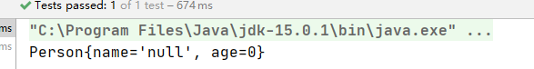
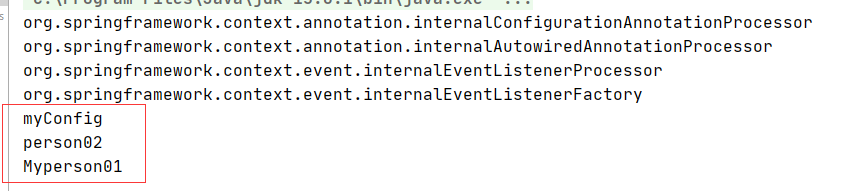
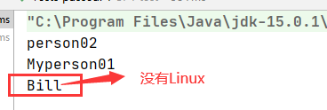
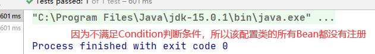

# 容器

- 使用纯注解方式来实现容器功能

使用配置类===>配置类相当于 配置文件 （使用注解@Configuration 来将类标注为配置类）

## 注册Bean

> 实现 注册Bean

- 如何给容器中注册一个Bean   （使用@Bean注解，可以指定 Bean的id  @Bean("Bean的Id")  )

创建一个返回对象的方法，Bean的类型为返回对象的类型，Bean的id默认以方法名作为id（使用注解@Bean 来标注该注册方法)

- 如何使用？

使用一个新的类 AnnotationConfigApplicationContext(配置类.class);  ===> 该类也是一个IOC容器

```java
ApplicationContext applicationContext = new AnnotationConfigApplicationContext("");
//获取的办法与之前在xml文件中注册差不多
```

- 代码演示：

配置类：

```java
package config;

import org.springframework.context.annotation.Bean;
import org.springframework.context.annotation.Configuration;
import pojo.Person;

//配置类 需要使用 @Configuration 标注
@Configuration 
public class MyConfig {

    //要注册进入容器的Bean 使用@Bean标注
    @Bean
     public Person person02(){
        return new Person("郑周",02);
    }
    
    //指定 Bean的id
    @Bean("Myperson01")
    public Person person03(){
        return new Person("周正",03);
    }
}
```

测试类：

```java
  @org.junit.Test
    public void Test01(){
      //使用xml配置文件
        ApplicationContext context = new ClassPathXmlApplicationContext("beans.xml");
        Object p1 = context.getBean("person01");
        System.out.println(p1);
    }

    @org.junit.Test
    public void test02(){
        //使用配置类
        ApplicationContext configurableApplicationContext = new AnnotationConfigApplicationContext(MyConfig.class);
        String[] names = configurableApplicationContext.getBeanDefinitionNames(); //获得所有在容器中注册的Bena的id
        for(String name:names){
            System.out.println(name);
        }

    }
```

运行结果图：

test01:



test02:



## 包扫描

> 实现包扫描

- 使用 @ComponentScan 注解 ，对配置类使用===>因为配置类相当于配置文件，所以在配置类操作就类似于之前在配置文件中操作

``` java
@ComponentScan(value="com.atguigu") // value 指定要扫描的包
//过滤规则 ==>指定排除规则
@ComponentScan(value="com.atguigu",excludeFilters={
    @Filter(type=FilterType.ANNOTATION，classes={Controller.class,Service.class},useDefaultFilters = false)
})
//excludeFilters ={  }    Filter数组
//Filter 是注解

//指定包含规则 ==>只需要包含哪些注解
@ComponentScan(value="com.atguigu",includeFilters={
    @Filter(type=FilterType.ANNOTATION，classes={Controller.class,Service.class})
})
//includeFilters = {}
```

- ComponentScan 是重复注解，可以写多个，来指定不同的扫描规则
- 使用 ComponentScans (  value = {@ComponentScan(.....),@ComponentScan(.....)})   ==> value = {  }  ComponentScan 数组

> Filter  的 扫描规则

- FilterType.ANNOTATION : 按照注解
- FilterType.ASSIGNABLE_TYPE :按照给定的类型

```java
@ComponentScan(value="com.atguigu",includeFilters={
    @Filter(type=FilterType.ANNOTATION，classes={Controller.class,Service.class}),
    @Filter(type=FilterType.ASSIGNABLE_TYPE,classes={BookService.class})
})
```

- Filter.ASPECTJ: 使用ASPECTJ表达式
- FILTER.REGEX ：使用正则表达式
- FILTER.CUSTOM :使用自定义规则

> 创建自定义规则 

- 实现TypeFilter接口

MetadataReader :读取到当前正在扫描的类的信息

MetadataReaderFactory: 可以获取到其他任何类的信息


## 设置作用域

> 设置作用域

- 使用 @Scope 注解
- 有四个作用域(单实例，多实例这边就不再赘述了)
- 单实例 就是**容器启动时**就将**所有单实例的Bean创建并初始化**，以后每次获取该Bean 就是直接从容器中（map.get())拿就可以了

```java
 @see ConfigurableBeanFactory#SCOPE_PROTOTYPE   prototype:多实例
	 * @see ConfigurableBeanFactory#SCOPE_SINGLETON   singleton：单实例
	 * @see org.springframework.web.context.WebApplicationContext#SCOPE_REQUEST   request：同一次请求创建一个实例
	 * @see org.springframework.web.context.WebApplicationContext#SCOPE_SESSION	  session：同一个Session创建一个实例
 
     @Scope("prototype")
     @Bean("person")
     public Person person(){
     ....
 }
```

> 懒加载

- 什么是懒加载===>容器启动时不创建对象，第一次使用（获取）Bean才创建对象，并初始化
- 懒加载 针对 单实例 Bean
- 使用 @Lazy 注解


## 按照条件注册Bean

- 使用 @Conditional注册 ：按照一定的条件进行判断，满足条件给容器注册Bean

- 传入 Condition数组 : Condition 为 一个接口 ====>所以要实现 Condition 实现类（成为判断条件)
- 可以放在方法上，也可以放在类上； 放在类（类中组件统一设置）： 满足当前条件，这个类中配置的所有Bean注册才可以生效

代码演示：

创建 Condition 实现类

- 判断是否为Windows系统的实现类(看注释中关于 抽象方法所带形参的 描述)

```java
package config;

import org.springframework.beans.factory.config.ConfigurableListableBeanFactory;
import org.springframework.beans.factory.support.BeanDefinitionRegistry;
import org.springframework.context.annotation.Condition;
import org.springframework.context.annotation.ConditionContext;
import org.springframework.core.env.Environment;
import org.springframework.core.type.AnnotatedTypeMetadata;

public class WindowsCondition implements Condition {
    /*
    * ConditionContext context ： 当前条件 可以使用的上下文（环境）
    * AnnotatedTypeMetadata metadata ： 当前标注了 Condtion注解的注释信息
    * */

    @Override
    public boolean matches(ConditionContext context, AnnotatedTypeMetadata metadata) {
        //获取类加载器
        ClassLoader classLoader = context.getClassLoader();
        //获取BeanFactory(IOC当前使用的工厂）
        ConfigurableListableBeanFactory beanFactory = context.getBeanFactory();
        //获取环境信息  封装了当前运行时的一些信息，包括环境变量，虚拟机的一些变量等
        Environment environment = context.getEnvironment();
        //获取 BeanDefinition类 的 注册类
        BeanDefinitionRegistry registry = context.getRegistry();

        String property = environment.getProperty("os.name");
        if(property.contains("Windows")){
            return true;
        }
        return false;
    }
}

```

- 判断是否为 Linux系统的实现类

```java
package config;

import org.springframework.context.annotation.Condition;
import org.springframework.context.annotation.ConditionContext;
import org.springframework.core.env.Environment;
import org.springframework.core.type.AnnotatedTypeMetadata;

public class LinuxCondition implements Condition {
    @Override
    public boolean matches(ConditionContext context, AnnotatedTypeMetadata metadata) {
        Environment environment = context.getEnvironment();
        String property = environment.getProperty("os.name");
        if(property.contains("Linux")){
            return true;
        }
        return false;
    }
}

```

配置类中方法使用注解：

```java
//配置类 需要使用 @Configuration 标注
@Configuration
public class MyConfig {
	 @Conditional({WindowsCondition.class})
    @Bean("Bill")
    public Person person04(){
        return new Person("比尔盖茨",69);
    }

    @Conditional({LinuxCondition.class})
    @Bean("Linus")
    public Person person05(){
        return new Person("linux",48);
    }
}
```

测试类：

```java
 @org.junit.Test
    public void test03(){
        ApplicationContext configurableApplicationContext = new AnnotationConfigApplicationContext(MyConfig.class);
        String[] names = configurableApplicationContext.getBeanNamesForType(Person.class);
        for(String name:names){
            System.out.println(name);
        }
    }
```

运行结果图：




- 将 注解加在 配置类上

```java
@Conditional({LinuxCondition.class})
//配置类 需要使用 @Configuration 标注
@Configuration
public class MyConfig {

    //要注册进入容器的Bean 使用@Bean标注
    @Bean
     public Person person02(){
        return new Person("郑周",02);
    }

    @Scope
    //指定 Bean的id
    @Bean("Myperson01")
    public Person person03(){
        return new Person("周正",03);
    }


    @Bean("Bill")
    public Person person04(){
        return new Person("比尔盖茨",69);
    }


    @Bean("Linus")
    public Person person05(){
        return new Person("linux",48);
    }
}
```

测试类：

```java
 @org.junit.Test
    public void test03(){
        ApplicationContext configurableApplicationContext = new AnnotationConfigApplicationContext(MyConfig.class);
        String[] names = configurableApplicationContext.getBeanNamesForType(Person.class);
        for(String name:names){
            System.out.println(name);
        }
    }
```

运行结果图：




# 扩展原理

## BeanFactoryPostProcessor

## BeanDefinitionREgistryPostProcessor

## ApplicationListener

## Spring容器创建过程


# web

## Servlet3.0

## 异步请求